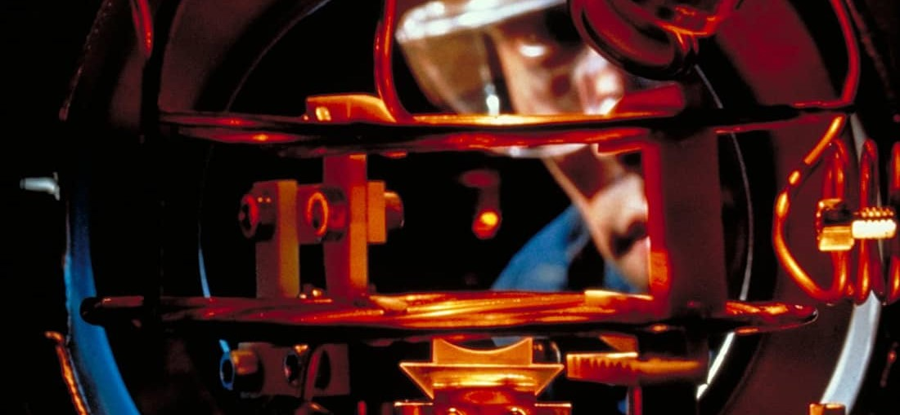

# Atomic physics 101

_The fundamental laws necessary for the mathematical treatment of a large part of physics and the whole of chemistry are thus completely known, and the difficulty is only that the exact application of these laws leads to equations much too complicated to be soluble._

 Paul Dirac 

## Introduction

{ title="Sodium atoms in a magneto-optical trap" }

A motivating anecdote will soon appear here, and you will be enraptured upon reading as to want to learn more about atomic physics.

??? warning "Futurama meme"
    A somewhat different tone, but both too relevant and too classic to pass up (from [S03E14: Time Keeps On Slippin'](https://www.imdb.com/title/tt0584462/)).

    <figure markdown>
      { width="500" align=right}
    </figure>

---

The study of quantum mechanics is a wild ride: it is punctuated by brief periods of understanding and then profound lulls of nothing making sense. It is often stated that quantum mechanics is counter intuitive, or that it cannot be understood, and whilst there one can argue that a deeper level this is true, one can use the scientific method to probe the universe, and formulate theories which accurately predict what will take place (with extraordinary accuracy!). Repeated exposure to commonly encountered systems and physical situations can be used to cultivate an intuition for might be likely to take place. If you come seeking explanations for quantum phenomena through analogy with "intuitive" classical systems, you will leave (mostly) empty handed. The best thing one can do to harness the power of quantum mechanics is take one's time: really marinate in the content. Build on the foundations of your existing physics knowledge (e.g. wave mechanics) and embark on a journey to harness the best model we have for the natural world.

<figure markdown>
  
</figure>

---

!!! info "Image credits"

    Header image taken from [physics world](https://physicsworld.com/a/colder-how-physicists-beat-the-theoretical-limit-for-laser-cooling-and-laid-the-foundations-for-a-quantum-revolution/).
