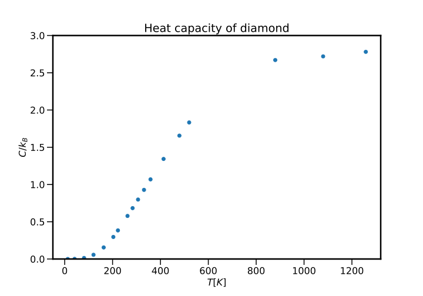
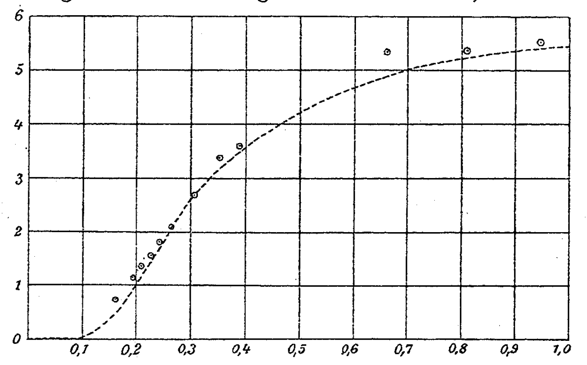
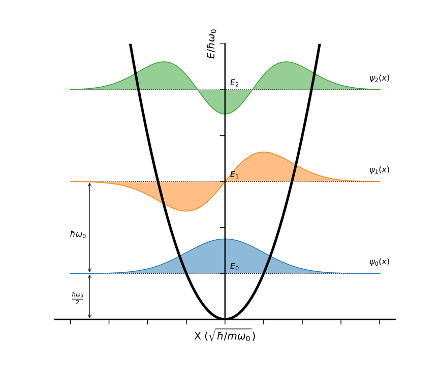

# The specific heat of solids I

## Introduction

We embark on our journey by starting at the nexus of the known and unknown, namely around the turn of the nineteenth and twentieth centuries, where the development of "modern" physics was being applied to systems which had hitherto be poorly understood. Now this is not to say that nothing was known about the systems, on the contrary: empirical laws had been used to great effect to describe the observable world, but with the increasing sophistication of experimental technique and apparatus, the cracks in certain rules started to appear.

!!! danger  "Expected competencies"

    It is assumed that you have familiarity with the following concepts/techniques:

    * Thermal physics: heat capacity
    * Quantum mechanics: energy spectrum of the harmonic oscillator
    * Statistical physics: the partition function, equipartition theorem

!!! info  "Text reference"
    The material covered here is discussed in section(s) $\S 2.1$ of [The Oxford Solid State Basics](https://global.oup.com/academic/product/the-oxford-solid-state-basics-9780199680771?cc=au&lang=en&)

---

## The Dulong–Petit law

Consider the heat capacity of a solid.

??? Question "1.1 Explain the concept of heat capacity in a manner understandable to someone _without_ a science background."

    The heat capacity is the a measure of how much heat, or how much energy transfer, is required to change the temperature of a material.

By measuring the heat capacity per weight, that is the _mass-specific heat capacity_, of a range of different elements, the two chemists Pierre Dulong and Alexis Petit observed the value was approximately constant when multiplied by the atomic weight of the element, stating that:

$$
c \times M = constant
$$

where $c$ is the specific heat capacity and $M$ is the molar mass of the material. More commonly, one will see the law expressed in terms of the heat capacity $C$ and number of moles $n$:

$$
C/n=\frac{\partial Q}{\partial T} = 3R
$$

where $R \approx 8.314~\mathrm{J K^{-1} mol^{-1}}$ is the ideal gas constant[^1]. In the physics context, it is much more common do talk about the number of atoms $N$, which transforms the above equation into the _Dulong-Peteit Law_:

$$
C/N= 3 k_\mathrm{B}
$$

But is this an accurate description? Let's have a look. Shown below is a plot of the heat capacity $C$[^2] (in units of $R$) as a function of atomic number:

<figure>
  
  <figcaption> Heat capacity of the elements at room temperature as sourced from the <a href='https://hbcp.chemnetbase.com/'>CRC handbook of chemistry of physics</a></figcaption>
</figure>

which is pretty incredible. But a natural question arises: why is this the case?

## The Boltzmann model of a solid

It was exactly the question of "why does the Dulong-Petit law seem to work?" that motivated Ludwig Boltzmann to use his novel - and at the time completely unaccepted - ideas, notably the existence of atoms and molecules and the mechanics that arises from statistically significant numbers of these atoms and molecules, to model unexplained systems.

The insight of Boltzmann was to consider a solid as a collection of constituent particles, but unlike gasses, these particles would be strongly interacting. Explicitly, the idea of atoms interacting with their nearest neighbours through an elastic spring-like potential - an _harmonic_ potential - would allow the system to be modelled with statistical mechanics. Like the case of a gas, energy can be stored in the system in the form of atomic motion, but unlike a gas, the motion of the atoms is constrained.  

<figure>
  
  <figcaption> A schematic of the atomic-scale model constructed by Boltzmann in an attempt to explain the Dulong-Petit law</a></figcaption>
</figure>

Whilst this may seem like a major leap forward, it is worth considering what the explaination for this behaviour had been prior to this proposal: _nothing_. Then, using the recently minted ideas such as the _equipartition theorem_, it was clear why the $C/N= 3 k_\mathrm{B}$. To see this, recall that for a *gas* in thermal equilibrium, we have

$$
C_V/N = f/2 k_\mathrm{B}
$$

where $f$ is the number of thermodynamic degrees of freedom, or stated another way: each degree of freedom contributes $k_\mathrm{B}/2$ to the heat capacity. Immediately, we can see that the Dulong–Petit law is of this form, but suggests that the number of DoF is six, i.e. twice that of an ideal monatomic gas.

??? Question "1.2 What is the difference between the heat capacities $C_V$ and $C_P$? What is the relationship between the two quantities, and what is the implication for the heat capacity of solids?"

    As the heat capacity of an object is defined through $\frac{\partial Q}{\partial T}$, one must consider the different thermodynamic processes (e.g. isochoric versus isobraic) as the heat supplied to the system will be different (e.g. $dQ = dU$ versus $dQ = dU + PdV$). It then follows that we define the _heat capacity at constant volume_ $C_V$ and the _heat capacity at constant pressure_ $C_P$.

    Linking the two quantities is Mayer's relation, which states that for an ideal gas:

    $$
    C_P - C_V = nR
    $$

    and more generally

    $$
    C_P - C_V = \frac{VT\alpha^2}{\beta}
    $$

    where $\alpha$ is the thermal expansion coefficient and $\beta$ is the isothermal compressibility. This should immediately point to the implication for solids: solids tend to be rather incompressible, which manifests in small values of $\alpha$ and $\beta$, and especially small values of $\alpha^2$, and a negligible difference between $C_P$ and $C_V$. Hence the usage of $C$!

    <figure>
      
      <figcaption> The thermal expansion coefficients of various elements, noting that $\beta$ is of order $10^{-6} \mathrm{m}^2 \mathrm{N}^{-1}$ for squishy things (e.g. soft clay) down to $10^{-10} \mathrm{m}^2 \mathrm{N}^{-1}$ for things that a not squishy (e.g. rocks)</figcaption>
    </figure>

Hopefully it not a mystery why there are additional degrees of freedom in a solid as compared to a monatomic gas: remember that Boltzmann's model of a solid is effectively a collection of harmonic oscillators, so not only could energy be stored in the motion of the motion of the constituent atoms, but also their position, storing energy in the "bonds" between atoms.

=== "Monatomic gas"

    The degrees of freedom for a monatomic gas are listed below:

    | Property    | Degrees of freedom        |
    | ----------- | -------------------       |
    | Momentum    | $p_x$, $p_y$, and $p_z$   |

    The 4 degrees of freedom each contribute $k_\mathrm{B}/2$ to the specific heat such that $C=3k_\mathrm{B}/2$.

=== "Diatomic gas"

    The degrees of freedom for a diatomic gas (at room temperature) are listed below:

    | Property    | Degrees of freedom        |
    | ----------- | -------------------       |
    | Momentum    | $p_x$, $p_y$, and $p_z$   |
    | Rotation    | Axial and end-over-end    |

    The 5 degrees of freedom each contribute $k_\mathrm{B}/2$ to the specific heat such that $C=5k_\mathrm{B}/2$.

=== "Solid"

    The degrees of freedom for a solid are listed below:

    | Property    | Degrees of freedom        |
    | ----------- | -------------------       |
    | Momentum    | $p_x$, $p_y$, and $p_z$   |
    | Position    | $x$, $y$, and $z$         |

    The 6 degrees of freedom each contribute $k_\mathrm{B}/2$ to the specific heat such that $C=3k_\mathrm{B}$.

This result stood as one of the great achievements of statistical mechanics at the time, as up to (and indeed past this point) it was still considered a fringe theory. So, what happened?

### Diamond is the worst


??? example "but also, diamond is remarkable"

    Whilst most people will be familiar with the cool properties of diamond, some things are best seen. For example, diamond is [often quoted](https://en.wikipedia.org/wiki/List_of_thermal_conductivities) as having the greatest thermal conductivity of any material, but what does that actually look like? Well, [take a look](https://www.youtube.com/watch?v=UZ-qKvtHDnM):

    <iframe width="560" height="315" src="https://www.youtube-nocookie.com/embed/UZ-qKvtHDnM" title="YouTube video player" frameborder="0" allow="accelerometer; autoplay; clipboard-write; encrypted-media; gyroscope; picture-in-picture" allowfullscreen class=center></iframe>

If one inspects the plot of heat capacities for the different elements, one can see that there are a few outliers, but it should be made clear that these measurements were taken at room temperature. Above room temperature, there is widespread agreement - even better than room temperature - but if one makes the same measurements at low temperatures, the Dulong-Petit law completely falls apart, with $C \rightarrow 0$ as $T \rightarrow 0$. And even at room temperature, some materials do not behave as expected, and in particular: diamond. At room temperature, diamond has a value of $C/R \approx 0.74$, which is much less than 3! The remarkable properties of diamond had long been known, and consequently any theory its salt had to explain why diamond was special. Shown below is a plot of the heat capacity of diamond versus temperature:

<figure>
  
  <figcaption> The heat capacity of diamond as a function of temperature. Data has been sourced from <a href='https://onlinelibrary.wiley.com/doi/10.1002/andp.200590013'>Einstein's original paper</a> of $T>230~\mathrm{K}$ and from <a href='https://www.tandfonline.com/doi/abs/10.1080/14786435808243223'>J. E. Desnoyehs & J. A. Morrison</a> for $T<230~\mathrm{K}$.</figcaption>
</figure>

Immediately one can notice:

  * $C$ is not a constant
  * Things are good at high temperature
  * Things are bad at low temperature

and Boltzmann's theory does not do anything to explain any of this.

## The Einstein model of a solid

It is perhaps unsurprising that a both difficult and well-known problem became the focus of attention for Einstein, someone who even at the very beginning of his career showed remarkable insight into physical systems, often reasoning from observations what must be going on, and constructing a theory to make it all work. Following his work on the photoelectric effect and Brownian motion, he was well placed to tackle the problem of the unexpected behaviour of heat capacity at low-temperatures.

### The model

Like Boltzmann's model, Einstein's model was based around atoms in an harmonic potential, but they key - and highly consequential - difference being that each atom is an identical potential, and that oscillation in said potential occurs at a frequency $\omega$, later dubbed the _Einstein frequency_. Basically, he took Boltzmann's model, injected quantum mechanics and asked: what will be the result. It is worth pausing to point out that this was done prior to quantum mechanics having been developed: Einstein's explanation of the photoelectric effect is widely heralded as the starting point of quantum, but it was not until roughly 20 years later that the Schrödinger equation was published! So this was a pretty wild assertion.

To see the implications, we can make use of our knowledge of statistical physics and the quantum harmonic oscillator: using the energy eigenstates of the system $E_n$, we can calculate the partition function $Z$, then the expectation value for the energy $\langle E \rangle$, and ultimately the heat cavity $C$.

??? Question "1.3 Beginning with the energy eigenstates of a single one-dimensional harmonic oscillator, show that the heat capacity for a single oscillator is $C = k_{\mathrm{B}}(\beta\hbar\omega)^2\frac{\exp(\beta\hbar\omega)}{(\exp(\beta\hbar\omega)-1)^2}$"

    In one dimension, the energy eigenstates $E_n$ of a single harmonic oscillator are given by:

    $$
    E_n = \hbar\omega(n+1/2)
    $$

    where $\omega$ is the frequency of the harmonic oscillator. The partition function is then given by:

    $$
    \begin{aligned}
    Z = & \sum_{n\ge0} \exp\left[-\beta\hbar\omega(n+1/2)\right] \\
    = & \frac{\exp(-\beta\hbar\omega/2)}{1-\exp(-\beta\hbar\omega)} = \frac{1}{2\sinh(\beta\hbar\omega/2)}
    \end{aligned}
    $$

    We can then compute the expectation value of the energy $\langle E \rangle$ via

    $$
    \begin{aligned}
    \langle E \rangle = -\frac{1}{Z}\frac{\partial Z}{\partial \beta} & = \frac{\hbar \omega}{2}\coth\left(\beta\hbar\omega/2\right) \\
    & = \hbar \omega \left(n_\mathrm{B}(\beta\hbar\omega) + 1/2\right)
    \end{aligned}
    $$

    where $n_\mathrm{B}$ is the Bose occupation factor, defined as

    $$
    n_\mathrm{B}(x) = \frac{1}{\exp(x)-1}
    $$

    It then straightforward to extract the heat capacity for a single oscillator through

    $$
    C = \frac{\partial \langle E \rangle}{\partial T} = k_{\mathrm{B}}(\beta\hbar\omega)^2\frac{\exp(\beta\hbar\omega)}{(\exp(\beta\hbar\omega)-1)^2}
    $$

The above result is stated for a one-dimensional harmonic oscillator, but to expend the system three dimensions we need to multiply this result by three[^3] which gives the final result

$$
C = 3k_{\mathrm{B}}(\beta\hbar\omega)^2\frac{\exp(\beta\hbar\omega)}{(\exp(\beta\hbar\omega)-1)^2}
$$


??? Question "1.4 Produce a plot the specific heat $C$ versus temperature for realistic values of $\omega$, providing your code."

    Code the produce the plot as requested in shown below, along with the output of said code. Note that  

    ``` python
    # Import all the goodies required for running code in this unit
    from ssp import *

    # Define a function to calculate the heat capacity
    def c_einstein(T, w):

        """
        Calculate the specific heat capacity according to the Einstein model of a solid

        Input:
        ---
        T: Temperature [K]
        w: Einstein frequency \omega [rad.s^-1]

        Returns:
        ---
        The heat capacity in units of k_B

        """

        x = (hbar * w)/(T * kb) # scale the variable
        return 3 * x**2 * np.exp(x) / (np.exp(x) - 1)**2 # compute the heat capacity

    # The range of temperatures over which the heat capity will be calculated
    # Note: overflow errors will occur is the x_min value is too small
    temp = np.linspace(10, 1000, 200)

    # The range of Einstein freqeuncies to be computed. For reference, diamond has \omega \approx 170
    w = np.linspace(20, 200, 5)

    # Create the plot instance
    fig, ax = plt.subplots()
    # Plot and label each frequency
    for f in w:
        ax.plot(temp, c_einstein(temp, f*1e12), label=f'$\omega={f:.0f}$ THz')

    # Make the plot readable
    ax.set_xlabel('$T [K]$')
    ax.set_ylabel(r'$C/k_B$');
    ax.set_title(r'The Einstein model of heat capacity')
    ax.legend()

    # Save the figure
    plt.savefig('01_Einstein_c.svg', facecolor='white', transparent=False)

    plt.show() # Show the plot
    ```

    <figure>
      
      <figcaption> A plot of the specific heat as computed from the Einstein model. Note that diamond has a an Einstein frequency of approximately $\omega = 170~\mathrm{Hz}$ </figcaption>
    </figure>

Looking at the from of $C$, it is clear:

  * In the high-temperature limit ($k_{\mathrm{B}} T/\hbar\omega \gg 1$) we recover the Dulong-Petit law
  * In the low-temperature limit, the heat capacity is exponentially small

But what is the physical interpretation of this behaviour? For higher temperatures ($k_{\mathrm{B}} T/\hbar\omega \gg 1$), the ability to store energy in harmonic motion is unencumbered, with a decrease in temperature, this ceases to be the case of these degrees of freedom are "frozen out". Once the temperature is sufficiently low  ($k_{\mathrm{B}} T/\hbar\omega < 1$), atoms are necessarily in the ground states of the harmonic oscillator; only with sufficient energy ($E = \hbar\omega$) can an atom be excited, and with a temperature much less than the energy level spacing, atoms are stuck and thus cannot absorb any energy. It is incredible that Einstein reasoned that this process must be occurring, which prompted him to describe the theory, essentially leading to him inventing the quantisation of energy levels.

### Coming up diamonds

Attempting to explain the heat capacity of diamond had proven the death knell of all theories up to this point, and so it is unsurprising that in [Einstein's original paper on the topic](https://onlinelibrary.wiley.com/doi/10.1002/andp.200590013) cantered around measurements of the heat capacity of diamond, which is shown below:

=== "Plot"

    <figure>
      
      <figcaption> A plot of the molar heat capacity of diamond as a function of temperature. The plot is somewhat diabolical in its omission of labels and units, which should read $k_\mathrm{B}T/\hbar\omega$ and $C~[\mathrm{cal}~\mathrm{K}^{-1}~\mathrm{mol}^{-1}]$ for the $x$ and $y$ axes respectively </figcaption>
    </figure>

=== "Data"

    <figure>
      
      <figcaption> The raw data used to produce the figure of the heat capacity of diamond </figcaption>
    </figure>

There are obviously a few discrepancies, but on the whole it looks _much_ better than the Boltzmann model and rightly was seen as a major triumph. But again, the question is why does this happen physically? What is it about diamond that makes is act so strangely?

<figure>
  
  <figcaption> An energy-level diagram for the quantum harmonic oscillator, showing the wavefunctions for the three lowest-energy eigenstates </figcaption>
</figure>

Well if we consider the energy spacing of the harmonic oscillator, $\hbar\omega$, it is related to both the mass ($m$) and the spring constant ($\kappa$) of the oscillator. For most materials, the Einstein frequency is such that $C/N \approx 3 k_\mathrm{B}$, but diamond has an especially low value of $\omega = \sqrt{\kappa/m}$, which perhaps is unsurprising given that carbon is light (low $m$) and diamond is incredibly hard (large $\kappa$).

---

## Conclusions

  1. The law of Dulong–Petit is an observation that all materials have $C \approx 3k_B$ per atom.
  2. The Einstein model describes each atom in a solid as an independent quantum harmonic oscillator with the same eigenfrequency $\omega_0$.
  4. At sufficiently low $T$, the thermal excitations freeze out, resulting in $\langle E \rangle = \hbar \omega_0/2$.
  5. The Einstein model correctly predicts that the heat capacity drops to 0 as $T\rightarrow 0$.

---

## Exercises

### Preliminary provocations

  1. What is the high-temperature heat capacity of an atom in a solid with two momentum and two spatial coordinate degrees of freedom?
  2. Sketch the Bose Einstein distribution as a function of $\omega$ for two different values of $T$

### Exercise 1: Total heat capacity of a diatomic material

One of the assumptions of the Einstein model states that every atom in a solid oscillates with the same frequency $\omega_0$. However, if the solid contains different types of atoms, it is unreasonable to assume that the atoms oscillate with the same frequency. One example of such a solid is a lithium crystal, which consists of the [two stable isotopes](https://en.wikipedia.org/wiki/Isotopes_of_lithium) $^6$Li (7.5%) and $^7$Li (92.5%) in their natural abundance. Let us extend the Einstein model to take into account the different masses of these different isotopes. Assume that the solid is 1D (1D quantum harmonic oscillator).

  1. Assume that the strength of the returning force $k$ experienced by each atom is the same. What is the difference in the oscillation frequencies of the two different isotopes in the lithium crystal?
  2. Write down the total energy stored in the vibrations of each atom of the lithium crystal, assuming that all $^6$Li atoms are in $n=2$ vibrational mode and all $^7$Li atoms are in $n=4$ vibrational mode.
  3. In the case where the oscilators can occupy any vibrational mode, write down the total energy stored in the vibrations of each atom in the lithium crystal at a temperature $T$ by modifying the Einstein model.
  4. Compute the heat capacity of the lithium crystal as a function of $T$.


[^1]: The exact value can be found on the [NIST database](https://physics.nist.gov/cgi-bin/cuu/Value?r)
[^2]: Data is collated in the _Heat Capacity of the Elements at 25 $^{\circ}$C_ as published in the [CRC handbook of chemistry of physics](https://hbcp.chemnetbase.com), but was sourced from [wikipedia](https://en.wikipedia.org/wiki/Heat_capacities_of_the_elements_(data_page))
[^3]: Verify this explicitly if it is not obvious: noting the result $ Z_{3D} = Z_{1D}^3$ is a key observation

--8<-- "includes/abbreviations.md"
