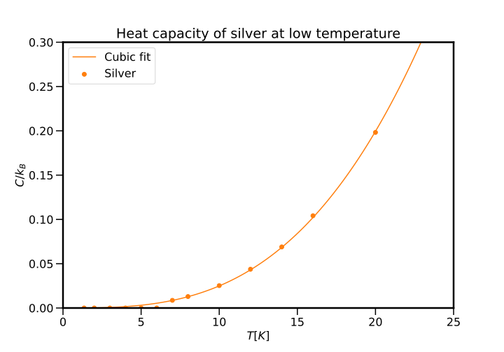
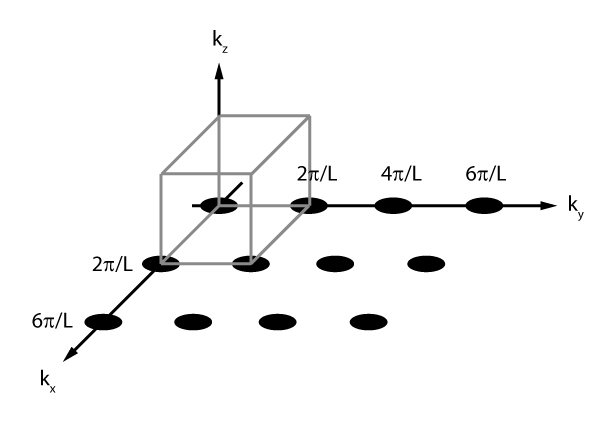

# The specific heat of solids II

## Introduction

Previously, we saw how an empirical observation describing the behaviour of the specific heat of solids motivated the development of atomic-scale models of solids in order to understand and predict their behaviour. This marked the beginning of using theories which involved the quantisation of certain observables to accurately predict previously unexplained behaviour, but as we shall see, one must continue down the rabbit hole of quantisation in order to better model physical systems.

!!! danger  "Expected competencies"

    It is assumed that you have familiarity with the following concepts/techniques:

    * Wave mechanics: acoustic waves in solids (sound)
    * Mathematics: periodic boundary conditions, spherical coordinates

!!! info  "Text reference"
    The material covered here is discussed in section(s) $\S 2.2$ of [The Oxford Solid State Basics](https://global.oup.com/academic/product/the-oxford-solid-state-basics-9780199680771?cc=au&lang=en&)

---

## Shortcomings of the Einstein model

The Einstein model did _much_ better than the Boltzmann model at explaining the behaviour of solids outside the regime of $k_{\mathrm{B}} T/\hbar\omega \gg 1$; however, it would turn out that the model routinely underpredicts the heat capacity as $T \rightarrow 0$. This can be seen in [Einstein's plot of diamond](../01specificheatI/#coming-up-diamonds), but also in other, better behaved materials. For example shown below is a plot of the heat capacity of silver (and diamond), along with a fit of the data using the Einstein model:

<figure>
  
  <figcaption> The heat capacity of silver and diamond as a function of temperature, with the data fitted to the Einstein model with fitting parameter $\omega$.</figcaption>
</figure>

Indeed, it was known that at low temperatures, the heat capacity displayed cubic behaviour, that is $C \propto T^3$.

??? question "Using the provided data !_Link the data_! for the heat capacity of silver, verify the cubic behaviour of the heat capacity at low temperatures. Ensure to include you code."

    ``` python
    # Import the data from the supplied .csv file
    data = pd.read_csv('Heat_capacity_Ag.csv')
    data = data[data['T']<25] # take only the low-termperature data

    # Define the function to fit (a cubic)
    def cubic(x, a):
        return a * x**3

    # The range of temperatures over which the fit capity will be calculated
    temp = np.linspace(0, 25, 100)

    fit = curve_fit(cubic, data['T'], data['C']) # perform the fit
    a_ag = fit[0][0] # extract the fit parameter

    # Make the plot
    fig, ax = plt.subplots()
    ax.scatter(data['T'], data['C'], label='Silver', color = 'C1')
    ax.plot(temp, cubic(temp, a_ag), label=f'Cubic fit', color = 'C1')
    ax.set_xlabel('$T$ [K]')
    ax.set_ylabel('$C/k_\mathrm{B}$')
    ax.set_ylim((0, .3))
    ax.set_xlim((0, 25))
    ax.set_title('Heat capacity of silver at low temperature');
    ax.legend()

    plt.savefig('02_heat_capacity_cubic.svg', facecolor='white', transparent=False)

    plt.show()
    ```

    <figure>
      
      <figcaption> The heat capacity of silver at low temperature, $T<25~\mathrm{K}$, follows well a cubic relationship in temperature.</figcaption>
    </figure>

??? question "How does $C$ predicted by the Einstein model behave at low $T$?"

    From the Einstein model, we have

    $$
    C = 3k_{\mathrm{B}}(\beta\hbar\omega)^2\frac{\exp(\beta\hbar\omega)}{(\exp(\beta\hbar\omega)-1)^2}
    $$

    which means that as $T \rightarrow 0$, $\beta \rightarrow \infty$ and thus $C \propto \beta^2/\exp(\beta\hbar\omega)$, which is exponentially small - and definitely not cubic!

## The Debye model

In the years following the development of Einstein's model, with more people delving into the world of quantised oscillators, people were grappling with the links to other areas of physics. A key insight of Peter Debye was that oscillators in a crystal cannot be thought of as isolated identical systems, but rather as a coupled network of oscillators: recognising that oscillations in solids gives rise to sound waves, these waves should be quantised in the same way that Max Plank had done previously for light.

??? info  "Sound wave refresher"

    A sound wave is a collective motion of atoms through a solid. The displacement $\mathbf{\delta r}$ of an atom at position $\mathbf{r}$ and time $t$  is described by

    $$
    \mathbf{\delta r} = \mathbf{\delta r}_0 e^{i(\mathbf{k} \cdot \mathbf{r}-\omega t)},
    $$

    where $\mathbf{\delta r}_0$ is the amplitude of the wave and $\mathbf{k} = (k_x, k_y, k_z)$ the _wave vector_.

    The wavelength $\lambda$ is related to the wavevector $\mathbf{k}$ though $\lambda = 2\pi/|\mathbf{k}|$.

    The wave depends on time only through the factor $e^{-i\omega t}$. Therefore these waves are _normal modes_: oscillations of a system in which all parts of the system oscillate with the same frequency and fixed phase relation.

    In addition to direction of the wave $k$, each sound wave has another degree of freedom: the direction in which the atoms themselves move or the wave *polarization*.

    Per wavevector $\mathbf{k}$ there are three modes in a 3D solid: two transverse (perpendicular to $\mathbf{k}$) and one longitudinal mode (parallel to $\mathbf{k}$).

    The space containing all possible values of $\mathbf{k}$ is called the _$k$-space_ (also named the _reciprocal space_).

Debye modelled the oscillation modes of a solid as waves with frequency $\omega$, which through the dispersion relation is related to the wavevector $k$, explicitly $\omega(\mathbf{k}) = v|\mathbf{k}|$ where $v$ is the speed of sound in the material. If we then construct a partition function and from this, compute the expectation value of the energy, we arrive at

$$
\langle E \rangle = 3 \sum_\mathbf{k} \hbar\omega(\mathbf{k}) \left( n_\mathrm{B}(\beta\hbar\omega(\mathbf{k}))+\frac{1}{2} \right)
$$

which is very similar to the equivalent expression from Einstein's treatment, other than the sum over wavevectors. It is also interesting to note that the oscillation modes also obey Bose statistics - we shall discuss this more later.

??? question "From Where does the factor of 3 in the above expression originate?"

    The factor 3 comes from the three possible normal modes of polarization for each wavevector $\mathbf{k}$.

To reiterate where we are and where we are going: instead of having $3N$ oscillators with the same frequency $\omega_0$, we now have $3N$ possible vibrational modes with frequencies depending on $\textbf{k}$ through the dispersion relation $\omega(\mathbf{k}) = v_s|\mathbf{k}|$. But the question is now, how do we evaluate the above expression? And there are a few natural questions that arise from what we have done thus far:

  * Don't normal modes depend on the material's shape. What impact does this have on the heat capacity?
  * Which values of $\mathbf{k}$ are possible? and if all $\mathbf{k}$ are possible, won't $E$ be infinite?

### Detour: periodic boundary conditions

It is expected that you will have seen periodic boundary conditions in various contexts, mostly likely in studies of differential equations of electromagnetism, but during this course we shall use them regularly. Importantly, we must first establish why we would impose periodic boundary conditions on a system which is not periodic: solids have boundaries! An intuition can be cultivated by considering that $C$ is a *macroscopic property*: it should not depend on the material's shape and should only be proportional to its volume. Therefore, we can consider making measurements of quantities of interest far from any boundary, and with this, we are free to choose the geometry of material and of course, we pick things that make our life easier!

Consider a box of dimension $L \times L \times L$, which then has volume $V = L^3$ with periodic boundary conditions. These conditions enforce that the atomic displacement $\mathbf{\delta r}$ is periodic inside the material. If we consider a translation by $L$ in the $x$-direction

$$
\mathbf{\delta r}(\mathbf{r} + L\mathbf{\hat{x}}) = \mathbf{\delta r}(\mathbf{r})
$$

and a wave in this sample $\delta \mathbf{r_0} e^{i(\mathbf{k}\cdot\mathbf{r}-\omega t)}$ must satisfy the above equation, implying

$$
\delta\mathbf{r_0} e^{i(\mathbf{k} \cdot \mathbf{r}+k_xL-\omega t)} = \mathbf{\delta r}_0 e^{i(\mathbf{k} \cdot \mathbf{r}-\omega t)}
$$

and ultimately

$$
e^{i k_x L} = e^{i 0} = 1.
$$

This then restricts the possible values of $k_x = n_x \frac{2 \pi}{L}$, for $n_x \in \mathbb{Z}$. Given the same condition holds for the $y$- and $z$-direction, the allowed values for $\mathbf{k}$ are given by

$$
\mathbf{k} = \frac{2\pi}{L}(n_x, n_y, n_z), \quad \{n_x, n_y, n_z\} \in \mathbb{Z}.
$$

A key observation here is that the imposition of periodic boundary conditions results in a discretisation of $k$-space, where the allowed values of $\mathbf{k}$ form a regular grid in $k$-space, and moreover, per volume $\left(\frac{2\pi}{L}\right)^3$ in $k$-space there is exactly one allowed $\mathbf{k}$.

<figure>
  
</figure>

In the standard way, if we are required to sum over all possible values of $\mathbf{k}$ and the volume of $L$ is sufficiently large - that is, the volume per allowed mode becomes smaller - we can replace the sum over $\mathbf{k}$ with an integral

$$
\sum_\mathbf{k}  \approx \frac{L^3}{(2\pi)^3}\int \textrm{d} \textbf{k}
$$

!!! tip "Integral over $k$-space"

    We shall use this result _very_ regularly. The conversion from a sum over the discrete grid of $k$-space states to a volume integral provides an effective way to count all the possible waves.

### The density of states

Armed with a shiny new tool (wrapping our sample into a hypertorus to make the maths nicer), we can return to evaluating the expectation value $\langle E \rangle$:

$$
\begin{aligned}
\langle E \rangle & = 3 \sum_\mathbf{k} \hbar\omega(\mathbf{k}) \left( n_\mathrm{B}(\beta\hbar\omega(\mathbf{k}))+\frac{1}{2} \right) \\
& = 3 \frac{L^3}{(2\pi)^3}\int \mathrm{d} \mathbf{k} \hbar\omega(\mathbf{k}) \left( n_\mathrm{B}(\beta\hbar\omega(\mathbf{k}))+\frac{1}{2} \right)
\end{aligned}
$$

Note that in the above expression, the integrand depends only on $\omega(\mathbf{k}) \propto |\mathbf{k}|$, and it is therefore natural to move to spherical coordinates, where the 3-dimensional integral can be collapsed to one dimension since:

$$
\int \mathrm{d} \mathbf{k} \rightarrow 4\pi\int_0^\infty k^2 \mathrm{d} \mathbf{k}
$$

??? info  "Spherical coordinate transformation"

    As a refresher, using the coordinate system defined by $x = r \sin(\theta)\cos(\varphi)$, $y = r \sin(\theta)\sin(\varphi)$, and $z = r\cos(\theta)$, the transformation of the integral can be performed via

    $$
    \int f(\mathbf{r}) \textrm{d} \textbf{r} \to \int\limits_0^{2\pi}\int\limits_0^{\pi} \int\limits_0^\infty f(r, \theta, \varphi) ~ r^2 \sin(\theta) \textrm{d}r \textrm{d}\theta \textrm{d}\varphi
    $$

Performing the change of variables, we obtain the expression for the total energy in spherical coordinates:

$$
\langle E \rangle = \int\limits_0^{\infty}\textrm{d} \omega ~ g(\omega) (\hbar\omega) \left(n_\mathrm{B}(\beta\hbar\omega) + \frac{1}{2} \right)
$$

where we have introduced $g(\omega)$, the density of states

$$
g(\omega) = L^3\left[\frac{12\pi\omega^2}{(2\pi)^3 v_s^3} \right] = n\left[\frac{12\pi\omega^2}{(2\pi)^3 n v_s^3} \right] = N \frac{9\omega^2}{\omega_d^3}
$$

and $\omega_d^3$ is the Debye frequency

$$
\omega_d^3 = 6\pi^2 n v_s^3
$$

The $(\hbar\omega) \left(n_\mathrm{B}(\beta\hbar\omega) + \frac{1}{2} \right)$ term describes the average energy of an oscillation with frequency $\omega$, and $g(\omega)$ describes the number of modes at the frequency $\omega$

!!! tip "The density of states"

    Technically, the density of states total is related to number of oscillation modes between frequencies $\omega$ and $\omega + \mathrm{d} \omega$ via $g(\omega)\mathrm{d} \omega$

It can be convenient to express the density of states in the form

$$
g(\omega) = 3 \left(\frac{L}{2\pi}\right)^3 \frac{4\pi \omega^2}{v_s^3}
$$

which allows for us to see $g(\omega)$ in terms of its constituent components:

  * $3$ comes from the number of possible polarizations in 3D (two transversal, one longitudinal).
  * $(\frac{L}{2\pi})^3$ is the density of $\textbf{k}$ points in $k$-space.
  * $4\pi$ is the area of a unit sphere.
  * $\omega^2$ is due to the area of a sphere in $k$-space being proportional to its squared radius $k^2$ and by having a linear dispersion relation $\omega = v_sk$.
  * $v_s^{-3}$ is from the linear dispersion relation $\omega = v_sk$.

So in our case, due to the spherical symmetry, $g(\omega)\textrm{d} \omega$ can be obtained by calculating the density of states of a volume element $dV = 4\pi k^2 dk$ in $k$-space and substituting the dispersion relation $\omega(k)$.

In terms of the calculation of $\langle E \rangle$, we multiply the number of modes $g(\omega)$ by the average energy of a single mode at a given frequency $\omega$ and integrate over all frequencies.

### Low-temperature behaviour

In order to calculate a value of $C$, we must compute $C = \partial \langle E \rangle/\partial T$, which means actually computing $\langle E \rangle$. From above we have

$$
\langle E \rangle = \int\limits_0^{\infty}\textrm{d} \omega ~ g(\omega) (\hbar\omega) \left(n_\mathrm{B}(\beta\hbar\omega) + \frac{1}{2} \right)
$$

which we are going to separate into two components:

$$
\begin{aligned}
\langle E \rangle & = \frac{9N\hbar}{\omega_d^3} \int\limits_0^{\infty}\textrm{d} \omega ~ \frac{\omega^3}{\exp(\beta\hbar\omega)-1} + \frac{9N\hbar}{\omega_d^3} \int\limits_0^{\infty}\textrm{d} \omega ~ \frac{\omega^3}{2} \\
& = \frac{9N\hbar}{\omega_d^3} \int\limits_0^{\infty}\textrm{d} \omega ~ \frac{\omega^3}{\exp(\beta\hbar\omega)-1} + \textrm{ something independent of } T
\end{aligned}
$$

The independent component is the _zero-point energy_ $E_{ZP}$ of the vibrational modes, which despite diverging towards infinity, does not contribute to $C$. One can then make the substitution $x =\beta\hbar\omega$ to transform the above equation into something a little more palatable:

$$
\langle E \rangle = \frac{9N\hbar}{\omega_d^3 (\beta\hbar)^4} \int\limits_0^{\infty}\mathrm{d} x ~ \frac{x^3}{\exp(x)-1} + E_{ZP}
$$

which evaluates to

$$
\langle E \rangle = 9N\frac{\left(k_\mathrm{B} T\right)^4}{(\hbar \omega_d)^3}\frac{\pi^4}{15} + E_{ZP}
$$

It should not be conspicuous that this result looks similar to Plank's result that $E \propto T^4$ for photons. The above result also yields the result that

$$
C = \frac{\partial \langle E\rangle}{\partial T} = N k_\mathrm{B} \frac{(k_\mathrm{B} T)}{(\hbar\omega_d)^3}\frac{12\pi^4}{5} \propto T^3
$$

which produces the desired $T^3$ dependence, but critically, and unlike the result of Einstein, does not have any free parameters rather only requiring knowledge material density and the sound velocity.

??? question  "What is the physical reason for the difference in the low-temperature behaviour of $C$ for the Einstein and Debye models?"

    In the Einstein model, once the temperature was below the energy associated with the oscillator, there was no capacity for the heat to absorb heat. In contrast, in the Debye model, there exist vibrational modes of the solid do have the capacity to absorb heat.

### Debye's interpolation (the duct-tape solution)

Debye successfully constructed a model which quantised the vibrational modes of solids to accurately predict the low-temperature behaviour of the heat capacity. Unfortunately, the model produces a $T^3$ dependence for all $T$, not just low temperature and thus does not recover the Dulong-Petit law at high temperature. Debye understood the problem arose from allowing an infinite number of modes, with an implication that there are more modes of oscillation than atoms in the system. The "quick fix" for this - which will be revisited with rigour later in the course - to ensure that there are only as many oscillation modes as there are degrees of freedom is to introduce a cutoff frequency $\omega_{\textrm{cutoff}}$ such that the total number of oscillation modes equates to the $3N$, the number of normal modes in an 3-dimension material. This manifests in the following way:

$$
3N = \int_0^{\omega_{\textrm{cutoff}}} \textrm{d} \omega ~ g(\omega)
$$

which leads to an altered expression for $\langle E \rangle$:

$$
\langle E \rangle = \int_0^{\omega_{\textrm{cutoff}}} \textrm{d} \omega ~ g(\omega)~\hbar\omega ~ n_{\textrm{B}}(\beta\hbar\omega) + E_{ZP}
$$

??? question "Verify that the expected high-temperature behaviour for $C$ is recovered when using Debye's interpolation"

    For high temperature:

    $$
    n_{\textrm{B}}(\beta\hbar\omega) = \frac{1}{\exp(\beta\hbar\omega)-1} \to \frac{k_{\textrm{B}}T}{\hbar\omega}
    $$

    which when put into the expression above (ignoring the zero-point energy)

    $$
    \langle E \rangle = k_{\textrm{B}}T \int_0^{\omega_{\textrm{cutoff}}} \textrm{d} \omega ~ g(\omega)
    $$

    which by design returns $3 k_{\textrm{B}} T N$, which is exactly the Dulong-Petit law.

??? question "Explicitly evaluate the cutoff frequency, and express the solution in terms of the Debye frequency"

    An educated guess would probably land you in the correct spot: given the arbitrary definition of the Debye frequency, it is likely that $\omega_{\textrm{cutoff}} = \omega_d$. Let's have a look:

    $$
    3N = \int_0^{\omega_{\textrm{cutoff}}} \textrm{d} \omega ~ g(\omega) = 9N \int_0^{\omega_{\textrm{cutoff}}} \textrm{d} \omega ~ \frac{\omega^2}{\omega_d^3} = 3N \frac{\omega_{\textrm{cutoff}}^3}{\omega_d^3}
    $$

    That is, $\omega_{\textrm{cutoff}} = \omega_d$.

The question that one must ask: was it worth it? Well, let's look at the Debye model applied to the silver data as shown at the beginning of this section:

<figure>
  
  <figcaption> The heat capacity of silver with fits to both the Einstein and Debye models of solids.</figcaption>
</figure>

---

## Conclusions

1. The Debye model assumes that atoms in materials move in a collective fashion, described by quantized normal modes with a dispersion relation $\omega = v_s|\mathbf{k}|$.
2. The phonon modes have a constant density of $(L/2\pi)^3$ in the reciprocal / $k$-space.
3. The total energy and heat capacity are obtained by integrating the contribution of the individual modes over $k$-space.
4. The density of states $g(\omega)$ is the number of states per frequency. With a dispersion relation $ω = v_s|\mathbf{k}|$, $g(\omega)$ is proportional to $\omega^2$ for a 3D bosonic system.
5. At low temperatures the phonon heat capacity is proportional to $T^3$.
6. Phonon modes only exist up until the Debye frequency $\omega_D$, after which there are no modes in the system.

---

## Exercises

### Preliminary provocations

1. Why are there only 3 polarizations when there are 6 degrees of freedom in three-dimensions for an oscillator?
2. Express the two-dimensional integral $\int\mathrm{d}k_x\mathrm{d}k_y$ in terms of polar coordinates.
You can assume rotational symmetry.
3. The Einstein model has a material-dependent frequency $\omega_0 = k_\mathrm{B} T_E/\hbar$ of the quantum harmonic oscillators as a free fitting parameter.
What is the material-dependent parameter that plays a similar role in the Debye model?
4. Derive an expression for the shortest possible wavelength in the Debye model it in terms of the interatomic distance $a$.
Hint: assume that the number of atoms is given by $N=V/a^3$. Discuss if the answer is reasonable.

### Exercise 1: Debye model: concepts

Consider the probability to find an atom of a 1D solid that originally had a position $x$ at a displacement $\delta x$ shown below:


  1. Describe which $k$-states are occupied. Explain your answer.

??? hint

    There are two $k$-states which contain a phonon.

  2. Describe the concept of $k$-space. What momenta are allowed in a 2D system with dimensions $L\times L$?
  3. Explain the concept of density of states.
  4. Calculate the phonon density of states $g(\omega)$ of a 3D, 2D and 1D solid with linear dispersion $\omega=v_s|\mathbf{k}|$.

###  Exercise 2: Debye model in 2D

1. State the assumptions of the Debye model.
2. Determine the energy of a two-dimensional solid as a function of $T$ using the Debye approximation.
You do not have to solve the integral.
3. Calculate the heat capacity in the high $T$ limit.
4. At low $T$, show that $C_V=KT^{n}$. Find $n$. Express $K$ as an indefinite integral (similarly to what done during the lecture)[^3].


###  Exercise 3: Different phonon modes
*(adapted from ex 2.6a of "The Oxford Solid State Basics" by S.Simon)*

During the lecture we derived the low-temperature heat capacity assuming that all the phonons have the same sound velocity $v$.
In reality the longitudinal and transverse modes have different sound velocities (see [Wikipedia](https://en.wikipedia.org/wiki/Sound#Longitudinal_and_transverse_waves) for an illustration of different sound wave types).

Assume that there are two types of excitations:

* One longitudinal mode with $\omega = v_\parallel |k|$
* Two transverse modes with $\omega = v_\bot |k|$

<!-- Separate a bullet list from enumeration; fixes a markdown rendering bug -->
1. Write down the total energy of phonons in this material *(hint: use the same reasoning as in the [Lithium exercise](../01specificheatI/#exercise-1-total-heat-capacity-of-a-diatomic-material))*.
2. Verify that at high $T$ you reproduce the Dulong-Petit law.
3. Compute the behavior of heat capacity at low $T$.

### Exercise 4: Anisotropic sound velocities
*(adapted from ex 2.6b of "The Oxford Solid State Basics" by S.Simon)*

Suppose now that the velocity is anisotropic ($v_x \neq v_y \neq v_z$) and $\omega = \sqrt{v_x^2 k_x^2 + v_y^2 k_y^2 + v_z^2 k_z^2}$. How does this change the Debye result for the heat capacity?

??? hint

    Write down the total energy as an integral over $k$, then change the integration variables so that the spherical symmetry of the integrand is restored.
