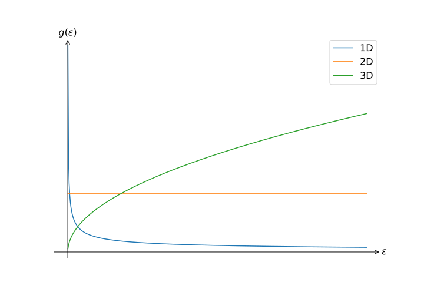

# Electrons in metals II

## Introduction

The kinetic theory of Drude was a great first step in trying to answer the question "metals, how do they work?", but it was clear from the outset that there were problems with the theory. But with the discovery of the Pauli exclusion principle, it seemed only logical that with the inclusion of _the_ fundamental property of the electrons, life would improve. Indeed it does...

!!! danger  "Expected competencies"

    It is assumed that you have familiarity with the following concepts/techniques:

    * Statistical mechanics: familiarity with Fermi-Dirac statistics
    * Quantum mechanics: Wavefunction of a free (unbound) electron

!!! note  "Text reference"
    The material covered here is discussed in section(s) $\S 4$ of [The Oxford Solid State Basics](https://global.oup.com/academic/product/the-oxford-solid-state-basics-9780199680771?cc=au&lang=en&)

!!! info "Computational content"

    The Jupyter notebook associated with this section can be accessed by clicking the icon below:
    [<i class="fab fa-python fa-5x"></i>](https://jove2021.cloud.edu.au/hub/user-redirect/git-pull?repo=https%3A%2F%2Fgithub.com%2FAndy-UTAS%2FSolid-state&urlpath=tree%2FSolid-state%2F04metalsII.ipynb&branch=master){ .md-button .md-button--primary class="text-center" style="margin-left: 45%"}

---

## The free electron model

### Fermi statistics

In studying the [Debye model](02specificheatII.md), we saw the properties and physical behavior which arise from considering modes of oscillation in a material. The model we look at there, the *Sommerfeld* model, applies the same conceptual approach to electrons in metals. Sommerfeld considered the electrons as _free particles_ that are not interacting with atomic nuclei, which is why the model is also called the *free electron model*.

Similar to the Debye model, we consider a cubic box of size $L \times L \times L$ with periodic boundary conditions. The solutions to the Schrödinger equation of a free particle are plane waves:

$$
\psi \propto \exp(i\mathbf{k} \cdot \mathbf{r}),
$$

where $\mathbf{k}$ is the electron wave vector. Because we impose periodic boundary conditions, $\mathbf{k}$ must take discrete values $\frac{2\pi}{L} (n_x, n_y, n_z)$. The plane waves have eigenenergies given by the dispersion relation

$$
\varepsilon(\mathbf{k}) = \frac{\hbar^2 \mathbf{k}^2}{2m},
$$

with $m$ being the mass of the electron. Let us plot $\varepsilon(k)$ as a function of $k$ for a 1D system:

<figure>
  
  <figcaption> A plot of the energy $\varepsilon$ as a function of $k$, where black dot represent possible electron states </figcaption>
</figure>

In is worth highlighting the differences between the modes of oscillation in a solid we have considered previously, and the states of electrons which we now consider: electrons have a quadratic dispersion dispersion relation, and critically, electrons obey fermionic statistics. Conseqeuntly, the occupation of electron states is described by the Fermi-Dirac distribution

$$
n_{F}(\beta(\varepsilon-\mu)) = \frac{1}{e^{\beta(\varepsilon-\mu)}+1}
$$

where $\beta = 1/k_{\textrm{B}} T$, $\varepsilon$ is the energy, and $\mu$ the _chemical potential_ of an electron. The Fermi-Dirac distribution defines the number of electrons in the system:

$$
\begin{align}
N &= 2 \sum_{\mathbf{k}} n_{F}(\beta(\varepsilon-\mu))\\
&= 2 \frac{V}{(2 \pi)^3} \int \mathrm{d} \mathbf{k} ~ n_{F}(\beta(\varepsilon(\mathbf{k})-\mu)).
\end{align}
$$

Where we have again replaced a discrete sum over $k$ with a volume integral.

??? question "From where does the factor of 2 come from in the above equation? Contrast this to the Debye model."

    The factor $2$ accounts for the spin degeneracy, whereas in the Debye model we had a factor of 3 to account for the distinct polarisations. To keep track of the origin of this term we will denote the spin degeneracy as $2_s$.

In the same way that we compute the number of electrons, we can compute the total energy of the electrons via

$$
E = 2_s \frac{V}{(2 \pi)^3} \int \mathrm{d} \mathbf{k} ~ \varepsilon(\mathbf{k}) n_{F}(\beta(\varepsilon(\mathbf{k})-\mu)) .
$$

To cement the differences between Debye theory and Sommerfeld theory, different parameters are listed below:

|   | Crystal oscillations | Electrons |
| - | - | - |
| Dispersion relation | $\omega = v_s \lvert\mathbf{k}\rvert$ | $\varepsilon = \frac{\hbar^2\mathbf{k}^2}{2m}$ |
| Statistics | Bose-Einstein | Fermi-Dirac |
| $n(\varepsilon) =$ | $1/(e^{\beta \varepsilon} - 1)$ | $1/(e^{\beta(\varepsilon - \mu)} + 1)$ |
| Degeneracy per $\mathbf{k}$ | 3 (polarization) | 2 (spin) |
| Total particle number | temperature-dependent | constant |

Note that the last element is important: in the case of oscillations within a material, warming said material creates more more oscillations. In contrast, the number of electrons stays generally remains the same.

### The Fermi sea

To determine the chemical potential $\mu$ let us consider a 2D system with zero temperature and a finite number of electrons. At $T=0$, the Fermi-Dirac distribution is step function

$$
n_{F}(\beta(\varepsilon-\mu)) = \Theta(-(\varepsilon-\varepsilon_F)).
$$

The chemical potential at $T=0$ is called the _Fermi energy_ $\varepsilon_F$ and in this scenario, all electronic states with lower energies are occupied and all the states with higher energies are empty. In the reciprocal space, the occupied $\mathbf{k}$-states form a circle (in 1D it is a line and in 3D a sphere).

<figure>
  
  <figcaption> Reciprical space in two dimensions at $T=0$: states within the circle are occuplied and those outside are not </figcaption>
</figure>

A all-pervasive metaphor for describing this state of many electrons is the idea of the _Fermi sea_: electrons occupy a finite area in reciprocal space, starting from the "deepest" points with the lowest energy all the way up to the chemical potential. The border of the Fermi sea is called the _Fermi surface_, and in the free electron model it is a sphere with the radius equal to the _Fermi wave vector_.

??? bug  "Can you identify the pattern in the nomencalture of important concepts?"

    Pick an object or concept x, and name it _the Fermi_ x.

In an attempt to clarify the relationship between these concepts, let us take a look at the dispersion relation in 1D:

<figure>
  
  <figcaption> The dispersion relation for electrons in one dimension </figcaption>
</figure>

By using the dispersion relation, we arrive to the relation
$$
\varepsilon_F = \frac{\hbar^2 \mathbf{k}_F^2}{2m}.
$$

The Fermi wavevector $\mathbf{k}_F$ also defines the _Fermi momentum_ $\mathbf{p}_F = \hbar \mathbf{k}_F$ and the _Fermi velocity_:

$$
\mathbf{v}_F = \frac{\mathbf{p}_F}{m} = \frac{\hbar \mathbf{k}_F}{m}.
$$

??? question "The Fermi energy of copper is ~7 eV. What is the corresponding Fermi velocity?"

    The Fermi velocity $v_F\approx$ 1700 km/s or 0.3% of the speed of light!

## Heat capacity

### Density of states

As were have done previously, we want to compute the heat capacity, and to do this, we need to find the density of states: the number of states per energy interval. We have expression for both the number $N$ and the energy $E$ from [above](04emetalsII/#fermi-statistics):

$$
\begin{aligned}
N & = 2_s \frac{V}{(2 \pi)^3} \int \mathrm{d} \mathbf{k} ~ n_{F}(\beta(\varepsilon-\mu)) \\
E & = 2_s \frac{V}{(2 \pi)^3} \int \mathrm{d} \mathbf{k} ~ \varepsilon(\mathbf{k}) n_{F}(\beta(\varepsilon-\mu))
\end{aligned}
$$

which we seek to evaluate. Using the same tricks as last time, we move to spherical coordinates to reduce the inegral over three dimension to an intergral over one dimension, we can arrive at the expressions

$$
\begin{aligned}
N & = 2_s \frac{V}{(2 \pi)^3} \int_0^\infty \mathrm{d} k ~ 4\pi k^2 ~ n_{F}(\beta(\varepsilon(k)-\mu)) \\
E & = 2_s \frac{V}{(2 \pi)^3} \int_0^\infty \mathrm{d} k ~ 4\pi k^2 ~ \varepsilon(k) ~ n_{F}(\beta(\varepsilon(k)-\mu))
\end{aligned}
$$

We rewrite the expression above by substituting $k=\sqrt{2m\varepsilon/\hbar^2}$ and $\mathrm{d}k=\sqrt{m/2\varepsilon\hbar^2} d\varepsilon$:

$$
\begin{aligned}
N & = V \int_0^\infty \mathrm{d} \varepsilon ~ g(\varepsilon) ~ n_{F}(\beta(\varepsilon-\mu)) \\
E & = V \int_0^\infty \mathrm{d} \varepsilon ~ \varepsilon ~ g(\varepsilon) ~ n_{F}(\beta(\varepsilon-\mu))
\end{aligned}
$$

where _the density of states per unit volume_ is given by

$$
\begin{aligned}
g(\varepsilon) \mathrm{d} \varepsilon & = \frac{2}{(2\pi)^3} 4 \pi k^2 \mathrm{d} k \\
& = \frac{(2m)^{3/2}}{2 \pi^2 \hbar^3} \varepsilon^{1/2} \mathrm{d} \varepsilon
\end{aligned}
$$

and quantifies the number of energy eigenstates between $\varepsilon$ and $\varepsilon + \mathrm{d} \varepsilon$. This expression can be more cleanly written as

$$
g(\varepsilon) \mathrm{d} \varepsilon = \frac{3n}{2\varepsilon_F}\left(\frac{\varepsilon}{\varepsilon_F}\right)^{1/2}
$$

??? question  "Verify the above expression. A good starting point would be to find a value for the number of electrons inside the sphere defined by $k_F$ for $T=0$"

    _Do the maths_, integral of the Heaviside just means intergral is the volume of a sphere.

We observe that the density of states of a 3D solid is proportional to a square root of energy:
$$
g(\varepsilon) \mathrm{d} \varepsilon \propto\sqrt{\varepsilon}
$$

Repeating the similar derivations, we find the density of states of 1D and 2D systems:

  * 1D: $g(\varepsilon) = \frac{2 L}{\pi} \frac{ \mathrm{d}k}{ \mathrm{d}\varepsilon} \propto 1/\sqrt{\varepsilon}$
  * 2D: $g(\varepsilon) = \frac{k L^2}{\pi} \frac{ \mathrm{d}k}{ \mathrm{d}\varepsilon} \propto \text{constant}$

which we can plot for a comparison of the behaviour of the system with different dimensionalities:

### Crank the handle

Given we have an expression for $E$, we can set about computing the heat capacity.

!!! failure "Sommerfeld expansion"

    To explicitly calculate the heat capacity is a lot of work, and is the definition of a mathematical persuit with little reward. With a bit of hand waving, we can arrive at the same point, so that is what we are going to do. Some will think this lazy, and by all means, feel free to pursue the full calcuation - the [Sommerfeld expansion](https://en.wikipedia.org/wiki/Sommerfeld_expansion) may be of use.

To effectively hand wave, let us begin by taking a closer look at the Fermi-Dirac distribution

$$
n_{F}(\beta(\varepsilon-\mu)) = \frac{1}{e^{\beta(\varepsilon-\mu)}+1}
$$

which is plotted below for $T = 0$ and $T > 0$ with the same chemical potential $\mu = \varepsilon_F$.

<figure>
  
  <figcaption> The Fermi-Dirac distribution at both $T = 0$ and $T > 0$ with the same chemical potential  </figcaption>
</figure>

With a finite temperature $T>0$, thermal excitations _smear out_ the sharp change in the number of occupied electrons near $\varepsilon_F$. Because the Fermi energy is typically in the range of electronvolts, the temperature of $\sim 10 000 ~\mathrm{K}$ would be required in order for thermal excitations to give an electron a similar amount of energy! Therefore at room temperature $T = 300~\mathrm{K}$ the electron distribution over energies is very similar to that at $T=0$.

Below we compare the number of occupied electron states at each energy $g(\varepsilon) n_{F}(\beta(\varepsilon-\mu))$ at $T = 0$ (blue shaded area) with $T > 0$ (orange shaded area).

In order to estimate the electron energy increase, we approximate difference between the blue and orange areas by triangles, as shown in the figure.
This approximation is appropriate because the thermal smearing happens at the energies $E ∼ k_B T$, and it is much smaller than the Fermi energy $\varepsilon_{F}$.

At a finite temperature, the electrons occupying the top triangle (blue) are thermally excited to occupy the bottom triangle (orange). The base of the triangle is proportional to $k_\mathrm{B}T$ and the height is $\sim g(\varepsilon_F)$. Hence the number of excited electrons is $N_\mathrm{exc} \approx g(\varepsilon_F)k_BT$ (neglecting constants not depending on $\varepsilon_{F}$).

These electrons gain $k_BT$ of thermal energy, such that the total extra energy is
$$
\begin{align}
E(T) &= E(T = 0) + N_\mathrm{exc}k_BT\\
&\approx  E(T = 0) + g(\varepsilon_F)k_B^2T^2.
\end{align}
$$
Therefore, the electron heat capacity $C_e$ is
$$
\begin{align}
C_e &= \frac{ \mathrm{d}E}{ \mathrm{d}T}\\
 &\approx 2 g(ε_F)k_B^2T\\
 &\overset{\mathrm{3D}}{=} 3 Nk_B\frac{T}{T_F}\\
 &\propto T,
\end{align}
$$
where we used $N=\frac{2}{3}\varepsilon_Fg(\varepsilon_F)$ and defined the _Fermi temperature_ $T_F \equiv \varepsilon_F/k_B$.

So what does all of this mean? Well, our algebraic journey has left us with a heat capacity that is _linear_ in $T$, which to contrast to the model of Debye, had dependence on $T^3$, which fitted the measurements pretty well. Does this mean that we have made things worse? Well let's look closely:

<figure>
  
  <figcaption> The heat capacity of Silver divided by temperature versus the square of the temperature as taken from <a href='https://journals.aps.org/pr/abstract/10.1103/PhysRev.98.1699'> Atomic Heats of Copper, Silver, and Gold from 1°K to 5°K </a> </figcaption>
</figure>

??? question  "What is the expected behaviour of the plot above as predicted by the Debye model and the Sommerfeld model?"

    We now have two contributions to the heat capacity $C_{\textrm{Sommerfeld}} = \gamma T$ and $C_{\textrm{Debye}} = \alpha T^3$, which should manifest as

    $$
    C = \gamma T + \alpha T^3.
    $$

    In the plot above, if we plot $C/T$, any offest at $T=0$ is indicative of free-electron behaviour, which we indeed observe. It is worth noting that

      * At room temperature $C_{\textrm{Debye}}\approx 3Nk_B\gg C_{\textrm{Sommerfeld}} \propto k_B T / T_F$, because $T \ll T_F$.
      * Near $T=0$, the heat capacity due to ocillations $C_{\textrm{Debye}} \propto k_B (T/T_D)^3$, which becomes smaller than the electron heat capacity at $T \lesssim \sqrt{T_D^3/T_F}$

### The scaling of $C$

The behavior of contribution to $C$ from the free-electron component at low temperature can be intuited via particles within an energy range of $\sim k_{B}T$ to the Fermi energy $\varepsilon_F$ become thermally excited, and each carries an extra energy $k_{B}T$:

$$
N_\mathrm{exc} \approx g(\varepsilon_F)k_BT \\
E \sim N_\mathrm{exc} k_\mathrm{B} T
$$

#### Example 1: 3D free electrons

In 3D, $g(\varepsilon_F)$ is roughly constant.
Thus the total energy obtained through thermal excitation is proportional to $T \times \left( T\times g(\varepsilon_F) \right)$, from which it follows that $C_e \propto T$.

#### Example 2: graphene

Graphene has a Fermi energy $\varepsilon_F = 0$ and a density of states $g(\varepsilon) \propto \varepsilon$.
Therefore, within the energy range of $k_BT$, $g(\varepsilon) \propto k_BT$.
Thus the total energy is proportional to $T \times T^2$ and the heat capacity $C_e \propto T^2$.

---

## Conclusions

  1. The Sommerfeld free-electron model treats electrons as free particles with energy dispersion $\varepsilon = \frac{\hbar^2k^2}{2m}$.
  3. The Fermi-Dirac distribution gives the probability of an electron state to be occupied.
  4. The electron contribution to the heat capacity is proportional to $T$. It is much lower than the heat capacity due to oscillations at high temperatures, and much higher at low temperatures.
  5. The scaling of heat capacity with $T$ can be quickly estimated by estimating the number of particles in an energy range $k_\mathrm{B}T$ from the Fermi energy.

---

## Exercises

### Preliminary provocations

  1. Write down the expression for the total energy of particles with the density of states $g(\varepsilon)$ and the occupation number $n_{F}(\beta(\varepsilon - \mu))$.
  2. Explain what happens if a material is heated up to its Fermi temperature (assuming that material where this is possible exists).
  3. Why can we not use the Sommerfeld expansion with a Fermi energy of the order of the thermal energy?
  4. Is the heat capacity of a solid at temperatures near $T=0$ dominated by electrons or vibrations?

### Exercise 1: potassium

The Sommerfeld model provides a good description of free electrons in alkali metals such as potassium (element K), which has a Fermi energy of $\varepsilon_{F} =  2.12$ eV (data from Ashcroft, N. W. and Mermin, N. D., Solid State Physics, Saunders, 1976.).

1. Check the [Fermi surface database](http://www.phys.ufl.edu/fermisurface/). Explain why potassium and (most) other alkali metals can be described well with the Sommerfeld model.
2. Calculate the Fermi temperature, Fermi wave vector and Fermi velocity for potassium.
3. Why is the Fermi temperature much higher than room temperature?
4. Calculate the free electron density $n$ in potassium.
5. Compare this with the actual electron density of potassium, which can be calculated by using the density, atomic mass and atomic number of potassium. What can you conclude from this?

### Exercise 2: a hypothetical material
A hypothetical metal has a Fermi energy $\varepsilon_F = 5.2 \, \mathrm{eV}$ and a density of states $g(\varepsilon) =  2 \times 10^{10} \, \mathrm{eV}^{-\frac{3}{2}} \sqrt{\varepsilon}$.

1. Give an integral expression for the total energy of the electrons in this hypothetical material in terms of the density of states $g(\varepsilon)$, the temperature $T$ and the chemical potential $\mu = \varepsilon_F$.
2. Find the ground state energy at $T = 0$.
3. In order to obtain a good approximation of the integral for non-zero $T$, one can make use of the [Sommerfeld expansion](https://en.wikipedia.org/wiki/Sommerfeld_expansion) (the first equation is all you need and you can neglect the $O\left(\frac{1}{\beta \mu}\right)^{4}$ term).
Using this expansion, find the difference between the total energy of the electrons for $T = 1000 \, \mathrm{K}$ with that of the ground state.
4. Now, find this difference in energy by calculating the integral found in 1 numerically. Compare your result with 3.

	??? hint
		 You can do numerical integration in python with [`scipy.integrate.quad(func, xmin, xmax)`](https://docs.scipy.org/doc/scipy/reference/generated/scipy.integrate.quad.html)

5. Calculate the heat capacity for $T = 1000 \, \mathrm{K}$ in eV/K.
6. Numerically compute the heat capacity by approximating the derivative of energy difference found in 4 with respect to $T$. To this end, make use of the fact that $$\frac{dy}{dx}=\lim_{\Delta x \to 0} \frac{y(x + \Delta x) - y(x - \Delta x)}{2 \Delta x}.$$ Compare your result with 5.

### Exercise 3: graphene
One of the most famous recently discovered materials is [graphene](https://en.wikipedia.org/wiki/Graphene). It consists of carbon atoms arranged in a 2D honeycomb structure.
In this exercise, we will focus on the electrons in bulk graphene. Unlike in metals, electrons in graphene cannot be treated as 'free'.
However, close to the Fermi level, the dispersion relation can be approximated by a linear relation:
$ \varepsilon(\mathbf{k}) = \pm c|\mathbf{k}|.$ Note that the $\pm$ here means that there are two energy levels at a specified $\mathbf{k}$.
The Fermi level is set at $\varepsilon_F = 0$.

1. Make a sketch of the dispersion relation.
What other well-known particles have a linear dispersion relation?
2. Using the dispersion relation and assuming periodic boundary conditions, derive an expression for the density of states of graphene.
Do not forget spin degeneracy, and take into account that graphene has an additional two-fold 'valley degeneracy' (hence there is a total of a fourfold degeneracy instead of two).
Your result should be linear with $|\varepsilon|$.

	??? hint
		 It is convenient to first start by only considering the positive energy contributions $\varepsilon(\mathbf{k}) = + c|\mathbf{k}|$ and calculate the density of states for it. Then account for the negative energy contributions $\varepsilon(\mathbf{k}) = - c|\mathbf{k}|$ by adding it to the density of states for the positive energies. You can also make use of $\frac{\rm{d} |k|}{\rm{d}k} = \frac{k}{|k|}$.

3. At finite temperatures, assume that electrons close to the Fermi level (i.e. not more than $k_B T$ below the Fermi level) will get thermally excited, thereby increasing their energy by $k_B T$. Calculate the difference between the energy of the thermally excited state and that of the ground state $E(T)-E_0$. To do so, show first that the number of electrons that will get excited is given by $$n_{ex} = \frac{1}{2} g(-k_B T) k_B T.$$
4. Calculate the heat capacity $C_e$ as a function of the temperature $T$.

--8<-- "includes/abbreviations.md"
