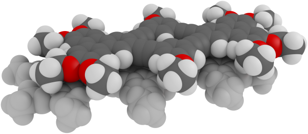
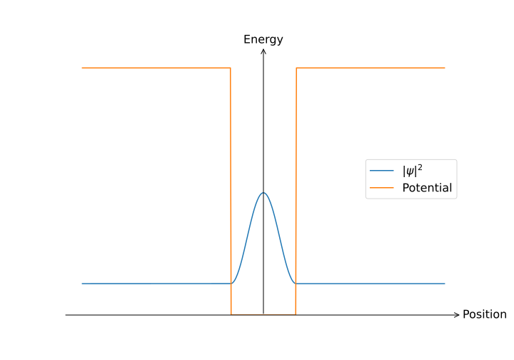

# Chemisty 101

Also known as _the physicist's guide to chemistry_[^1].

## Introduction

<figure>
  
</figure>

Our journey thus far has been considering the basic properties of solids, and our descriptions have been based around the properties of electrons and vibrations in solids, which can provide useful results but our endeavour is much grander: we would like to explain all the properties of all the solids. The first step on this journey is to no longer consider a collection of free electrons; solids are made up of many atoms, so we best find a way of baking this into whatever we do!

!!! danger  "Expected competencies"

    It is assumed that you have familiarity with the following concepts/techniques:

    * Quantum mechanics: the Schrödinger equation, wavefunction of the hydrogen atom, wavefunction for a particle in a box, Dirac notation   
    * Mathematics: the variational principle, linear algebra

!!! note  "Text reference"
    The material covered here is discussed in section(s) $\S 5, 6.3$ of [The Oxford Solid State Basics](https://global.oup.com/academic/product/the-oxford-solid-state-basics-9780199680771?cc=au&lang=en&)

!!! info "Computational content"

    The Jupyter notebook associated with this section can be accessed by clicking the icon below:
    [<i class="fab fa-python fa-5x"></i>](https://jove2021.cloud.edu.au/hub/user-redirect/git-pull?repo=https%3A%2F%2Fgithub.com%2FAndy-UTAS%2FSolid-state&urlpath=tree%2FSolid-state%2F05chemistry101.ipynb&branch=master){ .md-button .md-button--primary class="text-center" style="margin-left: 45%"}

---

### A retrospective

Up to this point, we have:

  * Introduced reciprocal ($k$-space)
  * Postulated the dispersion relations for free electrons and oscillations in a solid
  * Calculated the heat capacity of free electrons and oscillations in a solid

which has permitted

  * The understanding of how materials can store heat via oscillations (Debye model)
  * The understanding of how free electrons conduct (Drude model) and store heat/energy (Sommerfeld model)

In constructing these models, we have made several approximations and postulations, and there are a few big questions to answer:

  * In the Debye model, why is there a cutoff frequency for oscillations? Why are there no modes of oscillation beyond this frequency?
  * In the Drude model, we have electrons modelled as a gas, but why don't electrons scatter from the atoms in solid?
  * Why are some materials metallic, and others not metallic?

If we are to have a hope of understanding any of the above, we are going to have to understand better what is happening on the atomic scale.

## Atoms, how do they work?

It is no exaggeration to say that everything can be pretty-well described by the Schrödinger equation:

$$
\hat{H}\psi = E\psi,
$$

with $\hat{H}$ the Hamiltonian of the system, that is, the sum of kinetic and potential energies. For the hydrogen atom, the potential is due to the Coulomb interaction between the electron and the nucleus:

$$
H=-\frac{\hbar^2}{2m}\frac{\partial^2}{\partial {\mathbf r^2}} - \frac{e^2}{4\pi\varepsilon_0|r|}
$$

which you will have solved in detail elsewhere. If we move to the next-most-simple atom, helium, the Hamiltonian immediately becomes more complex,
containing not just the Coulomb interaction between the individual electrons and the nuclei, but also Coulomb repulsion between the two electrons:

$$
H=-\frac{\hbar^2}{2m}\frac{\partial^2}{\partial {\mathbf r_1^2}} -\frac{\hbar^2}{2m}\frac{\partial^2}{\partial {\mathbf r_2^2}}- \frac{2e^2}{4\pi\varepsilon_0|r_1|} - \frac{2e^2}{4\pi\varepsilon_0|r_2|} + \frac{e^2}{4\pi\varepsilon_0|r_1 - r_2|}.
$$

From a purely mathematical point of view, this means we need find eigenvalues and eigenvectors of a six-dimensional PDE, which is much tougher work than the three-dimensional PDE descirbing hydrogen. You have likely seen the variational method to construct appoximate wavefunctions, any even in this case it is a fair amount of work.

Let us now turn to another system, a single copper atom. Copper has 29 electrons, so to find the energy spectrum of copper we would need to solve an 87-dimensional Schrödinger equation. Such things are totally intractable: there is simply no way to solve such a thing, even with _really_ big computers. It is this growth in complexity with the number of interacting quantum particles is why *many-body quantum physics* is very much an active research area in solid-state physics and quantum chemistry. But we need not have an analytic solution for everything in order to be satisfied, on the contrary, we can use physical insight and approximations to construct models of complex systems based on simpler, easier to handle systems.

To some extent, this is exactly where chemisty takes over: it is often said that Chemisty is applied physics, but they should simply be thought of as the same thing, but with a focus on different parts of the spectrum: the complexity of solving problems in chemistry is the reason why we need to accept empirical observations as *chemical laws*, even though they work with limited precision and ultimately consequences of the underlying physics as modelled by the Schrödinger equation.

### Quantum numbers and shell filling

The wavefunction for an electron in a hydrogen atom is described by the state $|n, l, m_l, m_s\rangle$, where the quantum numbers are:

  * $n = 1, 2, \ldots$ is the principal (azimuthal) quantum number
  * $l = 0, 1, \ldots, n-1$ is the _orbital_ angular momentum (also known as $s, p, d, f$ orbitals)
  * $m_l = -l, -l+1 \ldots, l$ is the $z$-component of angular momentum $l$
  * $m_s$ is the $z$-component of the electronic spin

The low energy states of hydrogen are shown below:

<figure>
  
  <figcaption> Electronic wavefunctions for the low-energy states of Hydrogen. Image source: <a href="https://commons.wikimedia.org/wiki/File:Atomic_orbitals_n123_m-eigenstates.png#/media/File:Atomic_orbitals_n123_m-eigenstates.png">Wikipedia</a> © Geek3 CC-BY-SA </figcaption>
</figure>

To a first approximation, the electronic wavefunctions in other atoms are similar to those of hydrogen; however, the electron energies are very different due to the Coulomb interaction, both between other electrons and the ionic core. Even still, knowledge of the hydrogenic wavefunctions can greatly aid our description of other atoms.

If one considers an atom with multiple electrons, as we "add" electrons to a given system - for example, if one considers a sequence of elements - it is important to determine the order in which electronic states will be filled. Two empirical rules which can do an excellent job of describing this order are:

  * _Aufbau principle_: electrons fill the lowest-lying states first and fill these shells to completion
  * _Madelung's rule_: electrons first occupy shells with the lowest $n+l$. If there are several orbitals with equal $n+l$, electrons preferentially occupy those with smaller $n$

Combining the two rules, we obtain the shell filing order: 1s, 2s, 2p, 3s, 3p, 4s, 3d, etc., which is illustrated in the periodic table below:

While these rules accurately predict the electronic structure of most elements, they are only approximate, and fail to describe some of the [heavier elements](https://en.wikipedia.org/wiki/Aufbau_principle#Exceptions_in_the_d-block).

The reason we care about the order in which shells are filled is because as we have seen, the valence electrons, that is, those in the outermost shell dominate the elements properties, including underpinning chemical reactions and conductivity. Inner-shell electrons acts to shield the charge from the valance electrons - resulting in an altered effective nuclear charge as seen by the valance electrons - but beyond this, they are largely inert.

## Bonds: the ties that bind

There exist many different mechanisms for bonding, for example: ionic bonding, covalent bonding, bonding through the van der Waals interaction, and the list continues. At its simplest, one can understand bonding as two (or more) systems combining to reduce the collective energy, that is, reaching a state with lower energy than the sum of energies of the individual states.

### Ionic bonding

The conceptually simplest form of bonding is when an atom that has an electron of which it isn't much fond, meets and atom which really likes collecting electrons. The most common example of this would be the reaction of sodium and chlorine:

$$
\textrm{Na + Cl} \rightarrow \textrm{Na}^+ + \textrm{Cl}^- \rightarrow \textrm{NaCl}
$$

where one can think of electron transfer from sodium ion to the chlorine ion, rendering sodium and chlorine in their lowest energy states but also leaving them charged, and these ionic species consequently attract and form a compound. To firm up this concept, we can consider the _ionisation energy_, which is the energy required to remove an electron (and form a positive ion) and the _electron affinity_, which is the energy associated with the capture of an electron to form a negative ion. Shown below are periodic tables with values for the ionisation energy and the electron affinity indicated.  

<figure>
  
  <figcaption> First-ionisation energies for various elements. Image source: <a href="https://chem.libretexts.org/Bookshelves/General_Chemistry/Map%3A_Chemistry_-_The_Central_Science_(Brown_et_al.)/07._Periodic_Properties_of_the_Elements/7.4%3A_Ionization_Energy">LibreTexts</a> which is used under licence <a href="https://creativecommons.org/licenses/by-nc-sa/3.0/us">CC-BY-NC-SA 3.0</a> </figcaption>
</figure>

<figure>
  
  <figcaption> Electron affinity (first electron) for various elements. Image source: <a href="https://chem.libretexts.org/Bookshelves/General_Chemistry/Map%3A_Chemistry_-_The_Central_Science_(Brown_et_al.)/07._Periodic_Properties_of_the_Elements/7.5%3A_Electron_Affinities">LibreTexts</a> which is used under licence <a href="https://creativecommons.org/licenses/by-nc-sa/3.0/us">CC-BY-NC-SA 3.0</a> </figcaption>
</figure>

It should be clear that in a situation where an atom $A$ has a low ionisation energy and an atom $B$ with a large electron efficiency, there will be some energy difference between the states of neutral atoms and ions

$$
\Delta E_{A+B \rightarrow A^+ + B^-} = E_{\textrm{ionisation},~A} - E_{\textrm{affinity},~B}
$$

It is also important to consider the energy that comes from the attraction between the oppositely charged ionic species

$$
E_{\textrm{cohesive}} = \Delta E_{A^+ + B^- \rightarrow AB}
$$

which is mostly determined by the Coulomb interaction between the ions. The energy change for the bonding process in then

$$
\Delta E_{A+B \rightarrow AB} = E_{\textrm{ionisation},~A} - E_{\textrm{affinity},~B} - E_{\textrm{cohesive}}
$$

and the reaction will proceed if $\Delta E_{A+B \rightarrow AB}<0$. The properties of ionic solids are that they tend to have high melting points - the bond is strong! - and they tend to be electrical insulating (something we will discuss later).

### Covalent bonding

Covalent bonding - as the name suggests - involves the sharing of electrons between atoms.

#### Particles in boxes

The simplest way one can model the bonding process is to consider the electronic wavefunctions of the atoms at particles in a box, which is likely the first quantum system you ever discussed in detail. Whilst the picture is not going to produce highly-accurate results, the qualitative behaviour goes a long way to understand the process more generally.

Let us consider two identical atoms, where we model the atomic potential as a one-dimensional box with length $L$, which are far apart to ignore the influence of the other potential, then the energy of each state is given by

$$
E = \frac{\hbar^2\pi^2}{2mL^2}
$$

If our boxed-like atoms are brought close together such that the boxes merge into one large box of length $2L$, the energy of this new _bonding_ state will be given by

$$
E = \frac{\hbar^2\pi^2}{2m(2L)^2}
$$

If we imagine that our atoms were hydrogenic - that is, with a single valance electron - the electrons from both atoms could occupy this ground state due to the spin degeneracy of the state, and thus a new system with lower energy is formed. It is this interaction which results in Hydrogen existing as a the diatomic molecule $\textrm{H}_2$.

Now imagine a system with more electrons, for example, 2 electrons. When these atoms come together, the shared electrons will occupy the lower-energy bonded state, but must also occupy the first excited state, the so-called anti-bonded state which will have energy

$$
E = \frac{2^2\hbar^2\pi^2}{2m(2L)^2}
$$

Under these circumstances, it is not energetically favourable to a covalent bond, and thus molecules are not formed - see the noble gasses here!

<figure>
  
  <figcaption> Probabilities for electrons in bonding and antibonding states as modelled using square-well potentials </figcaption>
</figure>

#### The linear combination of atomic orbitals (LCAO)

The mouthful that is LCAO is also commonly called _molecular orbital_ or _Tight-binding_ theory, and is a way to quantitatively justify the handwaving from above. Consider a system of two atoms next to each other from which we want to calculate their propensity to form a molecule, that is, calculate the energy eigenstates as a function of the separation of the nuclei. As the nuclei are big and heavy, we are going to assume that their positions are fixed for all positions of the electrons (aka the _Born-Oppenheimer_ approximation). For an individual electron, the Hamiltonian is given by

$$
\hat{H} = \hat{V}_1 + \hat{V}_2 + \hat{K},
$$

where $V_1$ the potential due to the first nucleus, $V_2$ due to the second nucleus, and $K$ is the kinetic energy of the electron. Whilst it is possible to solve the Schrödinger equation directly, it is a fair bit of work, and we want to have a mechanism for solving these systems more generally, so we will seek a solution using the variational method.

We begin by denoting the wave function of an electron bound to the first and second atom $|1\rangle$ and $|2\rangle$ respectively, which we know to be eigenfunctions of the systems:

$$
\begin{align}
(\hat{V}_1 + \hat{K})|1\rangle = \varepsilon_0 |1\rangle \\
(\hat{V}_2 + \hat{K})|2\rangle = \varepsilon_0 |2\rangle
\end{align}
$$

We are going to search for a solution in the form:
$$
|\psi\rangle = \phi_{1}|1\rangle + \phi_{2}|2\rangle.
$$

where $\phi_{1}$ and $\phi_{2}$ are the probability amplitudes of the respective electronic states. The state $|\psi\rangle$ is called a _molecular orbital_ because it describes the state of the diatomic molecule, and the molecular orbital is created as a _Linear Combination of Atomic Orbitals_.

To increase the tractability of the problem, we are assume that the atomic orbitals are orthogonal, that is $\langle1|2\rangle=0$; however, this is not strictly necessary. We can then write the Schrödinger equation for our system in matrix form

$$
\sum_j H_{ij} \phi_j = \epsilon\phi_i
$$

where the matrix elements of the Hamiltonian are given by

$$  
H_{ij} = \langle i | \hat{H} | j \rangle
$$

??? question  "5.1 Compute the matrix elements of the Hamiltonian $\hat{H}$"

    Crank the handle!

    $$
    \begin{align}
    H_{11} = \langle 1 | \hat{H} | 1 \rangle = \langle 1 | \hat{V}_1 + \hat{K} | 1 \rangle + \langle 1 | \hat{V}_2 | 1 \rangle = \varepsilon_0 + V_{\textrm{cross}} \\
    H_{22} = \langle 2 | \hat{H} | 2 \rangle = \langle 2 | \hat{V}_2 + \hat{K} | 2 \rangle + \langle 2 | \hat{V}_1 | 2 \rangle = \varepsilon_0 + V_{\textrm{cross}} \\
    H_{12} = \langle 1 | \hat{H} | 2 \rangle = \langle 1 | \hat{V}_2 + \hat{K} | 2 \rangle + \langle 1 | \hat{V}_1 | 2 \rangle = 0 - t \\
    H_{21} = \langle 2 | \hat{H} | 2 \rangle = \langle 2 | \hat{V}_1 + \hat{K} | 1 \rangle + \langle 2 | \hat{V}_2 | 1 \rangle = 0 - t*
    \end{align}
    $$

    where

    $$
    V_{\textrm{cross}} = \langle 1 | \hat{V}_2 | 1 \rangle = \langle 2 | \hat{V}_2 | 2 \rangle
    $$

    is the potential felt by state $| 1 \rangle$ due to nucleus 2 and vice versa, and the term

    $$
    t = - \langle 1 | \hat{V}_1 | 2 \rangle = - \langle 2 | \hat{V}_2 | 1 \rangle
    $$

    is the energy associated with a movement between states  $| 1 \rangle$ and  $| 2 \rangle$

The matrix is thus defined by two parameters, the __onsite energy__ which gives the energy of an electron occupying either of the orbitals, and the so-called __hopping integral__ which is the energy associated with the exchange of the electronic states[^2].

??? question  "5.2 Using the matrix computed above, calculate the energy eigenstates for the system and their energies"

    From above, we have the Schrödinger equation in the form

    $$
    \begin{bmatrix}
    \varepsilon_0 + V_{\textrm{cross}} & -t \\ -t* & \varepsilon_0 + V_{\textrm{cross}}
    \end{bmatrix}
    \begin{bmatrix} \phi_1 \\ \phi_2 \end{bmatrix}
    =
    E \begin{bmatrix} \phi_1 \\ \phi_2 \end{bmatrix}
    $$

    which has Eigenvalues

    $$
    E_{\pm} = \varepsilon_0 + V_{\textrm{cross}} \mp t
    $$

    and Eigenvectors

    $$
    \begin{align}
    |\psi_{+}\rangle = \tfrac{1}{\sqrt{2}}(|1\rangle + |2\rangle) \\
    |\psi_{-}\rangle = \tfrac{1}{\sqrt{2}}(|1\rangle - |2\rangle)
    \end{align}
    $$

##### Bonding vs antibonding

In the definition above, we have that $\psi_{+}$ is symmetric and $|\psi_{-}\rangle$ is antisymmetric, so from the _node theorem_, we can immediately identify that $E_+ < E_-$, or in a previous terminology, $\psi_{+}$ is the bonding state and $|\psi_{-}\rangle$ is the antibonding state. From the expression for the energy of the states $E_{\pm} = \varepsilon_0 + V_{\textrm{cross}} \mp t$ by decreasing the interatomic distance, the two atoms get closer and the atomic orbitals have more overlap, resulting in an increased hopping $t$. Assuming a hopping factor similar in form the potential, we can plot the energies $E_{\pm} $as a function of the inter-atomic distance $\Delta x$:

When an electron occupies the state $|\psi_+\rangle$, the atoms attract (or *bond*) because the total energy is lowered. With an electron in the $|\psi_{-}\rangle$ state, the molecular energy increases with decreasing interatomic distance and thus the atoms repel each other. Therefore, if each atom has a single electron in the outermost shell, these atoms attract because the bonding orbital hosts two electrons with opposite spins.
On the other hand, if each atom has 0 or 2 electrons in the outermost shell, the net force from the bonding and antibonding orbitals cancels out, but Coulomb repulsion remains.

---

## Conclusions

  * Electrons in atoms occupy shells, with only electrons in the outermost shell (valence electrons) contributing to interatomic interactions
  * The molecular orbital can be written as a Linear Combination of Atomic Orbitals (LCAO)
  * The LCAO method reduces the full Hamiltonian to a finite size problem written in the basis of individual orbitals
  * If two atoms have one orbital and one electron each, they occupy the bonding orbital

---

## Exercises
### Preliminary provocations

  1. Is the assumption that the atomic orbitals are orthogonal always a reasonable assumption?
  2. What happens if the hopping $t$ is chosen to be negative?
  3. How does the size of the Hamiltonian matrix change with the number of atoms?
  4. How does the size of the Hamiltonian matrix change if each atom now has two orbitals?
  5. Assuming that we have two atoms with a single orbital each, what is the size of the Hamiltonian matrix if we also consider the spin of the electron?

### Exercise 1: Shell-filling model of atoms

  1. Describe the shell-filling model of atoms.
  2. Use Madelung’s rule to deduce the atomic shellfilling configuration of the element tungsten, which has atomic number 74.
  3. Although Madelung’s rule for the filling of electronic shells holds extremely well, there are a number of exceptions to the rule. Here are a few of them:
  $$\textrm{Cu} = [\textrm{Ar}] 4\textrm{s}^1 3\textrm{d}^{10}$$
  $$\textrm{Pd} = [\textrm{Kr}] 5\textrm{s}^0 4\textrm{d}^{10}$$
  $$\textrm{Ag} = [\textrm{Kr}] 5\textrm{s}^1 4\textrm{d}^{10}$$
  $$\textrm{Au} = [\textrm{Xe}] 6\textrm{s}^1 4\textrm{f}^{14} 5\textrm{d}^{10}$$
  What should the electron configurations be if these elements followed Madelung’s rule and the Aufbau principle?
  What could be the reason for the deficiency of Madelung's rule?

### Exercise 2: Application of the LCAO model to the delta-function potential

Consider an electron moving in 1D between two negative delta-function shaped potential wells.
The complete Hamiltonian of this one-dimensional system is then:
$$
\hat{H} = \frac{\hat{p}^2}{2m}-V_0\delta(x_1-x)-V_0\delta(x_2-x),
$$
where $V_0>0$ is the potential strength, $\hat{p}$ the momentum of the electron, and $x_1$, $x_2$ the positions of the potential wells.

??? hint "Properties of a single $\delta$-function potential"

    A delta function $\delta(x_0 - x)$ centered at $x_0$ is defined to be zero everywhere except for $x_0$, where it tends to infinity.
    Further, a delta function has the property:
    $$
    \int_{-\infty}^{\infty} f(x)\delta(x_0-x)dx = f(x_0).
    $$

    The procedure to find the energy and a wave function of a state bound in a $\delta$-function potential, $V=-V_0\delta(x-x_0)$, is similar to that of a quantum well:

    1. Assume that we have a bound state with energy $E<0$.
    2. Compute the wave function $\phi$ in different regions of space: namely $x < x_0$ and $x > x_0$.
    3. Apply the boundary conditions at $x = x_0$. The wave function $\phi$ must be continuous, but $d\phi/dx$ is not. Instead due to the presence of the delta-function:
       $$
       \frac{d\phi}{dx}\Bigr|_{x_0+\epsilon} - \frac{d\phi}{dx}\Bigr|_{x_0-\epsilon}= -\frac{2mV_0}{\hbar^2}\phi(x_0).
       $$
    4. Find at which energy the boundary conditions at $x = x_0$ are satisfied. This is the energy of the bound state.
    5. Normalize the wave function.

Let us apply the LCAO model to solve this problem. Consider the trial wave function for the ground state to be a linear combination of two orbitals $|1\rangle$ and $|2\rangle$:
$$|\psi\rangle = \phi_1|1\rangle + \phi_2|2\rangle.$$
The orbitals $|1\rangle$ and $|2\rangle$ correspond to the wave functions of the electron when there is only a single delta peak present:

$$H_1 |1\rangle = \epsilon_1 |1\rangle,$$
$$H_2 |2\rangle = \epsilon_2 |2\rangle.$$

We start of by calculating the wavefunction of an electron bound to a single delta-peak.
To do so, you first need to set up the Schrödinger equation of a single electron bound to a single delta-peak.
You do not have to solve the Schrödinger equation twice—you can use the symmetry of the system to calculate the wavefunction of the other electron bound to the second delta-peak.

  1. Find the expressions for the wave functions of the states $|1\rangle$ and $|2\rangle$: $\psi_1(x)$ and $\psi_2(x)$.
  Also find an expression for their energies $\epsilon_1$ and $\epsilon_2$.
  Remember that you need to normalize the wave functions.
  2. Construct the LCAO Hamiltonian. To simplify the calculations, assume that the orbitals are orthogonal.
  3. Diagonalize the LCAO Hamiltonian and find an expression for the eigenenergies of the system.
  It was previously mentioned that $V_0>0$.
  Using this, determine which energy corresponds to the bonding energy.

### Exercise 3: Polarisation of a hydrogen molecule

Consider a hydrogen molecule as a one-dimensional system with two identical nuclei at $x=-\frac{d}{2}$ and $x=+\frac{d}{2}$, so that the center of the molecule is at $x=0$.
Each atom contains a single electron with charge $-e$.
The LCAO Hamiltonian of the system is given by

$$
H_{\textrm{eff}} = \begin{pmatrix}
          E_0&&-t \\
          -t&&E_0
          \end{pmatrix}.
$$

??? hint "The electric potential is given by"
    $$
    V_{\mathbf{E}}=-\int_{C} \mathbf{E} \cdot \mathrm{d} \boldsymbol{\ell}
    $$

  1. Let us add an electric field $\mathcal{E} \hat{\bf{x}}$ to the system.
     Which term needs to be added to the Hamiltonian of each electron?
  2. Compute the LCAO Hamiltonian of the system in presence of the electric field.
     What are the new onsite energies of the two orbitals?
  3. Diagonalize the modified LCAO Hamiltonian. Find the ground state wavefunction $\psi$.
  4. Find the polarisation $P$ of the molecule in the ground state.

??? hint "Reminder: polarisation"
    The polarisation $P$ of a molecule with $n\leq 2$ electrons at its ground state $|\psi\rangle$ is:
    $$
    P = n e \langle\psi|\hat{x}|\psi\rangle.
    $$
    Use that ground state you found in 3.2 is a linear superposition of two orthogonal orbitals centered at $-\frac{d}{2}$ and $+\frac{d}{2}$.

[^1]: For reasons I simply cannot understand, there is often a tension between chemistry and physics: they are both fantastic and any erosion of barriers between the two disciplines is to be commended.
[^2]: In atomic physics, these terms are called the _direct_ and _exchange_ energies, which makes (in my opinion) makes much more sense; however, solid-state physics reserves these names for other things...

*[LCAO]: Linear combination of atomic orbitals
