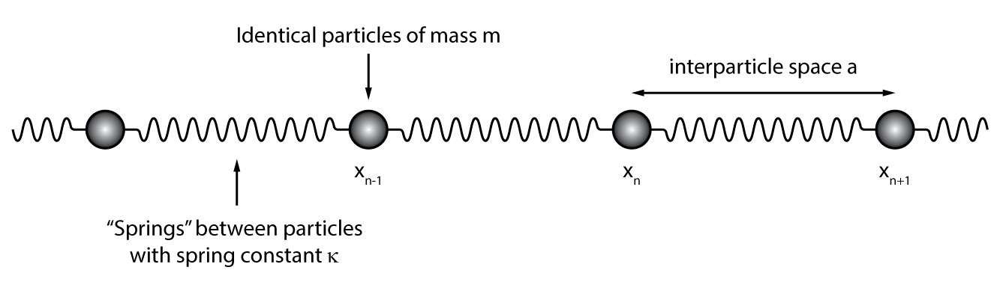
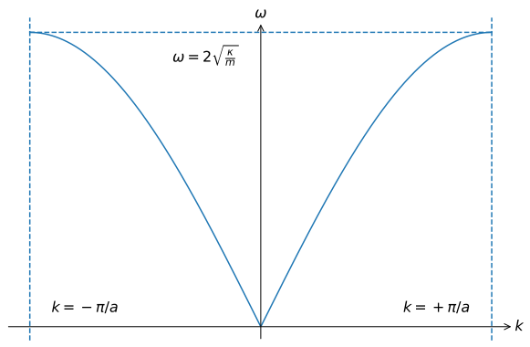
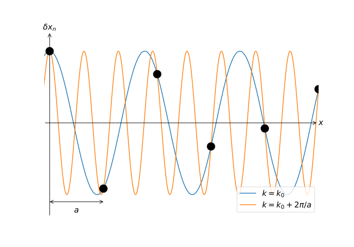

# Vibrations

## Introduction

We can consider our journey thus far a preparation: we have seen how quantum mechanics forced its way into statistical mechanics with much success, but also started a discussion of using quantum mechanics to describe complex systems, rather than just applying a finishing touch of quantum to a classical system. Beginning here, we are going to set out to conquer solid-stead state systems from a quantum standpoint; if someone ever asks:

> have you studied solid-state physics?

it is the content in this, and the following sections, about which they are asking. The concepts are core to understanding basically everything we do from here on out, so strap in and let's get into it!

!!! danger  "Expected competencies"

    It is assumed that you have familiarity with the following concepts/techniques:

    * Quantum mechanics:
    * Mechanics: Normal modes of an oscillator
    * Mathematics: Series expansions of functions (Maclaurin/Taylor series)

!!! note  "Text reference"
    The material covered here is discussed in section(s) $\S 8, 9$ of [The Oxford Solid State Basics](https://global.oup.com/academic/product/the-oxford-solid-state-basics-9780199680771?cc=au&lang=en&)

!!! info "Computational content"

    The Jupyter notebook associated with this section can be accessed by clicking the icon below:
    [<i class="fab fa-python fa-5x"></i>](https://jove2021.cloud.edu.au/hub/user-redirect/git-pull?repo=https%3A%2F%2Fgithub.com%2FAndy-UTAS%2FSolid-state&urlpath=tree%2FSolid-state%2F3-1-vibrations.ipynb&branch=master){ .md-button .md-button--primary class="text-center" style="margin-left: 45%"}

    A program used to visualise oscillations in one dimension (``chainplot`` as written by [Mike Glazer](https://www.amg122.com/programs/#xl_xr_page_index)) can be downloaded [here](http://www-thphys.physics.ox.ac.uk/people/SteveSimon/condmat2015/chainplot.zip)

---

## Material properties from the interatomic potential

In the previous section, we looked at the energy eigenstates of neighbouring atoms which were sufficiently close to display bonding behaviour. The energy eigenstates $\psi_{+}$ and $|\psi_{-}\rangle$ had energies as a function of atomic separation as shown below:

Such a model is a good start, but it is unphysical as the bonding energy does continue to decrease with decreasing interatomic distance, rather, it reaches some minimum value before it starts to increase as the nuclei begin to repel. The exact nature of this repulsion is not so important, but it its existence is extremely important. A more realistic form of the energy for the bonding state is shown below, which includes a repulsion term when the atoms are sufficiently close:

The physics in which we are interested, that is, solids, necessitates that we are interested in the regime where bonding occurs, so we are going to be most interested in the region of the energy minimum.

To begin, let us consider two atoms that are in equilibrium and at the bottom of the potential well as shown in the image above. We are going to denote the spacing which corresponds to this minimum $\delta x = x_{\mathrm{eq}}$, the equilibrium separation. As the potential is nicely behaved in this region (and indeed everywhere else!), we can then express the potential

$$
V \approx V_0(x_{\mathrm{eq}}) + \frac{\kappa}{2!} (r - x_{\mathrm{eq}})^2 - \frac{\kappa_3}{3!} (r - x_{\mathrm{eq}})^3 + \ldots
$$

we have deliberately excluded term linear in $x_{\mathrm{eq}}$, as its inclusion would remove the minimum! In the usual way, we are only going to consider small displacements around $x_{\mathrm{eq}}$ and then throw all terms other than the constant and the quadratic in the bin, greatly simplifying our life.

??? question  "3.1.1: With a potential of the form $V(x) = V_0 + a x^2$, what will be the motion of an atom in the potential?"

    <!-- Quadratic potentials give rise to harmonic motion: harmonic oscillator here we come! -->

### Compressibility

With our potential approximated as a quadratic, let us consider what happens when we compress or stretch the system. Consider a material with length $L$; if the equilibrium distance between atoms is $x_{\mathrm{eq}}$, then there are $N = L/x_{\mathrm{eq}}$ atoms in the material. Now lets change the material to length $L + \delta L$, which will lead to a change in the interatomic distance of $\delta x = \delta L/N$. With only small changes in $x$ we can then write

$$
F = - \frac{\mathrm{d} V}{\mathrm{d} x} \Bigr|_{x = x_{\mathrm{eq}} + \delta x} = \kappa a \frac{\delta L}{L}.
$$

This is a description of the compressibility (or elasticity) of a solid, and from a mechanics, the compressibility $\beta$[^1] is usually defined through the relation

$$
\beta = -\frac{1}{V} \frac{\partial V}{\partial P}
$$

for a three dimensional system. In the one dimensional case, this simplifies to

$$
\beta = -\frac{1}{L} \frac{\partial L}{\partial F}= \frac{1}{\kappa x_{\mathrm{eq}}} \equiv \frac{1}{\kappa a}
$$

where we have introduced $a$, the symbol used to denote the distance between identical particles, which in this case is our equilibrium interatomic spacing $x_{\mathrm{eq}}$

#### Sound velocity

The compressibility $\beta$ allows us to calculate the speed of sound by using the usual relation between the speed $v$ and the density $\rho$, and the bulk modulus $B$:

$$
v = \sqrt{\frac{B}{\rho}} = \sqrt{\frac{1}{\rho \beta}}
$$

and because in one-dimension $\rho = m/a$ (in 1D), we can predict that

$$
v = \sqrt{\frac{\kappa a^2}{m}}.
$$

Let us put a pin in this result, as we are about to construct a detailed microscopic model for a solid which will allow for calculation of $v$, it will be useful to compare the results.

## Vibrations in one dimension

To emphasize the similarities and the differences between electrons and phonons, we will deal with both types of particles at once.

Up to this point, we have seen the Boltzmann, Einstein, and Debye models of solids, which at the core are models of vibrations in a solid. In the case of Debye, the language around this was much more explicit; however, in all cases, we were considering the motion of the constituent atoms and how ultimately, this allowed for the storage of energy. Here we are going to construct an atomic-scale model of an atomic lattice with an attempt to better understand both the successes and failures of these early models of solids

### An infinite one-dimensional chain of identical atoms

We begin by considering the amalgamation of the concepts ripped from _physicists' bingo_, namely: a low-dimensional model, and infinite model, a model stripped of unnecessary complexity, and a model centred around a harmonic potential. But in all seriousness, the model is incredibly rich and goes a long way to understanding solids!

Consider a chain of identical atoms of mass $m$ with equilibrium spacing $a$, connected to nearest-neighbours by springs with spring constant $\kappa$. Hopefully it is clear from the discussion above, that by using a spring model, we are explicitly using a Harmonic potential which we assume well-approximates the inter-atomic potential for bound systems and small oscillation amplitudes, that is, low temperature.

We define the position of the $n^{\textrm{th}}$ atom to be $x_n$ and the equilibrium position of the $n^{\textrm{th}}$ atom to be $x_{n, \textrm{eq}}=na$. We then write the displacement of an atom from its equilibrium position

$$
\delta x_n = x_n - x_{n, \textrm{eq}}.
$$

The potential energy for this _harmonic chain_ is then the sum over all harmonic potentials

$$
\begin{align}
V & = \sum_i V(x_{i+1}-x_i) = \sum_i \kappa/2 (x_{i+1}-x_i-a)^2 \\
& = \sum_i \kappa/2 (\delta x_{i+1}- \delta x_i)^2
\end{align}
$$

from which we can write the force on atom $n$ as

$$
F_n = - \frac{\partial V}{\partial x_n} = \kappa (\delta x_{n+1}- \delta x_n) + \kappa (\delta x_{n-1}- \delta x_n)
$$

which can be expressed as a $2^{\mathrm{nd}}$-order ODE in $\delta x_n$:

$$
m (\ddot{\delta x_n}) = \kappa (\delta x_{n+1} + \delta x_{n-1} - 2\delta x_n).
$$

With systems such as this, one is usually interested in the _normal modes_ of the system: oscillations where all particles move with the same frequency. Given we are persuing vibrations in the systems this is a worthwhile thing in which to be interested, but moreover, there is a deep connection between normal modes of a classical system and the energy Eigenstates of the equivalent quantum system, so let's consider progress in this direction an down payment of sorts.

Given that the structure of the equation of motion is the identical no matter what value of $n$ we choose, and since these equations define the solutions, one can reason that the solutions should also be independent of the choice of $n$. This, combined with us actively looking for wave solutions, leads us to assume solutions in the form of plane waves, with the same amplitude for each atom:

$$
\delta x_n = A e^{i \omega t - i k x_{n, \textrm{eq}}} = A e^{i \omega t - i k n a}
$$

??? question "3.1.2: Assuming plain-wave solutions, show that $\omega = 2 \sqrt{\kappa/m} |\sin(ka/2)|$"

<!-- Plug and play:

$$
- m \omega^2 A e^{i \omega t - i k n a} = \kappa  A e^{i \omega t} \left[ e^{- i k a (n+1)} + e^{- i k a (n-1)} - 2 e^{- i k a n} \right]
$$

and then

$$
m \omega^2 = 2\kappa[1-\cos(k a)] = 4\kappa \sin^2(ka/2)
$$

from which the results follows -->

It is worth stopping to emphasise that we now have a non-trivial _dispersion relation_

$$
\omega = 2 \sqrt{\kappa/m} |\sin(ka/2)|
$$

which in contrast to that we have seen previously in the Debye model, $\omega = v_s |k|$, is very different.

??? question "3.1.3: What can one say about the relationship between the dispersion relationship for a 1D chain of oscillators and that of the Debye model?"

<!-- In the Debye model, we were explicitly looking at sound waves, which have are long wavelength or small wavenumber waves, so if we look at the low $k$ behaviour of the dispersion relation $\omega = 2 \sqrt{\kappa/m} |\sin(ka/2)|$:

$$
\being{align}
\omega &\approx 2 \sqrt{\kappa/m} |ka/2| \\
& = \sqrt{\kappa a^2/m} |k| = v |k|
\end{align}
$$

which is exactly the relation that Debye used, but obviously for other values of $k$, there are issues! -->

### The reciprocal lattice

Let's go ahead an plot the dispersion relation:

where we can see that the dispersion relationship is _periodic_. This is clearly evident from the functional form of the relation, but just let that idea marinate for a minute: the dispersion, that is, the relationship between the oscillation frequency $\omega$ and $k$ is periodic. What does that even mean?

Well in the same way that we saw periodic boundary conditions resulting an a discretisation of $k-$space in the Debye model, a more general principle is that if a system is period in _real space_ (that is, in position space) with a periodicity $a$, it will also be periodic in $k-$space with periodicity $2\pi/a$. Mathematically, it is clear why this happens, but what is the physical interpretation?

Let's start by taking advantage of this periodicity by considering only the "unit cell" - the periodic unit in reciprocal ($k-$) space - which is called the _Brillouin zone_. A plot of the _Brillouin zone_ for the dispersion curve above is shown below:

As the dispersion is periodic with period $2\pi/a$, we need only look at the _Brillouin zone_ to understand how a material behaver for all $k$. But how does this all work? For example, consider our oscillation modes

$$
\delta x_n = A e^{i \omega t - i k n a}
$$

??? question  "3.1.4: What happens to a given mode of oscillation under the transformation $k \rightarrow k + 2\pi/a$?"

<!-- $$
\begin{align}
\delta x_n & = A e^{i \omega t - i (k + 2\pi/a) n a} = A e^{i \omega t - i k n a}  e^{- i 2 \pi n}
& = A e^{i \omega t - i k n a} = \delta x_n
\end{align}
$$

This means that the modes of oscillation with $k$ and $k + 2\pi/a$ are physically identical! -->

Given the periodicity of $k$ space, we can think about the set of points which are equivalent to the point $k=0$ ($k = \pm n \times 2\pi/a$), which is called the _reciprocal lattice_, in contrast to the _real-space lattice_ $x_n = n a$. A useful observation for all points $G_m$ in the reciprocal lattice and points $x_n$ in the real-space lattice is that

$$
e^{i G_m x_n} = 1
$$

#### BUT WHAT IS ACTUALLY GOING ON?!?!

If we think about life outside of periodic systems, for example, the propagation of light in a vacuum, one of our favourite relationships is

$$
c = \frac{\omega}{k}
$$

So what does it mean to talk about a (phase) velocity when $k$ is periodic? And what about the wavelength? We are pretty fond on the relation

$$
\lambda = \frac{2\pi}{k},
$$

but if $k$ and $k + n \times 2\pi/a$ are equivalent, what is heck is going on?

??? question  "3.1.5: What the heck is going on?"

    <!--  -->

### Counting normal modes

As is (hopefully) becoming a normal question to ask when we consider modes of oscillation: how many modes are there? Well let us consider a chain of $N$ masses, and once again we are going to assume periodic boundary conditions, with the same justification as last time, namely that we are interested in bulk quantities and we will make sure that we don't take look at things happening near boundaries. In a periodic system, we can consider the chain wrapped around back onto itself, such that

$$
e^{i\omega t - ikna} = e^{i\omega t - ik(N+n)a}
$$

which enforces the relation

$$
e^{ikNa} = 1
$$

and subsequently restricts the possible values of $k$:

$$
k = \frac{2\pi q}{N a} = \frac{2\pi q}{L} \textrm{ where } q \in \mathbb{Z}.
$$

This is exactly as we saw with the [Debye model](1-intoduction\1-3-emetalsI.md), where the imposition of periodic boundary conditions discretised reciprocal space. There we saw that points were equally spaced with a separation of $2\pi/L$, which in this case is equivalent to $2\pi/Na$. Now, to count all the modes, we can simply compute the ration of the possible values of $k$ by the spacing between modes. As discussed above, we need only consider the Brillouin zone, as the modes are periodic in $k$ with a period of $2\pi/a$, therefore the number of modes is

$$
\frac{2\pi/a}{2\pi/Na} = N
$$

which again, is what Debye had predicted - although he just plucked the result from the air - whereas we now have a grounding to say that there is one normal mode per mass in the system.

## "Quantum vibrations"

Our discussion up to this point has been purely classical, but thanks to firm foundations, mapping our classical system onto the equivalent quantum system is not so difficult. Explicitly, classical harmonic systems - and thus normal modes - map directly onto "equivalent" quantum systems, and a normal mode of oscillation at frequency $\omega$ will have eigenstates with energy

$$
E_n = \hbar \omega \left(n + \frac{1}{2}\right).
$$

This means that for a given mode with wavevector $k$, there are multiple energy eigenstates, each separated in energy by $\hbar\omega(k)$. We can now start to think of excitations (and de-excitations) of this particular mode, a quantum of energy $\hbar\omega(k)$, which are known as _phonons_.

Phonons are much like photons - especially in the under the formalism of second quantisation - but obviously are not quanta of the electromagnetic field, but rather the oscillation modes of a solid. In the same way phonons can occupy the same state - i.e. they are bosons - phonons are also bosons, so we can describe the occupation of a given mode though the Bose factor $n_\mathrm{B}$. Therefore we can write an expression for the energy associated with the wavevector $k$ as

$$
E_k = \hbar\omega(k)\left(n_\mathrm{B}(\beta\hbar\omega(k))+\frac{1}{2}\right)
$$

??? question  "3.1.6: Use the energy $E_k$ to get obtain an expression for the _total_ energy in the system in terms of an integral over $k$"

With this, we now have a well-formulated quantum system from which we can calculate quantities of interest, but also extend to model systems that are not just infinite chains of identical particles.

---

## Conclusions

  * The interatomic potential describes the compressibility of a material
  * A system which is periodic in real space with period $a$ in periodic in reciprocal space with period $2\pi/a$
  * The Brillouin zone contains all values of $k$, as modes separated by $2\pi/a$ are identical
  * A normal modes of frequency $\omega$ is mapped to the eigenstate with energy $E_n = \hbar \omega \left( n + 1/2 \right)

---

## Exercises
### Preliminary provocations

  1. What is the motion of adjacent masses when the chain is oscillating at the its maximum frequency?

### Exercise 1: Lennard-Jones potential

  A simple model approximating the interaction between a pair of noble gas atoms such as Argon is the [Lennard-Jones potential](https://en.wikipedia.org/wiki/Lennard-Jones_potential), in which the potential energy as a function of interatomic distance is

  $$ U(r) = 4\epsilon \left[\big(\frac{\sigma}{r}\big)^{12}-\big(\frac{\sigma}{r}\big)^6\right] $$

  where $r$ is the distance between two atoms, $\epsilon$ is the depth of the potential well, and $\sigma$ is the distance at which the inter-particle potential is zero.

  1. Sketch $U(r)$ as a function of interatomic distance and mark the regions of repulsive and attractive forces acting between the atoms.
  2. Find the distance, $r_0$ (bond length), at which the potential energy is minimal and find the value of the potential energy at this distance (binding energy of the molecule).
  3. Expand $U(r)$ in a Taylor series around $r_0$ up to second order. By considering a second-order (=harmonic) potential approximation around the minimum ($r_0$), find an expression for the spring constant, $\kappa$, in terms of $\epsilon$ and $\sigma$.
  4. Using the spring constant $\kappa$ you found earlier, find the ground state energy of the molecule by comparing the molecule to a quantum harmonic oscillator. What is the energy required to break the molecule apart?
  5. What is the approximate number of phonons that can occupy this mode before the potential becomes anharmonic?

??? hint

    Because the diatomic molecule is modelled as a one-body problem (in the center of mass rest frame of the molecule), the mass should be replaced by the [reduced mass](https://en.wikipedia.org/wiki/Reduced_mass).

### Exercise 2: Vibrational heat capacity of a 1D monatomic chain

  1. Give an integral expression for the heat capacity $C$.
  2. Compute the heat capacity numerically, using e.g. Python.
  3. Do the same for $C$ in the Debye model and compare the two.
  What differences do you see?

### Exercise 3: A finite chain

  Consider a chain of only 3 atoms. We can then write the equations of motion

  $$
  \begin{aligned}
  m \ddot{\delta x}_1 &= - \kappa (\delta x_1 - \delta x_2) \\
  m \ddot{\delta x}_2 &= - \kappa (\delta x_2 - \delta x_1) - \kappa (\delta x_2 - \delta x_3) \\
  m \ddot{\delta x}_3 &= - \kappa (\delta x_3 - \delta x_2)
  \end{aligned},
  $$

  and write this system of equations in matrix form

  $$
  m \ddot{\mathbf{u}} = -\kappa
  \begin{pmatrix}
  1 & -1 & 0\\
  -1 & 2 & -1\\
  0 & -1 & 1
  \end{pmatrix}\mathbf{u}
  $$

??? hint

    In Python use the function [`numpy.diag`](https://docs.scipy.org/doc/numpy/reference/generated/numpy.diag.html)

  1. Define a matrix that relates forces to displacements in a linear 1D chain containing $N=5$ atoms. Repeat for $N=200$.
  You may assume that the masses and spring constants are equivalent throughout the chain.
  2. Using numerical diagonalization ([`numpy.linalg.eigvalsh`](https://docs.scipy.org/doc/numpy/reference/generated/numpy.linalg.eigvalsh.html)), compute the eigenfrequencies of this atomic chain. Plot a histogram of these eigenfrequencies.
  3. Make the masses of every even atom different from the masses of every odd atom. Compute the eigenfrequencies of this atomic chain and plot a histogram.
  4. Now make the masses of even and odd atoms equivalent again. Furthermore, make the spring constants of every even spring different from the odd spring.
  Compute the eigenfrequencies of this atomic chain and plot a histogram.

[^1]: It is unfortunately that there are only so many letters in the Greek alphabet, especially when looking at mechanical and thermodynamic quantities!
