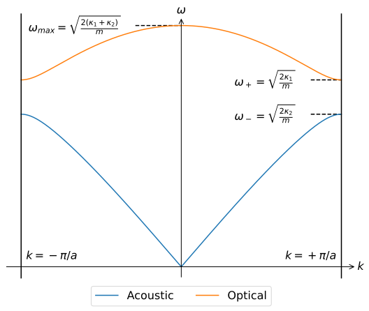
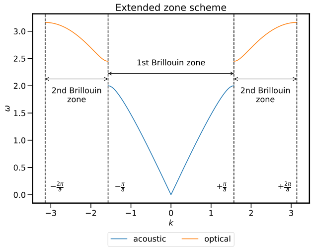
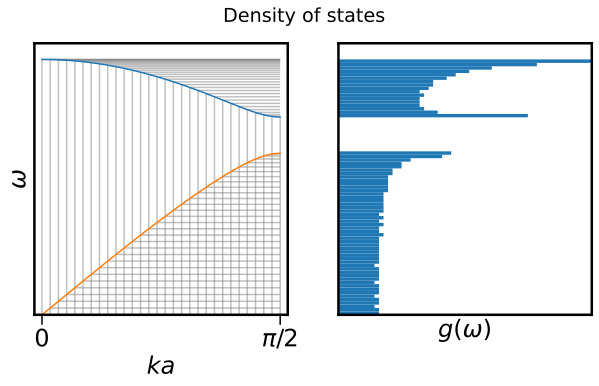

# The diatomic chain

Vibrations in one-dimension with extra pizzazz.

## Introduction

Modelling a solid as an [infinite one-dimensional chain of identical atoms](3-1d/3-1-vibrations.md) went a long way to

  * Accurately predicting the observed behaviour of solids whilst both incorporating ideas from previous models, and reconciling many of their shortcomings
  * Providing a microscopic picture of what is going on, both in a classical and quantum mechanical sense

Unfortunately for us, not everything is an infinite 1D chain of the same atom. In order to make our model more realistic and more broadly applicable, we are going to make some changes: let's look at an infinite one-dimensional chain of identical _pairs_ of atoms.

!!! danger  "Expected competencies"

    It is assumed that you have familiarity with the following concepts/techniques:

    * Mathematics: Eigenvalue equations

!!! note  "Text reference"
    The material covered here is discussed in section(s) $\S 10$ of [The Oxford Solid State Basics](https://global.oup.com/academic/product/the-oxford-solid-state-basics-9780199680771?cc=au&lang=en&)

!!! info "Computational content"

    The Jupyter notebook associated with this section can be accessed by clicking the icon below:
    [<i class="fab fa-python fa-5x"></i>](https://jove2021.cloud.edu.au/hub/user-redirect/git-pull?repo=https%3A%2F%2Fgithub.com%2FAndy-UTAS%2FSolid-state&urlpath=tree%2FSolid-state%2F3-2-diatomic.ipynb&branch=master){ .md-button .md-button--primary class="text-center" style="margin-left: 45%"}

    A program used to visualise oscillations in one dimension (``chainplot`` as written by [Mike Glazer](https://www.amg122.com/programs/#xl_xr_page_index)) can be downloaded [here](http://www-thphys.physics.ox.ac.uk/people/SteveSimon/condmat2015/chainplot.zip)

---

## Expanding the circle of concern

In the [previous](3-1d/3-1-vibrations.md), we modelled vibrations in a solid using a one-dimensional homogeneous chain of atoms. The model gave us insight into the vibrational modes of a solid, and in the quantum mechanical case precipitated the identification of phonons, quanta of vibrations. To expand our model to include more solids, we shall consider a chain of atoms with two distinct particles, but the method we use here is applicable to the inclusion of more particles and interactions. In the case of a diatomic system, the masses of each of the constituent atoms can be different ($m_1$ and $m_2$), but as can the harmonic potential between the atoms ($\kappa_1$ and $\kappa_2$). Following the text, we are going to consider the case of identical masses but varying spring constants as the algebra is ever so slightly simpler, and the qualitative behaviour we are trying to observe is present in all cases. A schematic of the system in shown below:

The first observation to make is that the repeated pattern, that is, the _unit cell_ is not longer just one atom, but rather to length which characterises the periodicity is now $2a$. We note that within this unit cell, there two degrees of freedom, namely the position of particle $x$ and particle $y$, which are distinguished by their relative location to harmonic potentials with force constants $\kappa_1$ and $\kappa_2$ as illustrated above. This is in contrast to the monatomic chain model, whereby there was one degree of freedom per unit cell.

### Equations of motion

Following a similar path as the monatomic case, we begin be writing the equations of motion:

$$
\begin{aligned}
m (\ddot{\delta x_n}) & = \kappa_2 (\delta y_{n} - \delta x_{n}) + \kappa_1 (\delta y_{n-1} - \delta x_{n}) \\
m (\ddot{\delta y_n}) & = \kappa_1 (\delta x_{n+1} - \delta y_{n}) + \kappa_2 (\delta x_{n} - \delta y_{n})
\end{aligned}
$$

and employing the same intuition as last time, namely that we expect wave solutions that should have unit cells oscillating at the same frequency, we seek solutions of the form:

$$
\begin{pmatrix}
\delta x_n\\
\delta y_n
\end{pmatrix} =
e^{i\omega t - ik na}
\begin{pmatrix}
A_{x}\\
A_{y}
\end{pmatrix}.
$$

When these solutions are deployed, one obtains the matrix equation

$$
m\omega^2\begin{pmatrix}
A_x\\
A_y
\end{pmatrix} =
\begin{pmatrix}
\kappa_1 + \kappa_2 & -\kappa_2 - \kappa_1 e^{ika}\\
-\kappa_2 - \kappa_1 e^{-ika} & \kappa_1 + \kappa_2
\end{pmatrix}
\begin{pmatrix}
A_x\\
A_y
\end{pmatrix}
$$

??? question "3.2.1: Explicitly verify that the trail solutions lead to the above matrix equation"

<!-- This is tedious but straightforward:

$$
\begin{align}
m (\ddot{\delta x_n}) & = -m \omega^2 A_x e^{i\omega t-ikna} \\
& = \kappa_2 A_y e^{i\omega t-ikna} + \kappa_1 A_y e^{i\omega t-ik(n-1)a} - (\kappa_1 + \kappa_2) A_x e^{i\omega t-ikna} \\
m (\ddot{\delta y_n}) & = -m \omega^2 A_y e^{i\omega t-ikna} \\
& = \kappa_1 A_x e^{i\omega t-ik(n+1)a} + \kappa_2 A_x e^{i\omega t-ika} - (\kappa_1 + \kappa_2) A_y e^{i\omega t-ikna}
\end{align}
$$

which after dividing through by the exponential becomes

$$
\begin{align}
-m \omega^2 A_x & = \kappa_2 A_y + \kappa_1 A_y e^{i\omega t-ik1a} - (\kappa_1 + \kappa_2) A_x \\
-m \omega^2 A_x & = \kappa_2 A_y + \kappa_1 A_y e^{i\omega t-ik1a} - (\kappa_1 + \kappa_2) A_x
\end{align}
$$

which when expressed in matrix form is as required. -->

This is an eigenvalue equation, and this can be solved in the usual way to obtain

$$
\omega_\pm^2 = \frac{\kappa_1+\kappa_2}{m} \pm \sqrt{\frac{(\kappa_1+\kappa_2)^2 - 4\kappa_1\kappa_2\sin^2(ka/2)}{m^2}}
$$

??? question "3.2.2: Solve the eigenvalue equation and verify the result for $\omega_\pm$"

<!-- Subtracting the eigenvalue $m\omega^2$ from the diagonal elements of the matrix and then solving when the determinant evaluates to zero:

$$
\begin{align}
0 & =
\begin{vmatrix}
\kappa_1 + \kappa_2 - m\omega^2 & -\kappa_2 - \kappa_1 e^{ika}\\
-\kappa_2 - \kappa_1 e^{-ika} & \kappa_1 + \kappa_2 - m\omega^2
\end{vmatrix} \\
& = |\kappa_1 + \kappa_2 - m\omega^2 |^2 - |\kappa_2 + \kappa_1 e^{ika}|^2.
\end{align}
$$

Then we identify the solutions must satisfy

$$
m\omega^2 = (\kappa_1 + \kappa_2) \pm |\kappa_1 + \kappa_2 e^{ika}|.
$$

From here, we write the absolute value

$$
\begin{align}
|\kappa_1 + \kappa_2 e^{ika}| & = \sqrt{(\kappa_1 + \kappa_2 e^{ika})(\kappa_1 + \kappa_2 e^{-ika})} \\
& = \sqrt{(\kappa_1^2 + \kappa_2^2 + 2\kappa_1\kappa_2\cos(ka)}
\end{align}
$$

and so

$$
\begin{align}
m\omega\pm^2 & = \kappa_1+\kappa_2 \pm \sqrt{(\kappa_1^2 + \kappa_2^2 + 2\kappa_1\kappa_2\cos(ka)} \\
& = \kappa_1+\kappa_2 \pm \sqrt{(\kappa_1^2 + \kappa_2^2 + 4\kappa_1\kappa_2\sin^2(ka/2)}
\end{align}
$$

which is the desired result. -->

### Dispersion

Immediately we notice that as compared to the monatomic chain, there are now two modes of oscillation for each value of $k$, and we denote the frequencies associated with the modes $\omega_{\pm}$, as shown in the plot below:

Looking at the associated eigenvectors, we can see that these frequencies correspond to in-phase ($\omega_-$) and out-of-phase ($\omega_+$) motion. Just like last time, the plot is periodic in $k$ with values of $k$ shifted by $2 \pi / a$ corresponding to the same solution, and therefore look only at the unique values of $k$, that is, those in the Brillouin zone, shown below:

One may ask why the second branch appears, which is an good question, and is understood as with a diatomic system, we have added a second degree of freedom per unit cell. Indeed, had we a unit cell with 3 atoms, that is 3 degrees of freedom, we would find that there are three branches, or three frequencies, for each value of $k$.

Looking at the $\omega_-$ mode, we notice that as $k \rightarrow 0$, the dispersion relationship is linear. In this regime, the modes behave like sound waves (i.e. $\omega = v |k|$) and consequently, the mode is referred to as the _acoustic mode_. On the other hand, modes which intersect with optical dispersion modes (i.e. $\omega = c|k|$) are referred to as _optical modes_.

??? question  "3.2.3: Plot the dispersion modes, along with an optical dispersion curve for visible light. What are the implications intersecting curves?"

We can look at the behaviour of the curves at specific values of $k$, for example at the zone boundary, $\omega_{+}(\pi/a) = \sqrt{2\kappa_1/m}$ and $\omega_{+}(\pi/a) = \sqrt{2\kappa_2/m}$. At this point, it is useful to consider the idea of an _extended_ Brillouin zone: the Brillouin zone houses all unique values of $k$, but in this case, there are multiple frequencies for each value of $k$. By extending the Brillouin zone, unfolding the higher-order mode(s) out to a the neighbouring unit cell in reciprocal space, we can obtain a plot which was unique frequencies for each $k$. A plot illustrating the extended scheme is shown below:

But why would we do this? Well, consider the case of $\kappa_1 \approx \kappa_2$ and the limit of $\kappa_1 = \kappa_2$. We can clearly observe an "opening" between the bands which depends on the values of $\kappa_1$ and $\kappa_2$, but physically, what would one expect to happen when $\kappa_1 = \kappa_2 = \kappa$?

??? question  "3.2.4: Make a prediction for what will be the consequences of setting $\kappa_1 = \kappa_2$ and how this relates to the monatomic chain."

    Hopefully it is clear that with identical spring constants, we are back at the case of a monatomic chain. In the case of the band splitting, this will go to zero as the difference between $\kappa_1$ and $\kappa_2$ goes to zero:

    

    But now we have a bit of a quandary, namely, in order to capture all unique values of $k$, we now have a plot Brillouin zone that runs from $-2\pi/a$ to $2\pi/a$ (see above), whereas previously this ran from $-\pi/a$ to $\pi/a$. Any what about our number of states?

    The solution comes in the recognition that in the diatomic case, one has a unit cell length of $a$, which is $2 \times a_\mathrm{monatomic}$, so the "true" Brillouin zone for the monatomic chain extents from $-\pi/a_\mathrm{monatomic}$ to $\pi/a_\mathrm{monatomic}$ which is equivalent to $-2\pi/a$ to $2\pi/a$. Similarly, the number of atoms per unit cell as changed from 2 to 1, meaning that everything doesn't fall apart. YAY!

### Density of states

As we have seen previously, the density of states is $g(\omega)\textrm{d}\omega = \textrm{d}N$ and thus

$$
g(\omega) = \frac{\textrm{d}N}{\textrm{d}\omega} = \frac{L}{2\pi} \sum | \textrm{d}k/\textrm{d} \omega|
$$

where sum goes over all states at a given energy. In this case, we must ensure that we include the contribution to the DoS from both the positive and negative momenta. Since the energy of this system is symmetric with respect to $k$, this sum will simply introduce a factor of 2. In an attempt to build an intuition for visualising and understanding the density of states, it is possible to think of the DoS as a histogram of the energy samples drawn from the dispersion relation $ω(k)$. Remember that by enforcing periodic boundary conditions on our system, we discretise $k$ space with equally spaced points separated by distance $2\pi/L$.

---

## Conclusions

  * The normal modes of a diatomic chain of atoms were found by once again intuiting that plane waves in real would be a well-suited solution
  * Systems with more than one degree of freedom per unit cell result in independent oscillation amplitudes for each degree of freedom, leading to multiple bands
  * The density of states can be derived graphically from the dispersion relation

---

## Exercises
### Preliminary provocations
  1. Verify that the expression for $\omega^2$ is always positive. Why is this important?
  2. When calculating the DOS, we only look at the first Brillouin zone. Why?

### Exercise 1: analysing the diatomic vibrating chain
  As we have shown, the normal modes of oscillation of a diatomic chain occur at frequencies:

  $$
  \omega_\pm^2 = \frac{\kappa_1+\kappa_2}{m} \pm \sqrt{\frac{(\kappa_1+\kappa_2)^2 - 4\kappa_1\kappa_2\sin^2(ka/2)}{m^2}}
  $$

  where the plus sign corresponds to the optical branch and the minus sign to the acoustic branch.

??? hint

    The final form of $\omega_\pm$ as given is not always the most useful: sometimes the complex exponential form - see 3.2.2 - can make life easier

  1. Find the magnitude of the group velocity near $k=0$ for the _acoustic_ branch.
  2. Show that the group velocity at $k=0$ for the _optical_ branch is zero.
  3. Derive an expression of the density of states $g(ω)$ for the _acoustic_ branch and small $k$. Make use of your expression of the group velocity in 1. Compare this expression with that of the derived density of states from [exercise 1](1-intoduction/1-2-specificheatII/#exercise-1-debye-model-concepts) of the Debye lecture.

### Exercise 2: atomic chain with 3 different spring constants
Suppose we have a vibrating 1D atomic chain with 3 different spring constants alternating like $\kappa_ 1$, $\kappa_2$, $\kappa_3$, $\kappa_1$, etc. All the atoms in the chain have an equal mass $m$.

??? hint

    To solve the eigenvalue problem quickly, make use of the fact that the mass-spring matrix in that case commutes with the matrix

    $$
    X = \begin{pmatrix} 0 & 0 & 1 \\ 0 & 1 & 0 \\ 1 & 0 & 0 \end{pmatrix}.
    $$

    What can be said about eigenvectors of two matrices that commute?

1. Make a sketch of this chain and indicate the length of the unit cell $a$ in this sketch.
2. Derive the equations of motion for this chain.
3. By filling in the trial solutions into the equations of motion (which should be similar to those used in the dual spring constants case), show that the eigenvalue problem is
   $$
   \omega^2 \begin{pmatrix} A_1 \\ A_2 \\ A_3 \end{pmatrix} = \frac{1}{m}
   \begin{pmatrix} \kappa_1 + \kappa_ 3 &  -\kappa_ 1 & -\kappa_ 3 e^{i k a} \\
   -\kappa_ 1 & \kappa_1+\kappa_2 & -\kappa_ 2 \\
   -\kappa_ 3 e^{-i k a} & -\kappa_2 & \kappa_2 + \kappa_ 3
   \end{pmatrix} \begin{pmatrix} A_1 \\ A_2 \\ A_3 \end{pmatrix}
   $$
4. In general, the eigenvalue problem above cannot be solved analytically, and can only be solved in specific cases. Find the eigenvalues $ω^2$ when $k a = \pi$ and $\kappa_1 = κ_2 = q$.
5. What will happen to the periodicity of the band structure if $\kappa_ 1 = \kappa_ 2 = \kappa_3$?
