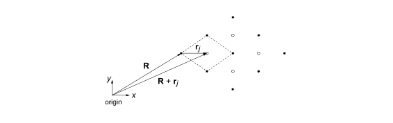

# Scattering

## Introduction

!!! danger  "Expected competencies"

    It is assumed that you have familiarity with the following concepts/techniques:

    * Wave mechanics: diffraction
    * Mathematics: The Fourier transform

!!! note  "Text reference"
    The material covered here is discussed in section(s) $\S 14$ of [The Oxford Solid State Basics](https://global.oup.com/academic/product/the-oxford-solid-state-basics-9780199680771?cc=au&lang=en&)

!!! info "Computational content"

    The Jupyter notebook associated with this section can be accessed by clicking the icon below:
    [<i class="fab fa-python fa-5x"></i>](https://jove2021.cloud.edu.au/hub/user-redirect/git-pull?repo=https%3A%2F%2Fgithub.com%2FAndy-UTAS%2FSolid-state&urlpath=tree%2FSolid-state%2F4-3-scattering.ipynb&branch=master){ .md-button .md-button--primary class="text-center" style="margin-left: 45%"}

---

### Reciprocal lattice: Laue conditions

Reciprocal lattice manifests directly in the diffraction experiments.
A diffraction experiment uses the crystal as a target and scatters high energy particles (X-rays, neutrons, or electrons) off of it.
As a result of interference between mutiple waves, the scattered radiation reveals the reciprocal lattice of the crystal.
In order to find the relationship between the incoming wave and the scattered one, let us consider a lattice of atoms separated by a lattice vector $\mathbf{R}$.
An incoming wave with wave vector $\mathbf{k}$ is incident upon the lattice.
After scattering, the outgoing wave's wave vector is $\mathbf{k'}$.
We assume that the atomic scattering is elastic (does not cause an energy loss), such that $|\mathbf{k'}|=|\mathbf{k}|$.
Below we present a simple sketch of two different atoms scattering an incoming wave.

Observe that the bottom ray travels a larger distance compared to the upper ray.
The difference in distance results in a relative phase shift between the rays $\Delta \phi$.
With a bit of geometry, we find that the extra distance traveled by the lower ray relative to the upper one is

$$
x_{\mathrm{extra}} = \Delta x_1+\Delta x_2 = \cos(\theta) \lvert R \rvert + \cos(\theta') \lvert R \rvert.
$$

As a result of the travel distance, the phase difference is:

$$
\begin{align}
\Delta \phi &= \lvert\mathbf{k} \rvert(\Delta x_1+\Delta x_2)\\
&= \lvert\mathbf{k}\rvert \lvert\mathbf{R}\rvert(\cos(\theta)+\cos(\theta'))\\
&= \mathbf{k'}\cdot \mathbf{R} - \mathbf{k}\cdot \mathbf{R} = (\mathbf{k'} - \mathbf{k}) \cdot \mathbf{R}.
\end{align}
$$

However, that is only a phase difference between waves scattered off of two atoms.
To find the outgoing wave's amplitude, we must sum over scattered waves from each and every atom in the lattice:

$$
A\propto\sum_\mathbf{R}\mathrm{e}^{i\left(\Delta \phi-\omega t\right)} = \sum_\mathbf{R}\mathrm{e}^{i\left((\mathbf{k'}-\mathbf{k})\cdot\mathbf{R}-\omega t\right)}.
$$

The above sum is non-zero if and only if the scattered waves interfere constructively i.e. the phase difference equals $2\pi n$, where $n$ is an integer.
Furthermore, we know that real and reciprocal lattice vectors are related by $\mathbf{G} \cdot \mathbf{R} = 2 \pi n$.
Therefore, we conclude that the difference between incoming and outgoing waves must be:

$$
\mathbf{k'}-\mathbf{k}=\mathbf{G}.
$$

In other words, if the difference of the wavevector between the incoming and outgoing wave vectors coïncides with a reciprocal lattice point, we expect constructive interference.
This requirement is known as the _Laue condition_.
As a result, the interference pattern produced in diffraction experiments is a direct measurement of the reciprocal lattice!

### Structure factor
Above we assumed that the unit cell contains only a single atom.
What if the basis contains more atoms though?
In the figure below we show a simple lattice which contains multiple atoms in the unit cell.
Note, the unit cell does not have to be primitive!

Let $\mathbf{R}$ be the lattice and let $\mathbf{R}+\mathbf{r}_j$ be the location of the atoms in the unit cell.
The distance $\mathbf{r}_j$ is taken with respect to lattice point from which we construct the unit cell.
Similar to before, we calculate the amplitude of the scattered wave.
However, now there are multiple atoms in the unit cell and each of these atoms acquires a phase shift of its own.
In order to keep track of the atoms, we define $\mathbf{r}_j$ to be the location of atom $j$ in the unit cell.
The distance $\mathbf{r}_j$ is defined with respect to the lattice point from which we construct the unit cell.
In order to calculate the amplitude of the scattered wave, we must sum not only over all the lattice points but also over the atoms in a single unit cell:

$$
\begin{align}
A &\propto \sum_\mathbf{R} \sum_j f_j \mathrm{e}^{i\left(\mathbf{G}\cdot(\mathbf{R}+\mathbf{r}_j)-\omega t\right)}\\
&= \sum_\mathbf{R}\mathrm{e}^{i\left(\mathbf{G}\cdot\mathbf{R}-\omega t\right)}\sum_j f_j\ \mathrm{e}^{i\mathbf{G}\cdot\mathbf{r}_j}
\end{align}
$$

where $f_j$ is the scattering amplitude off of a single atom, and it is called the *form factor*.
The form factor mainly depends on the chemical element, nature of the scattered wave, and finer details like the electrical environment of the atom.
The first part of the equation above is the familiar Laue condition, and it requires that the scattered wave satisfies the Laue condition.
The second part gives the amplitude of the scattered wave, and it is called the **structure factor**:

$$
S(\mathbf{G})=\sum_j f_j\ \mathrm{e}^{i\mathbf{G}\cdot\mathbf{r}_j}.
$$    

In diffraction experiments, the intensity of the scattered wave is $I \propto A^2$
Therefore, the intensity of a scattered wave depends on the structure factor $I \propto S(\mathbf{G})^2$.
Because the structure factor depends on the form factors and the positions of the basis atoms, by studying the visibility of different diffraction peaks we may learn the locations of atoms within the unit cell.

### Non-primitive unit cell

Laue conditions allow scattering as long as the scattering wave vector is a reciprocal lattice vector.
However if we consider a non-primitive unit cell of the direct lattice, the reciprocal lattice contains more lattice points, seemingly leading to additional interference peaks.
Computing the structure factor allows us to resolve this apparent contradiction.

??? Question "Calculate the structure factor in which there is a single atom the unit cell located at the lattice point. Do any diffraction peaks dissapear?"
    $\mathbf{r}_1=(0,0,0)\rightarrow S=f_1$.
    In this case, each reciprocal lattice point gives one interference peak, none of which are absent.

As a demonstration of how it happens, let us compute the structure factor of the FCC lattice using the conventional unit cell in the real space.

The basis of the conventional FCC unit cell contains four identical atoms.
With respect to the reference lattice point, these attoms are located at

$$
\begin{aligned}
\mathbf{r}_1&=(0,0,0)\\
\mathbf{r}_2&=\frac{1}{2}(\mathbf{a}_1+\mathbf{a}_2)\\
\mathbf{r}_3&=\frac{1}{2}(\mathbf{a}_2+\mathbf{a}_3)\\
\mathbf{r}_4&=\frac{1}{2}(\mathbf{a}_3+\mathbf{a}_1),
\end{aligned}
$$
with $f_1=f_2=f_3=f_4\equiv f$. Let the reciprocal lattice be described by $\mathbf{G}=h\mathbf{b}_1+k\mathbf{b}_2+l\mathbf{b}_3$, where $h$, $k$ and $l$ are integers. Using the basis described above and the reciprocal lattice, we calculate the structure factor:

$$
\begin{aligned}
S&=f\left(\mathrm{e}^{i\mathbf{G}\cdot\mathbf{r}_1}+\mathrm{e}^{i\mathbf{G}\cdot\mathbf{r}_2}+\mathrm{e}^{i\mathbf{G}\cdot\mathbf{r}_3}+\mathrm{e}^{i\mathbf{G}\cdot\mathbf{r}_4}\right)\\
&=f\left(1+\mathrm{e}^{i(h\mathbf{b}_1\cdot\mathbf{a}_1+k\mathbf{b}_2\cdot\mathbf{a}_2)/2}+\mathrm{e}^{i(k\mathbf{b}_2\cdot\mathbf{a}_2+l\mathbf{b}_3\cdot\mathbf{a}_3)/2}+\mathrm{e}^{i(h\mathbf{b}_1\cdot\mathbf{a}_1+l\mathbf{b}_3\cdot\mathbf{a}_3)/2}\right)\\
&=f\left(1+\mathrm{e}^{i\pi(h+k)}+\mathrm{e}^{i\pi(k+l)}+\mathrm{e}^{i\pi(h+l)}\right).
\end{aligned}
$$
Because $h$, $k$ and $l$ are integers, all exponents are either $+1$ or $-1$, and the interference is only present if

$$
S =
\begin{cases}
    4f, \: \mathrm{if} \: h, \: k, \: \mathrm{and} \: l \: \mathrm{are \: all \: even \: or \: odd,}\\
    0, \: \mathrm{in \: all \: other \: cases}.
\end{cases}
$$
We now see that the reciprocal lattice points with nonzero amplitude exactly form the reciprocal lattice of the FCC lattice.

### Powder Diffraction
The easiest way to do diffraction measurements is to take a crystal, shoot an X-ray beam through it and measure the direction of outgoing waves.
However growing a single crystal may be hard because many materials are polycrystalline

A simple alternative is to perform **powder diffraction**.
By crushing the crystal into a powder, the small crystallites are now orientated in random directions.
This improves the chances of fulfilling the Laue condition for a fixed direction incoming beam.
The experiment is illustrated in the figure above.
The result is that the diffracted beam exits the sample via concentric circles at discrete **deflection angles** $2 \theta$.

In order to deduce the values of $\theta$ of a specific crystal, let us put the Laue condition into a more practical form.
We first take the modulus squared of both sides:

$$
\left|\mathbf{G}\right|^2 = \left|\mathbf{k'}-\mathbf{k} \right|^2 \\
G^2 =  2k^2-2\mathbf{k'} \cdot \mathbf{k},
$$

where we used $|\mathbf{k'}| = |\mathbf{k}|$.
We then substitute the Laue condition $\mathbf{k'} = \mathbf{k}+\mathbf{G}$:

$$
\begin{align}
\lvert \mathbf{G} \rvert ^2 &= 2k^2-2 \left(\mathbf{k}+\mathbf{G}\right) \cdot \mathbf{k} \\
&= -2 \mathbf{G} \cdot \mathbf{k}.
\end{align}
$$

Using $\mathbf{k} \cdot \mathbf{G} = \lvert \mathbf{k} \rvert \lvert \mathbf{G} \rvert \cos(\phi)$,  we obtain

$$
\left| \mathbf{G} \right| = -2 \lvert \mathbf{k} \rvert \cos (\phi).
$$

Note, $\phi$ is the angle between the vector $\mathbf{k}$ and $\mathbf{G}$, which is not the same as the angle between the incoming and scattered waves $\theta$.
We are nearly there, but we are left with finding out the relation between $\phi$ and $\theta$.

Recall the concept of Miller planes.
These are sets of planes identified by their Miller indices $(h,k,l)$ which intersect the lattice vectors at $\mathbf{a}_1 / h$, $\mathbf{a}_22 / k$ and $\mathbf{a}_3 / l$.
It turns out that Miller planes are normal to the reciprocal lattice vector $\mathbf{G} = h \mathbf{b}_1 + k \mathbf{b}_2 + l \mathbf{b}_3$ and the distance between subsequent Miller planes is $d_{hkl} = 2 \pi/\lvert \mathbf{G} \rvert$ (you will derive this in today's exercise.
Substituting the expression for $\lvert \mathbf{G} \rvert$ into the expression for the distance between Miller planes we get:

$$
d_{hkl} \cos (\phi) = -\frac{\pi}{\lvert \mathbf{k} \rvert}.
$$

We know that $\lvert \mathbf{k} \rvert$ is related to the wavelength by $\lvert \mathbf{k} \rvert = 2\pi/\lambda$.
Therefore, we can write the equation above as

$$
2 d_{hkl} \cos (\phi) = -\lambda.
$$

Lastly, we express the equation in terms of the deflection angle through the relation $\phi = \theta + \pi/2$.
With this, one can finally derive **Bragg's Law**:

$$
\lambda = 2 d_{hkl} \sin(\theta)
$$

Bragg's law allows us to obtain atomic distances in the crystal $d_{hkl}$ through powder diffraction experiments!

---

## Conclusions

---

## Exercises

### Preliminary provocations

2. Why is the amplitude of a scattered wave zero if $\mathbf{k'}-\mathbf{k} \neq \mathbf{G}$?
3. Suppose we have a unit cell with a single atom in it.
Can any intensity peaks dissapear as a result of the structure factor?
4. Can increasing the unit cell in real space introduce new diffraction peaks due to reciprocal lattice having more points?

### Exercise 3: X-ray scattering in 2D

Consider a two-dimensional crystal with a rectangular lattice and lattice vectors $\mathbf{a}_1 = (0.468, 0)$ nm and $\mathbf{a}_2 = (0, 0.342)$ nm (so that $\mathbf{a}_1$ points along $x$-axis and $\mathbf{a}_2$ points along $y$-axis).

1. Sketch the reciprocal lattice of this crystal.
2. Consider an X-ray diffraction experiment performed on this crystal using monochromatic X-rays with wavelength $0.166$ nm. By assuming elastic scattering, find the magnitude of the wave vectors of the incident and reflected X-ray beams.
3. On the reciprocal lattice sketched in 3.1, draw the "scattering triangle" corresponding to the diffraction from (210) planes. To do that use the Laue condition $\Delta \mathbf{k} = \mathbf{G}$ for the constructive interference of diffracted beams.

### Exercise 4: Structure factors and powder diffraction

1. Compute the structure factor $\mathbf{S}$ of the BCC lattice.
2. Which diffraction peaks are missing?
3. How does this structure factor change if the atoms in the center of the conventional unit cell have a different form factor from the atoms at the corner of the conventional unit cell?
4. A student carried out X-ray powder diffraction on Chromium (Cr) which is known to have a BCC structure. The first five diffraction peaks are given below. Furthermore, the student took the liberty of assigning Miller indices to the peaks. Were the peaks assigned correctly? Fix any mistakes and explain your reasoning.

5. Calculate the lattice constant, $a$, of the chromium bcc unit cell. Note that X-ray diffraction was carried out using Cu K-$\alpha$ ($1.5406 \unicode{xC5}$) radiation.
