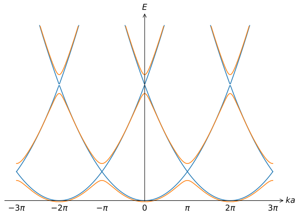
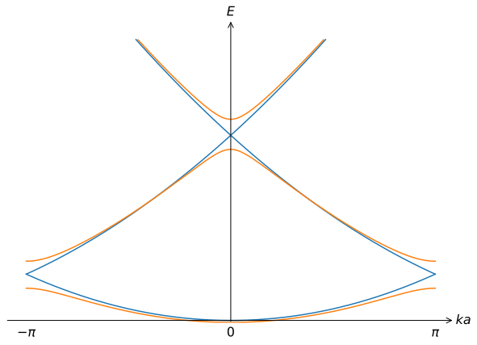
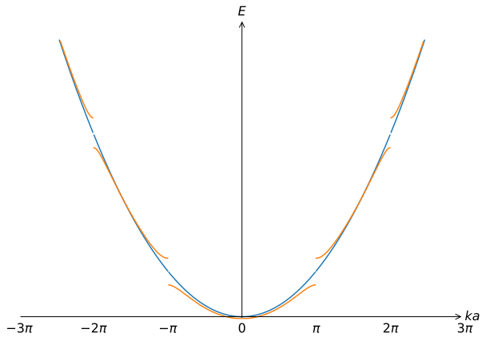

# The nearly free electron model

<!-- Some clever quip -->

## Introduction

<!-- 

Some introductory text -->

!!! danger  "Expected competencies"

    It is assumed that you have familiarity with the following concepts/techniques:

    * Quantum: Perturbation theory, including degenerate perturbation theory

!!! note  "Text reference"
    The material covered here is discussed in section(s) $\S 15$ of [The Oxford Solid State Basics](https://global.oup.com/academic/product/the-oxford-solid-state-basics-9780199680771?cc=au&lang=en&)

!!! info "Computational content"

    The Jupyter notebook associated with this section can be accessed by clicking the icon below:
    [<i class="fab fa-python fa-5x"></i>](https://jove2021.cloud.edu.au/hub/user-redirect/git-pull?repo=https%3A%2F%2Fgithub.com%2FAndy-UTAS%2FSolid-state&urlpath=tree%2FSolid-state%2F5-1-bloch.ipynb&branch=master){ .md-button .md-button--primary class="text-centre" style="margin-left: 45%"}

---

Let's summarize what we learned about electrons so far:

* Free electrons are described by plane waves with a quadratic dispersion and form a Fermi sea ([Electrons in metals II](../../1-intoduction/1-4-emetalsII/))
* Electrons on isolated atoms live in discrete orbitals ([Chemistry](../../2-chemistry/2-1-chemistry/))
* When orbitals hybridise we get *LCAO* or *tight-binding* band structures ([The tight binding model](../../3-1d/3-3-tightbinding/))

In this section, we will analyse how electrons behave in solids using the *nearly-free electron model*. This model considers electrons as plane waves (as in the free electron model) that are weakly perturbed by the periodic potential associated with the atoms in a solid. This approach is opposite to that of the tight-binding model, where our starting point was that the electrons are strongly bound to the individual atoms and we included hopping to other atoms as a small effect. Perhaps surprisingly, we will find that the nearly-free electron model gives very similar results to the tight binding model: it also leads to the formation of energy bands, and these bands are separated by *band gaps* - regions in the band structure where there are no allowed energy states.  

## Nearly free electron model

In the free electron model, the dispersion is $E = \hbar^2 |\mathbf{k}|^2/2m$. The corresponding eigenfunctions $|\mathbf{k}\rangle$ are plane waves with a real-space representation $\psi(\mathbf{r}) \propto e^{i\mathbf{k}\cdot \mathbf{r}}$. We note that in the free electron model,

* there is only one band
* the band structure is not periodic in $k$-space
* i.e., the Brillouin zone is infinite in $k$-space

Within the **nearly free electron model** we start from the dispersion relation of free electrons and analyse the effect of introducing a weak lattice potential. The logic is very similar to getting optical and acoustic phonon branches by changing atom masses (and thereby reducing the size of the Brillouin zone). The lattice potential results in a band structure that is periodic in $k$-space, with a period given by the period of the reciprocal lattice:

In this figure, the orange curves represent the nearly-free electron dispersion, which differs from the free-electron dispersion (blue curves) because of the interaction with the lattice. We see that **band gaps** open where two copies of the free-electron dispersion cross. A key goal of this lecture is to understand how the weak interaction with the lattice leads to this modified band structure.

### Analysing the avoided crossings

To analyse what happens near the crossings, we first neglect the lattice potential and consider the free-electron dispersion near the crossing at $k=\pi/a$ in 1D. Near this crossing, we see that two copies of the dispersion come together (one copy centred at $k=0$, the other at $k=2\pi/a$). We call the corresponding plane-wave eigenfunctions $|k\rangle$ and $|k'\rangle =|k-2\pi/a\rangle$. We now express the wavefunction near this crossing as a linear superposition $|\psi\rangle = \alpha |k\rangle + \beta |k'\rangle$. Note that this wave function is very similar to that used in the LCAO model, except there we used linear combinations of the orbitals $|1\rangle$ and $|2\rangle$ instead of the plane waves $|k\rangle$ and $|k'\rangle$.

We express the Hamiltonian near the crossing as a matrix, using $| k \rangle$ and $| k' \rangle$ as the basis states. The matrix elements are given by $\langle k |H|k\rangle = E_0 + v \hbar \delta k$ and $\langle k' |H|k'\rangle = E_0 - v \hbar \delta k$, where $\delta k = k-\pi/a$ is the distance from the centre of the crossing and we approximated the dispersion near the crossing by a linear term. In matrix form, this yields

$$H\begin{pmatrix}\alpha \\ \beta \end{pmatrix} =
\begin{pmatrix} E_0 + v \hbar \delta k & 0 \\ 0 & E_0 - v \hbar \delta k\end{pmatrix}
\begin{pmatrix}\alpha \\ \beta \end{pmatrix}.
$$
Note that this Hamiltonian is diagonal, so the eigenenergies are on the diagonal and the eigenfunctions are simply the $|k\rangle$ and $|k'\rangle$ basis states.

??? question "calculate $E_0$ and the velocity $v$"
    The edge of the Brilloin zone has $k = \pi/a$. Substituting this in the free electron dispersion $E = \hbar^2 k^2/2m$ we get $E_0 = \hbar^2 \pi^2/2 m a^2$, and $v=\hbar k/m=\hbar \pi/ma$.

As we will see below, the lattice potential $V(x)$ can couple the states $|k\rangle$ and $|k'\rangle$. The coupling between these states is given by the matrix element $W=\langle k | V | k'\rangle$. Including this coupling into the Hamiltonian:

$$
H\begin{pmatrix}\alpha \\ \beta \end{pmatrix} =
\begin{pmatrix} E_0 + v \hbar \delta k & W \\ W^* & E_0 - v \hbar \delta k\end{pmatrix}
\begin{pmatrix}\alpha \\ \beta \end{pmatrix},
$$

*(This is where we applied perturbation theory, and this is very similar to the LCAO Hamiltonian where the coupling was given by $-t=\langle 1 | H | 2 \rangle$)*.

#### Dispersion near the avoided level crossing

To find the dispersion near $k=\pi/a$, we need to diagonalize this 2x2 matrix Hamiltonian. The solutions for the eigenvalues are
$$ E(\delta k) = E_0 \pm \sqrt{v^2\hbar^2\delta k^2 + |W|^2}$$

(Check out section 15.1.1 of the book for the details of this calculation). This equation describes the avoided crossing. We observe that the gap that has opened at $\delta k=0$ is equal to $2W$.

#### Calculating the magnitude of the gaps

We will now show that $W=\langle k | V |k' \rangle$ represents a Fourier component of the lattice potential. To see this, we express the lattice potential (which is periodic with $V(x)=V(x+a)$) as a Fourier series

$$ V(x) = \sum_{n=-\infty}^{\infty} V_n e^{2\pi i n x/a}$$

and recall that such a series has Fourier components $V_n$ given by

$$
V_n = \frac{1}{a}\int_0^a e^{- i n 2\pi x /a} V(x) dx
$$

Calculating $W$, we find
$$W = \langle k | V | k' \rangle = \frac{1}{a}\int_0^{a} e^{-i k x} V(x) e^{i k'x}  dx = \frac{1}{a}\int_0^a e^{-i 2\pi x /a} V(x) dx = V_1$$

where we have used that $k-k' =2\pi/a$ because we are analysing the first crossing. We see that the first component of the Fourier-series representation of $V(x)$ determines the gap near the first crossing.

#### Crossings between the higher bands

Everything we did can also be applied to the higher-energy crossings seen in the figure above. We note that all crossings occur between parabola's that are shifted by integer multiples of reciprocal lattice vectors $n 2\pi/a$. The first crossing corresponds to $n=1$, and we found that the magnitude of the gap is given by $V_1$. Similarly, $V_2$ determines the gap between the second and third bands, $V_3$ for the crossing between third and fourth, etc.

The key conclusion is that the lattice potential couples plane-wave states that differ by integer multiples of reciprocal lattice vectors. This coupling alters the band structure most strongly where the free-electron eigenenergies cross, opening up gaps of which the magnitudes are determined by the Fourier components of the lattice potential.  

??? question "Suppose the lattice potential is $V(x)=A\cos(2\pi/ax)$. At what locations in the dispersion does $V(x)$ lead to the formation of gaps?"
    Hint: The Fourier series of $V(x)$ is $V(x)=A(e^{i2\pi/ax}+e^{-i2\pi/ax})/2$, so the only non-zero Fourier components are $V_1=V_{-1} = A/2$.  

## General description of a band structure in a crystal - Bloch theorem

The different models considered thus far can be organized as a function of the strength of the lattice potential $V(x)$:

We have seen that in the nearly-free electron model, the electrons behave as plane waves that are only slightly perturbed by the lattice potential. How is it possible that an electron that can scatter off all the atoms in a solid can even remotely look like a plane wave? The answer lies in that the periodic potential of the atoms can only scatter an electron between momentum states $|\mathbf{k}\rangle$ and $|\mathbf{k'}\rangle$ *if these momenta differ by a reciprocal lattice vector*. This condition is very similar to the Laue condition of X-ray scattering. In this lecture we have explicitly analysed it in the context of the nearly-free electron model. The condition is known as the **conservation of crystal momentum** and is central to Bloch's theorem, which provides a general framework for computing band structures in crystals.

Bloch theorem:

> All Hamiltonian eigenstates in a crystal have the form
> $$ \psi^\alpha(\mathbf{r}) = u^\alpha(\mathbf{r})e^{i\mathbf{k}\cdot \mathbf{r}} $$
> with $u^\alpha(\mathbf{r})$ having the same periodicity as the lattice potential $V(\mathbf{r})$, and index $\alpha$ labeling electron bands with energies $E^\alpha(\mathbf{k})$.

In other words: any electron wave function in a crystal is a product of a periodic part that describes electron motion within a unit cell and a plane wave. In both the tight-binding and the nearly-free electron models, the wave functions we considered are consistent with Bloch's theorem.

??? question "Does our nearly-free electron wavefunction $|\psi\rangle = \alpha|k\rangle + \beta|k'\rangle$ satisfy the Bloch theorem? What is $u(x)$ in this case?"
    The wave function has a form $\psi(x) = \alpha \exp[ikx] + \beta \exp[i(k - 2\pi/a)x]$
    (here $k = \pi/a + \delta k$). Choosing $u(x) = \alpha + \beta \exp(2\pi i x/a)$ we see
    that $\psi(x) = u(x) \exp(ikx)$.

### Extra remarks

The wave function $u^\alpha(\mathbf{r})e^{i\mathbf{k} \cdot \mathbf{r}}$ is called a **Bloch wave**.

The $u^\alpha(\mathbf{r})$ part is some unknown function. To calculate it we need to solve the Schrödinger equation. It is hard in general, but there are two limits when $U$ is "weak" and $U$ is "large" that provide us with most intuition.

If we change $\mathbf{k}$ by a reciprocal lattice vector $\mathbf{k} \rightarrow \mathbf{k} + h\mathbf{b}_1 + k\mathbf{b}_2 + l\mathbf{b}_3$, and we change $u^\alpha(\mathbf{r}) \rightarrow u^\alpha(\mathbf{r})\exp\left[i(-h\mathbf{b}_1 - k\mathbf{b}_2 - l\mathbf{b}_3)\cdot \mathbf{r}\right]$ (also periodic!), we obtain the same wave function. Therefore energies of all bands $E^\alpha(\mathbf{k})$ are periodic in reciprocal space with the periodicity of the reciprocal lattice.

An alternative way for expressing the Bloch wave is obtained by formulating $u^\alpha(r)$ as a Fourier series:
$$
u^\alpha(r) = \sum_\mathbf{G} u^{\alpha}_\mathbf{G}e^{i\mathbf{G}\cdot\mathbf{r}}
$$
where $u^{\alpha}_\mathbf{G}$ are the Fourier coefficients. Substituting this into our expression for the Bloch wave, we get
$$
\psi^\alpha(r) = \sum_\mathbf{G} u^{\alpha}_\mathbf{G} e^{i(\mathbf{k}+\mathbf{G})\cdot\mathbf{r}}
$$
which shows that each Bloch wave can be written as a sum over plane waves that differ by a reciprocal lattice vector.

<!-- ??? question "Does the tight-binding wavefunction $|\psi\rangle = \sum_n e^{ikna}(\phi_0|n,1\rangle+\psi_0|n,2\rangle)$ (see exercise 2 in Lecture 8) satisfy the Bloch theorem? What part of $|\psi\rangle$ describes $u(x)$ in this case? Try to describe in words how this Bloch wave is built up." -->

??? question "Does the tight-binding wavefunction $|\psi\rangle = \sum_n e^{ikna}(\phi_0|n,1\rangle+\psi_0|n,2\rangle)$ satisfy the Bloch theorem? What part of $|\psi\rangle$ describes $u(x)$ in this case? Try to describe in words how this Bloch wave is built up."

### Repeated vs reduced vs extended Brillouin zone

There are several common ways to **plot** the same dispersion relation (no difference in physical information).

Repeated BZ (all possible Bloch bands):

* Contains redundant information
* May be easier to count/follow the bands

Reduced BZ (all bands within 1st BZ):

* No redundant information
* Hard to relate to original dispersion

Extended BZ (n-th band within n-th BZ):

* No redundant information
* Easy to relate to free electron model
* Contains discontinuities

## Exercises
#### Exercise 1: Bloch's theorem
Suppose we have a crystal with lattice vectors $\mathbf{a}_ 1$, $\mathbf{a}_ 2$, and $\mathbf{a}_ 3$.

1. What can be said about the symmetry of the Hamiltonian $\hat{H}$ of this crystal?
2. Now define the translation operator $\hat{T}_{\alpha,\beta,\gamma}$ so that $$\hat{T}_{\alpha,\beta,\gamma} \psi(\mathbf{r}) = \psi(\mathbf{r} - \alpha \mathbf{a}_1 - \beta \mathbf{a}_2 - \gamma \mathbf{a}_3),$$ where $\alpha$, $\beta$, $\gamma$ are integers. Show that $\hat{T}_{\alpha,\beta,\gamma}$ and $\hat{H}$ commute.
3. Show that the Bloch wavefunctions defined in the lecture notes are eigenfunctions of $\hat{T}_{\alpha,\beta,\gamma}$. What are the corresponding eigenvalues? What does this say about the eigenfunctions of $\hat{H}$.
4. By applying $\hat{H}$ to the Bloch wavefunction, show that the Schrödinger equation can be rewritten as $$\left[ \frac{\mathbf{\hat{p}}^2}{2m} + \frac{\hbar}{m} \mathbf{k} \cdot \mathbf{\hat{p}} + \frac{\hbar^2 \mathbf{k}^2}{2m} + V(\mathbf{r}) \right] u_{n,\mathbf{k}}(\mathbf{r}) = E_{n,\mathbf{k}} u_{n,\mathbf{k}}(\mathbf{r}),$$ where $\mathbf{\hat{p}} =-i\hbar\nabla$.
5. What is $u_{n,\mathbf{k}}(\mathbf{r})$ in case of free electrons? Is your answer consistent with the equation above?

#### Exercise 2: the central equation in 1D
Let's consider a 1D crystal with a period $a$. Let $k_0$ be any wave number of an electron in the first Brillouin zone.

1. What $k_n$ are equivalent to $k_0$ in this crystal?
2. First, we assume that the electrons with these $k_n$ are free. In that case, what are the wavefunctions $\phi_n(x)$ and energies $E_n$ of these electrons?
3. Make a sketch of the dispersion relation using a repeated Brillouin zone representation. Indicate some $k_n$ and $E_n$ as well as the first Brillouin zone in your sketch.

    We will now introduce a weak periodic potential $V(x) = V(x+na)$ in our system. This causes coupling between eigenstates $\left| \phi_n\right>$ in the free electron case. In order to find the right eigenstates of the system with that potential, we need an 'LCAO-like' trial eigenstate given by $$\left|\psi\right> = \sum_{n=-\infty}^{\infty}C_n \left|\phi_n\right>$$

4. Using the trial eigenstate above and the Schrödinger equation, show that $$E C_m = \varepsilon_m C_m+\sum_{n=-\infty}^{\infty} V_{n}C_{m-n},$$ where $V_n$ are the Fourier components of the potential defined [above](#physical-meaning-of-w). Find an expression for $\varepsilon_m$. _**NB:** This equation is also known as the central equation (in 1D)._

    ??? hint
        - Apply $\left<\phi_m\right|$ to the Schrödinger equation.
        - To evaluate $\left<\phi_m\right| \hat{H} \left| \phi_n\right>$, it may be helpful to separate the kinetic energy and potential energy of the Hamiltonian.

5. Why is the dispersion relation only affected near $k=0$ and at the edge of the Brillouin zone (see also figures [above](#repeated-vs-reduced-vs-extended-brillouin-zone))?

    ??? hint
        To answer this question, only consider consider two free electron wavefunctions in the Hamiltonian and ignore all the others. Between what two of free electron wavefunctions does the coupling give significant contribution to the energy levels of the free electron wavefunctions?

#### Exercise 3: the tight binding model vs. the nearly free electron model
Consider a 1D crystal with a periodic potential given by delta peaks: $$V(x) = -\lambda \sum_{n=-\infty}^{\infty} \delta(x+na),$$ where $\lambda>0$. In this exercise, we will find the band structure of this crystal in two ways:

- By means of the nearly free electron model explained in this lecture.
- By means of the tight binding model explained in [lecture 7](/7_tight_binding).

<!-- A comment to separate two lists -->

1. We first find the band structure using the nearly free electron model. To this end, we consider the effect of the potential on the free electron wavefunctions given by $\psi_1(x) \propto e^{ikx}$ and $\psi_2(x) \propto e^{i[k-2\pi/a]x}$ on the interval $k=[0,\pi/a]$. Derive a dispersion relation of the lower band using the Schödinger equation and the trial eigenstate $$\Psi(x) = \alpha \psi_1(x) + \beta \psi_2(x).$$

    ??? hint
        Using the Schrödinger equation and the trial eigenstate, first derive a 2×2 eigenvalue problem given by $$E \begin{pmatrix}\alpha \\ \beta\end{pmatrix} = \begin{pmatrix}\varepsilon_0(k)+V_0 & V_1^* \\ V_1 & \varepsilon_0(k - 2\pi/a) + V_0\end{pmatrix} \begin{pmatrix}\alpha \\ \beta\end{pmatrix}.$$ What are $\varepsilon_0(k)$, $V_0$ and $V_1$?

2. Make a sketch of the lower band.
3. We now use the tight binding model, where we know that the dispersion relation can be described by $$E = \varepsilon_0 - 2 t \cos (ka).$$ Find an expression for $\varepsilon_0=\left<n\right| \hat{H} \left|n\right>$ and $-t=\left<n-1\right| \hat{H} \left| n \right>$, where $|n\rangle$ is the wavefunction of a single $\delta$-peak well at site $n$. You may make use of the results obtained in [exercise 2 of lecture 5](/5_atoms_and_lcao/#exercise-2-application-of-the-lcao-model) or [look up the wavefunction](https://en.wikipedia.org/wiki/Delta_potential).
4. Compare the bands obtained in exercise 1 and 2: what are the minima and bandwidths (difference between maximum and minimum) of those bands?
5. For what $a$ and $\lambda$ is the nearly free electron model more accurate? And for what $a$ and $\lambda$ is the tight binding model more accurate?
