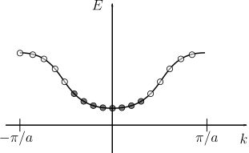
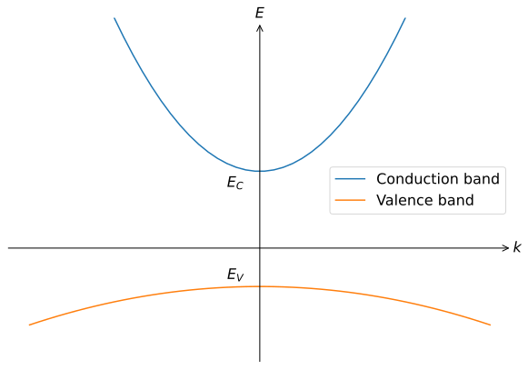
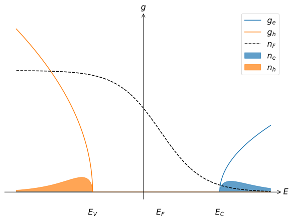

# Semiconductor physics
<!-- Some clever quip -->

## Introduction

<!-- 

Some introductory text -->

!!! danger  "Expected competencies"

    It is assumed that you have familiarity with the following concepts/techniques:

    *

!!! note  "Text reference"
    The material covered here is discussed in section(s) $\S 17 and 18$ of [The Oxford Solid State Basics](https://global.oup.com/academic/product/the-oxford-solid-state-basics-9780199680771?cc=au&lang=en&)

!!! info "Computational content"

    The Jupyter notebook associated with this section can be accessed by clicking the icon below:
    [<i class="fab fa-python fa-5x"></i>](https://jove2021.cloud.edu.au/hub/user-redirect/git-pull?repo=https%3A%2F%2Fgithub.com%2FAndy-UTAS%2FSolid-state&urlpath=tree%2FSolid-state%2F6-1-semiconductors.ipynb&branch=master){ .md-button .md-button--primary class="text-center" style="margin-left: 45%"}

---

Up until this point, we focused on calculating and understanding the band structures.
However, the dispersion of a band is only part of the story.
An empty band is not going to lead to any interesting physical properties no matter how sophisticated it is.
Therefore, it is also important *how* bands are filled by the particles.
By carefully controlling the distribution of particles in the bands, we are able to engineer material properties that we require.
Without a doubt, the greatest example is *semiconductors*—the bedrock of modern electronics.
In this lecture, we shall grasp the basics of semiconductors by learning how to treat bands at different levels of filling.

## Review of band structure properties

Before proceeding further, let us remind ourselves of important band structure properties.

* Group velocity $v=\hbar^{-1}\partial E(k)/\partial k$.
Descibes how quickly electrons move within the lattice.
* Effective mass $m^* = \hbar^2\left(d^2 E(k)/dk^2\right)^{-1}$.
Tells us how hard it is to *accelerate* the particles and is related to the curvature of the band.
* Density of states $g(E) = \sum_{\textrm{FS}} (dn/dk) \times (dk/dE)$.
The amount of states per infinitesimal interval of energy at given energy.
The quantity is vital in order to calculate any bulk property of the material such as conductivity, heat capacity, etc.

In order to check that everything makes sense, we apply the concepts to the free electron model:

$$H = \frac{\hbar^2 k^2}{2m}$$

The velocity is $\hbar^{-1}\partial E(k)/\partial k = \hbar k / m \equiv p/m$.  
The effective mass is $m^* = \hbar^2\left(d^2 E(k)/dk^2\right)^{-1} = m$.

So in this simplest case the definitions match the usual expressions.

## Filled vs empty bands

We distinguish three different band filling types: filled, empty and partially filled.
Despite being two opposite extreme extreme cases, filled and empty bands are very similar.
For example, both filled and empty bands carry no electric current:
$$
\begin{align}
j = 2e \frac{1}{2\pi} \int_{-\pi/a}^{\pi/a} v(k) dk = 2e \frac{1}{2\pi \hbar} \int_{-\pi/a}^{\pi/a} \frac{dE}{dk} \times dk = \\
2e \frac{1}{2\pi \hbar} [E(\pi/a) - E(-\pi/a)] = 0.
\end{align}
$$
On the other hand, a filled band has an equal number of electrons going forwards and backwards which thus cancel and lead to zero current.
Similar results apply to many other physical quantities such as heat capacity and magnetization.
Therefore, filled and empty bands do not affect most physical properties and can be disregarded.
As a result, rather than to consider hundreds of bands that a material contains, we neglect most of them and just focus on the handful of partially filled bands around Fermi level.

## From electrons to holes

Because completely filled or completely empty bands have simple properties, we may search for a convenient way to describe a band that only has a few electrons missing or extra.
While keeping track of a few electrons has no tricks, even a few electrons missing from a band seem to require considering all the other electrons in a band.

A more efficient approach to describing a nearly filled band is motivated by the following analogy.
Let us say we have 100 boxes: 99 are occupied and 1 is empty.
To keep track which box is occupied/empty, we could write down the numbers of all 99 occupied boxes.
If, on the other hand, we only keep track which single box is empty, we solve the problem with a lot less book-keeping.

The same approach applies to band filling.
Instead of describing a lot of electrons that are present in an almost filled band, we focus on those that are absent.
The absence of an electron is called a **hole**: a state of a completely filled band with one particle missing.

In this schematic we can either say that 8×2 electron states are occupied (the system has 8×2 electrons counting spin), or 10×2 hole states are occupied.
Electron and hole pictures correspond to two different, but equivalent ways of describing the occupation of a band.
Naturally, dealing with electrons is more convenient whenever a band is almost empty and with holes when a band is almost full.

## Properties of holes

Let us compare the properties of an electron with energy $E$ and a hole obtained by removing that electron.
Since removing an electron reduces the total energy of the system, the hole's energy is opposite to that of an electron $E_h = -E$.
The probability for an electron state to be occupied in equilibrium is given by $f(E)$:

$$f(E) = \frac{1}{e^{(E-E_F)/kT} + 1}.$$

Since a hole is a missing electron, the probability for a hole state to be occupied is

$$f_h(E) = 1 - f(E) = 1 - \frac{1}{e^{(E-E_F)/kT} + 1} = \frac{1}{e^{(-E+E_F)/kT} + 1},$$

which is the Fermi distribution of particles with energy $E_h= -E$ and $E_{F,h} = -E_F$.

The **momentum** $p_h$ of a hole should give the correct total momentum of a partially filled band if one sums momenta of all holes.
Therefore $p_h = -\hbar k$, where $k$ is the wave vector of the electron.

Similarly, the total **charge** should be the same regardless of whether we count electrons or holes, so holes have a positive charge $+e$ (electrons having $-e$).

On the other hand, hole's velocity is **the same** as that of an electron:
$$\frac{dE_h}{dp_h} = \frac{-dE}{-d\hbar k} = \frac{dE}{dp}.$$

Finally, we derive the hole effective mass from the equations of motion:

$$m_h \frac{d v}{d t} = +e (E + v\times B).$$

Comparing with

$$m_e \frac{d v}{d t} = -e (E + v\times B),$$

we get $m_h = -m_e$ (we could also obtain this by differentiating the hole's velocity).

## Semiconductors: materials with two bands.

Semiconductors are materials with all bands either nearly occupied or almost empty.
Unlike in insulators, however, the band gap in semiconductors is sufficiently small, for it to be possible to create a few electrons in the lowest unoccupied band or the highest filled band.
Because in the unoccupied band the **charge carriers** (particles carrying electric current) are electrons, it is called **conduction band**, while in the almost occupied **valence band** the charge carriers are holes.

!!! note "Holes in semiconductors"

    When introducting holes, we discussed holes obtained by removing *any* electron.
    From this point on, similar to most other discussions of semiconductors in the literature, we will only speak of holes in valence band and electrons in conduction band.

The occupation of the two bands is dictated by the Fermi distribution.
Furthermore, the Fermi level of a semiconductor lies between the conduction and the valence bands, and the band gap $E_G \gg k_B T$ in most materials.
As a result, only the bottom of the conduction band has electrons and the top of the valence band has holes.
Therefore we can approximate the dispersion relation of both bands as parabolic, like shown below

Or in other words

$$
\begin{align}
E_e &= E_c + \frac{\hbar^2k^2}{2m_e},\\
E_h &= E_{v,h} + \frac{\hbar^2k^2}{2m_h} = -E_{v} + \frac{\hbar^2k^2}{2m_h}.
\end{align}
$$

Here $E_c$ is the energy of an electron at the bottom of the conduction band and $E_v$ is the energy of an electron at the top of the valence band.
Observe that because we are describing particles in the valence band as holes, $m_h > 0$ and $E_h > -E_v$.

The corresponding density of states of the two types of particles is

$$
\begin{align}
g(E) &= (2m_e)^{3/2}\sqrt{E-E_c}/2\pi^2\hbar^3,\\
g_h(E_h) &= (2m_h)^{3/2}\sqrt{E_h+E_v}/2\pi^2\hbar^3.
\end{align}
$$

??? question "A photon gives a single electron enough energy to move from the valence band to the conduction band. How many particles does this process create?"
    Two: one electron and one hole.

## Semiconductor density of states and Fermi level

### Intrinsic semiconductor

Our next task is to figure out *how many* electrons and holes there are, and for that we need to find where the Fermi level $E_F$ is located.
Let us plot the density of states, the Fermi distribution function, and the density of particles at each energy in the same plot:

We know that by itself, the semiconductor should have no charge, and therefore the total numbers of electrons and holes must be equal.
Since increasing the Fermi level increases the number of electrons and reduces the number of holes, we will use the charge neutrality condition to determine where the Fermi level is situated.

**The key algorithm of describing the state of a semiconductor:**

1. Compute the density of states of all types of particles.
2. Calculate the number of electrons in the conduction band and holes in the valence band, assuming a certain value of $E_F$
3. Write down the charge balance condition: the difference between electrons and holes should equal the total charge of the semiconductor.
4. Apply approximations to simplify the equations (this is important!).
5. Find $E_F$ and concentrations of electrons and holes

Applying the first two steps of the algorithm:

$$n_h = \int_{-E_v}^\infty f_h(E_h) g_h(E_h) dE_h = \int_{-E_v}^\infty\frac{(2m_h)^{3/2}}{2\pi^2\hbar^3}\sqrt{E_h+E_v}\frac{1}{e^{(E_h+E_F)/kT}+1}dE_h$$

$$n_e = \int_{E_c}^\infty f(E)g_e(E)dE = \int_{E_c}^\infty\frac{(2m_e)^{3/2}}{2\pi^2\hbar^3} \sqrt{E-E_c}\frac{1}{e^{(E-E_F)/kT}+1}dE.$$

Note that whenever calculating the hole dependent quantities, we replace all the relevant physical quantities with their hole equivalents.
Since the hole energy is opposite $E_h = -E$, we replace the Fermi energy $E_F \to -E_F$ and the bottom of the valance band by $E_v \to -E_v$ in the integration limits.

In the third step, we need to solve the equation under charge balance $n_e = n_h$.
The equation is not a pleasant one and cannot be solved analytically unless an approximation is made.
Therefore, the fourth step assumes that the Fermi level is far from both bands $E_F-E_v \gg kT$ and $E_c - E_F \gg kT$.
As a result, the Fermi-Dirac distribution is approximately similar to Boltzmann distribution:

$$
f(E)_{e/h} \approx \exp\left[-(E_{e/h}\pm E_F)/kT\right].
$$

Now we can move to the last step and calculate $n_e$ and $n_h$:

$$
n_h \approx \frac{(2m_h)^{3/2}}{2\pi^2\hbar^3}e^{-E_F/kT} \int_{-E_v}^\infty\sqrt{E_h+E_v}e^{-E_h/kT}dE_h =
N_V e^{(E_v-E_F)/kT},
$$

where we used $\int_0^\infty \sqrt{x}e^{-x}dx=\sqrt{\pi}/2$ and we defined

$$
N_V = 2\left(\frac{2\pi m_h kT}{h^2}\right)^{3/2}.
$$

We see that holes are exponentially activated into the valence band.

??? question "how large is $N_V$ at room temperature? (hard question)"
    If $kT \sim 1\textrm{eV}$ (the typical energy size of a band), then electrons in the whole band may be excited and $N_V \sim 1$ per unit cell. On the other hand, $N_V \sim T^{3/2}$ Therefore $N_V \sim (kT/1 \textrm{eV})^{3/2}\sim 1\%$.

Similarly for electrons:

$$
n_e = N_C e^{-(E_c - E_F)/kT},\quad N_C = 2\left(\frac{2\pi m_e kT}{h^2}\right)^{3/2}.
$$

Combining everything together:

$$
n_h \approx N_V e^{(E_v-E_F)/kT} = N_C e^{-(E_c-E_F)/kT} \approx n_e.
$$

Solving for $E_F$:

$$
E_F = \frac{E_c + E_v}{2} - \frac{3}{4}kT\ln(m_e/m_h).
$$

An extra observation: regardless of where $E_F$ is located, $n_e n_h = N_C N_V e^{-E_g/kT} \equiv n_i^2$, where $E_g=E_c-E_v$ is the band gap of the semiconductor.

$n_i$ is the **intrinsic carrier concentration**, and for a pristine semiconductor $n_e = n_h = n_i$.

> The equation
> $$n_e n_h = n_i^2$$
> is the **law of mass action**. The name is borrowed from chemistry, and describes the equilibrium concentration of two reagents in a reaction $A+B \leftrightarrow AB$. Here electrons and hole constantly split and recombine.

### Conduction

Earlier, we deduced that empty and filled bands provide no current.
We finish the analysis by considering partially filled bands of an intrinsic (pristine) semiconductor.
To calculate the current, we utilize the Drude model and sum the electron and hole contributions:

$$j = -n_e e v_e + n_h e v_h $$

$$ -m_e v_e /\tau_e = -eE;\quad -m_h v_h /\tau_h = eE.$$

We see that despite opposite velocity signs for electrons and holes, they carry electric current in the same direction:

$$ \sigma \equiv \frac{j}{E} = \left(\frac{n_e e^2 \tau_e}{m_e}+\frac{n_h e^2 \tau_h}{m_h}\right) = n_e e \mu_e + n_h e \mu_h.$$

We know that for intrinsic semiconductors, the hole/electron densities are $n_e = n_h = n_i \propto e^{-E_G/kT}$.
Therefore, it is possible to measure the band gap of an intrinsic semiconductor by looking at the temperature dependant conductivity $E_G \approx d \ln \sigma / d [kT]^{-1}$.
Additional information can be obtained using Hall effect.
However Hall effect is much more complex in semiconductors since only the current in the direction perpendicular to the applied electric field must vanish.
This, however only means that the electron current is opposite of the hole current in that direction, not that the electrons and holes move parallel to the applied current.

## Exercises

#### Exercise 1: Energy, mass, velocity and cyclotron motion of electrons and holes

  1. Consider the top of the valence band of a semiconductor (see [above](#semiconductors-materials-with-two-bands)). Does an electron near the top of the valence band have a positive or a negative effective mass? Does the electron's energy increase or decrease as $k$ increases from 0? Does the electron have a positive or negative group velocity for $k>0$?
  2. Answer the same last 3 questions for a hole in the valence band.
  3. We now consider an electron in a 2D semiconductor near the bottom of the conduction band described by an energy dispersion $E=E_{G}+\frac{\hbar^2}{2m^*}(k_x^2+k_y^2)$. The electron's velocity is given by $\mathbf{v}=\nabla_\mathbf{k} E/\hbar = \frac{1}{\hbar}(\frac{\partial E}{\partial k_x}\mathbf{\hat{x}} + \frac{\partial E}{\partial k_y}\mathbf{\hat{y}})$. Suppose we turn on a magnetic field $B$ in the $z$-direction. Write down the equation of motion for this electron (neglecting collisions). What is the shape of the motion of the electron? What is the characteristic 'cyclotron' frequency of this motion? What is the direction of the Lorentz force with respect to $\nabla_\mathbf{k} E$?
  4. Suppose we now consider a hole near the bottom of the conduction band and turn on a magnetic field $B$ in the $z$-direction. Is the direction of the circular motion (i.e., the chirality) of the hole the same as that of the electron? Would the chirality change if we instead consider a hole (or electron) near the top of the valence band?

#### Exercise 2: holes in Drude and tight binding model

1. Recall from the [Drude model](/3_drude_model/) that electrons give rise to a negative Hall coefficient. Explain why the Hall coefficient is positive if holes are the charge carriers in a material.
2. What would be the Hall coefficient if both carriers with equal concentration are present? Assume that both electrons and holes can move freely and have the same scattering time.

    Recall that the dispersion relation of a [1D single orbital tight binding chain](/7_tight_binding/) is given by
    $$E(k)=\varepsilon + 2t \cos(ka),$$
    where $a$ is the lattice constant and $\varepsilon$ and $t$ are tight binding parameters.

3. What is the group velocity and effective mass of this band for holes compared to that of electrons?
4. Give an integral expression of the hole concentration in this band given the chemical potential $\mu$ and temperature $T$.
5. Show that the sum of the electron and hole concentration in this band is constant as a function of the temperature.

#### Exercise 3: a 1D semiconductor
Suppose we have a 1D semiconductor with a conduction band described by $$E_{cb} = E_G - 2 t_{cb} [\cos(ka)-1],$$ and a valence band described by $$E_{vb} = 2 t_{vb} [\cos(ka)-1].$$ Furthermore, the chemical potential is set at $0 < \mu < E_G$.

1. Derive an expression for the group velocity and effective mass for electrons in the conduction bands and holes in the valence band.

    Assume that the Fermi level is far away from both bands. That is, $|E - \mu| \gg k_B T$. In that case, it is acceptable to approximate the bands for low $k$.

2. Why is it acceptable? Write down an approximate expression of these bands.
3. Write down an expression for the density of states _per unit length_ for both bands using the approximated expressions. Compare with the actual density of states per unit length.
4. Calculate the electron density in the conduction band and the hole density in the valence band.
5. What would the chemical potential $\mu$ be in case of an intrinsic semiconductor?
