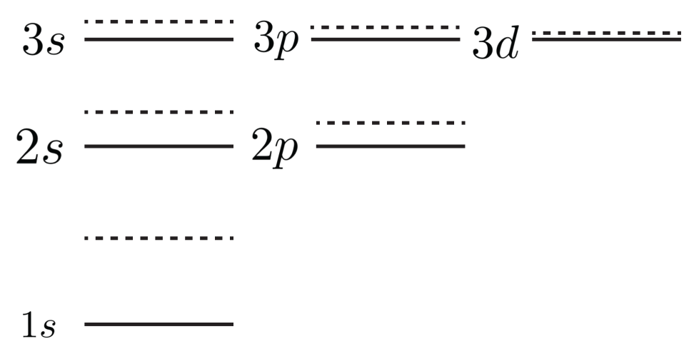
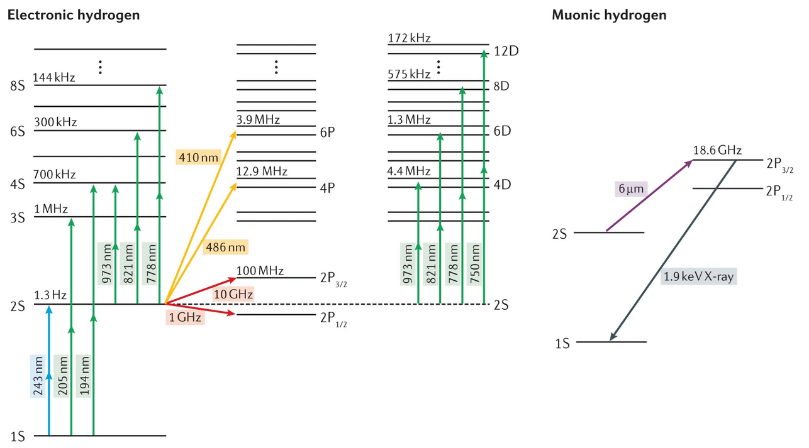
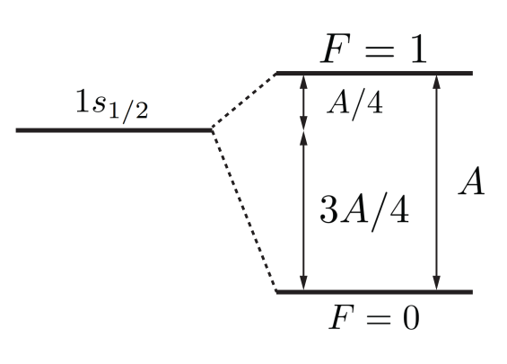

```python tags=["initialize"]

from matplotlib import pyplot
import numpy as np

from common import draw_classic_axes, configure_plotting

configure_plotting()

```

# Assignment one

The first assignment covers the content from weeks 1 and 2, which includes topics such as early atomic physics, the hydrogen atom, stationary perturbation theory, the variational principle, angular momentum coupling, and the Hyperfine effect.

<figure markdown>
<a href = '../hosted/Assignment1.pdf'> <i class="fas fa-file-pdf fa-3x"></i> </a>
    <figcaption>A pdf version of the assignment as distributed
    </figcaption>
</figure>

---

## Question 1

!!! question "Tritium"
    [Tritium](https://en.wikipedia.org/wiki/Tritium) is an isotope of hydrogen, with a nucleus comprising one proton and two neutrons. The tritium nucleus (triton) is radioactive, decaying via $\beta$ emission to a helium-3 nucleus which comprises two protons and one neutron. An electron is initially in the ground state of a tritium atom. After the (instantaneous) $\beta$ decay, what is the probability that the electron is in the ground state of the new atom?

The ground state of tritium ($Z=1$) is

\[
    \psi_{T,100}(r, \theta, \phi) = \frac{1}{\sqrt{\pi a_0^3}} e^{-r/a_0}
\]


and the ground state of helium-3 ($Z=2$) is

\[
    \psi_{He,100}(r, \theta, \phi) = \sqrt{\frac{8}{\pi a_0^3}} e^{-2r/a_0}.
\]


The wavefunction is unchanged during the decay, so we can compute the probability via the usual way, namely:

\[
    \mathscr{P}(\psi = \psi_{He,100}) = \left\rvert \left\langle \psi_{He,100} \rvert \psi_{T,100} \right\rangle \right\rvert^2.
\]

The inner product is

\begin{align*}
    \left\langle \psi_{He,100} \rvert \psi_{T,100} \right\rangle & = \int \psi_{He,100} \, \psi_{T,100} \, dV \\
    & = \int_0^\infty \int_0^{2\pi} \int_0^\pi \sqrt{\frac{8}{\pi a_0^3}} e^{-2r/a_0} \frac{1}{\sqrt{\pi a_0^3}} e^{-r/a_0} r^2 \sin(\theta) \, d\theta \, d\phi \, dr \\
    & = \frac{\sqrt{8}}{\pi a_0^3} (4\pi) \int_0^\infty r^2 e^{-3r/a_0} dr = \frac{4\sqrt{8}}{a_0^3} \left(\frac{2a_0^3}{27}\right) \\
    & = \frac{8\sqrt{8}}{27}
\end{align*}

and therefore the probability is

\[
    \mathscr{P}(\psi = \psi_{He,100}) = \left\rvert  \frac{8\sqrt{8}}{27} \right\rvert^2 \approx 0.702
\]

## Question 2

!!! question annotate "Muonic hyrdogen"

    Muons are effectively heavy electrons. They rapidly decay into electrons with a lifetime of approximately $2.2~\mu\textrm{s}$ - see the [lifetime of the muon experiment](https://polus.utasphys.cloud.edu.au/partIII/muon/) in third year labs - but through some technical wizardry, it is possible to produce muonic hydrogen and perform precision spectroscopy on these atoms before they decay. Indeed, said spectroscopy has led to a still-unanswered problem, the so-called [*proton radius problem*](https://en.wikipedia.org/wiki/Proton_radius_puzzle).

    As muons are much heavier than electrons, muonic hydrogen is a much smaller atom the vanilla hydrogen. As such, the finite size of the nucleus plays an more significant role in the energy-level structure of the system. The effective Coulomb potential can be approximated as

    \[
        V(r) =
        \begin{cases}
            -\frac{Z e^2}{r} & r \geq R \\
             -\frac{Z e^2}{r}\left( \frac{3}{2}-\frac{1}{2}\frac{r^2}{R^2} \right) & r \leq R
        \end{cases}
    \]

    where $R$ is the region over which the nuclear charge is distributed.


    1. Express the Hamiltonian for muonic hydrogen as a perturbation of a hydrogenic system.          
    2. Posit how the energies for all the states with $n=1, 2,$ and $3$ will be shifted. How will the levels be shifted relative to absolutely, and relatively? Draw an energy-level diagram, indicating the unperturbed states, the perturbed states, and discuss the physical origins of any differences between states.
    3. Calculate the first-order change in energy for the ground state of muonic hydrogen. You can make the approximation that $R \ll a_\mu$, where $a_\mu$ is the Bohr radius for the muon (1).
    4. The charge radius $R$ is often measured by probing the $2s \rightarrow 2p$ transition. Find an expression for the (angular) frequency of this transition, thus showing one can indeed measure $R$ from measurement of this transition.
    5. Can you suggest reasons that the $2s \rightarrow 2p$ transition is used to measure $R$ instead of directly measuring the ground state energy?
1. **Hint**: make this approximation early!

### 2.1
!!! question ""
    Express the Hamiltonian for muonic hydrogen as a perturbation of a hydrogenic system.  

If the system were ideal, that is, the proton charge radius was zero, the potential would be $V_0 = -\frac{Z e^2}{r}$ for all $r$ - which we know how to solve. Our perturbation can then be constructed by considering $H'=V - V_0$, or explicitly

\[
    H^\prime =
    \begin{cases}
        0 & r \ge R \\
        Z e^2 \left[\frac{1}{r}-\frac{1}{R}\left(\frac{3}{2} - \frac{1}{2}\frac{r^2}{R^2}\right)\right] & r \le R
    \end{cases}
\]

### 2.2
!!! question ""
    Posit how the energies for all the states with $n=1, 2,$ and $3$ will be shifted. How will the levels be shifted relative to absolutely, and relatively? Draw an energy-level diagram, indicating the unperturbed states, the perturbed states, and discuss the physical origins of any differences between states.

When $r < R$, $H^\prime > 0$ and the energy levels shift upwards, which is best understood through Gauss' law: inside the charge radius, there is less enclosed charge, so the interaction will be lessened and therefore the muon will be more weakly bound. This effect will be greatest for states which have a higher likelihood of being closer to the nucleus ($n=1$) and the effect will diminish with increasing angular momentum $\ell$, as states are further from the origin. We therefore expect the greatest effects for low $n$ and $l$, with the perturbation diminishing for higher $n$ and $l$.

<figure markdown>
  {width="800"}
  <figcaption>The energy levels of muonic hydrogen</figcaption>
</figure>

### 2.3
!!! question annotate ""
    Calculate the first-order change in energy for the ground state of muonic hydrogen. You can make the approximation that $R \ll a_\mu$, where $a_\mu$ is the Bohr radius for the muon (1).
1. **Hint**: make this approximation early!

The first-order correction to the ground state is given by

\[
    E_{1s}^{(1)} = \left\langle 1s \left\rvert H^\prime \right\rvert 1s \right\rangle
\]

The ground state in position space is given by $\psi_{\mu,100} = \frac{1}{\sqrt{\pi a_\mu^3}} e^{-r/a_{\mu}}$ so making the approximation that $e^{-r/a_\mu}\approx 1$ since $R \ll a_\mu$ (I told you to make the approximation early!)

\[
  E_{1s}^{(1)} = \int \psi_{\mu,100}^* \, H' \, \psi_{\mu,100} d\mathbf{r} = \frac{1}{\pi a_\mu^3} (4\pi) \int_0^R  Z e^2 \left[\frac{1}{r}-\frac{1}{R}\left(\frac{3}{2} - \frac{1}{2}\frac{r^2}{R^2}\right)\right] r^2 dr
\]

where we note that the angular integral simply evaluates to $4\pi$ as there is no dependence on $\theta$ or $\phi$. Cranking the handle:

\begin{align*}
    \frac{ 4 Z e^2 }{a_\mu^3} \left(\frac{R^2}{2}-\frac{R^3}{2R} + \frac{R^5}{10 R^3} \right) & = \frac{ 4 Z e^2 }{a_\mu^3} \left(\frac{R^2}{2}-\frac{R^2}{2} + \frac{R^2}{10} \right) \\
    & = \frac{ 2 R^2 Z e^2 }{5 a_\mu^3}
\end{align*}

### 2.4
!!! question annotate ""
    The charge radius $R$ is often measured by probing the $2s \rightarrow 2p$ transition. Find an expression for the (angular) frequency of this transition, thus showing one can indeed measure $R$ from measurement of this transition.

We follow essentially an identical procedure to that above, except using the states $\psi_{\mu,200}$ and $\psi_{\mu,210}$. Once you have played the game long enough, you can be sneaky, identifying that in integral over $\psi_{\mu,210}$ is going to vanish, as the only angular dependence of the wave function is $\cos(\theta)$, and the perturbing Hamiltonian does not have angular dependence, so we will effectively compute the integral of $\cos^2(\theta)\sin(\theta)$ which when integrated over $[0,2\pi]$ will average to zero, so we can immediately say that $E_{2p}^{(1)}=0$.

Computing $E_{2s}^{(1)}$, we have

\[
\psi_{\mu,200} = \frac{1}{\sqrt{\pi}}\left(\frac{1}{2 a_\mu}\right)^{3/2} \left[1-\frac{r}{2 a_\mu}\right] e^{-r/a_{\mu}}
\]

and again, making the approximation that $e^{-r/a_\mu}\approx 1$ since $R \ll a_\mu$ means we end up computing effectively the same as above

\begin{align*}
    E_{2s}^{(1)} = \int \psi_{\mu,200}^* \, H' \, \psi_{\mu,200} d\mathbf{r} & =  \frac{1}{8 \pi a_\mu^3} (4\pi) \int_0^R  Z e^2 \left[\frac{1}{r}-\frac{1}{R}\left(\frac{3}{2} - \frac{1}{2}\frac{r^2}{R^2}\right)\right] r^2 dr \\
    & = \frac{Ze^2}{2 a_\mu^3} \frac{R^2}{10} \\
    & = \frac{R^2 Z e^2 }{20 a_\mu^3}
\end{align*}

And so the perturbation to the energy of the transition is given by

\[
\Delta E = E_{2p}^{(1)} - E_{2s}^{(1)} \approx E_{2s}^{(1)}
\]

and the total energy of the transition $E=\hbar\omega=E_{2p}-E_{2s}$ to first-order only has the correction $E_{2s}^{(1)}$

### 2.5
!!! question ""            
    Can you suggest reasons that the $2s \rightarrow 2p$ transition is used to measure $R$ instead of directly measuring the ground state energy?

This is very much an experimentally-oriented question, and there are a few main considerations. The first is what happens when when measures a ground-state energy: when you do spectroscopy, you put in a photon with enough energy to drive the transition. By definition, the ground-state energy is the same as the ionisation energy of the atom, so you will generate muons in the spectroscopy process, which has the disadvantage of destroying your hard-won muonic hydrogen, but also means that you now have charge available to perturb the energy levels of surrounding atoms. There is also the practical consideration of when we perform spectroscopy, we like microwaves and optical frequencies, as we can control the frequencies of both of these very well. In muonic hydrogen, the energies involved are *much* larger than those of hydrogen - see the energy-level diagram below - and producing monochromatic radiation at those wavelengths is hard! Explicitly, experiments which deal even with the $1s\rightarrow2p$ states in hydrogen are hard work, as you require a laser in the UV, and these are both hard to make and difficult to use. In the case of muonic hydrogen, you require 2keV X-rays for the same transition, and coherent sources of X-rays are not readily available.

<figure markdown>
  {width="800"}
  <figcaption>The energy levels of both electronic hydrogen and muonic hydrogen, taken from the paper <a href="https://www.nature.com/articles/s42254-020-0229-x">The proton size</a> which gives a good account of the *proton radius puzzle*.</figcaption>
</figure>

For the $2s\rightarrow2p$ transition in hydrogen, we can use microwaves to drive transitions, which corresponds to deep infrared transitions for muonic hydrogen, but whilst this is not the most convenient laser wavelegnth, we can make it, and therefore do precision spectroscopy of muonic hydrogen. Well, for the time it exists before the muon decays!


## Question 3

!!! question annotate "Variational method"
    Electrons in many-electron atoms generally experience a *screened* potential, that is, a potential that is smaller in magnitude than that due solely to its interaction with the nucleus due to other electrons shielding the nuclear charge.

    In atomic units, we can model this screened potential using

    \[
        V(r) = -\frac{Z}{r} + \frac{1 - e^{-\mu r}}{r}
    \]

    where $\mu$ (1) is a constant determined by atomic properties. We are going to use our intuition and propose a trial wave function for the ground state of the form

    \[
    \psi_{trial}(\mathbf{r}) \propto e^{-\lambda Z r} Y_0^0(\theta, \phi)
    \]

    You are going to use the variational method to find a bound on the ground-state energy.


    1. Determined the normalisation constant for the trail wave function \psi_{trial}(\mathbf{r})
    2. Calculate the expectation value $\left\langle \psi_{trial} \rvert T \rvert\psi_{trial} \right\rangle$, where $T$ is the kinetic energy operator
    3. Calculate the expectation value $\left\langle \psi_{trial} \rvert V_0 \rvert \psi_{trial} \right\rangle$, where $V_0$ is the normal Coulomb potential
    4. Calculate the expectation value $\left\langle \psi_{trial} \rvert V^\prime \rvert \psi_{trial} \right\rangle$, where $V^\prime$ is perturbation from the normal Coulomb potential
    5. Using the above, calculate a bound on the ground state energy of the system, assuming a screening potential of $\mu = 0.1~\text{a.u.}^{-1}$. You may solve non-trivial polynomials computationally (indeed, it is encouraged) but ensure to include executable code in your response.
1. The symbol $\mu$ here is convention, and is unfortunate given the question above, but the two $\mu$ are very much unrelated!

### 3.1
!!! question ""            
    Determined the normalisation constant for the trail wave function $\psi_{trial}(\mathbf{r})$

If we have our trial wave function

\[
    \psi_{trial}(\mathbf{r}) = N e^{-\lambda Z r} Y_0^0(\theta, \phi) = \frac{N}{\sqrt{4\pi}} e^{-\lambda Z r}
\]

then normailsation demands that $\left \langle \psi_{trial} \rvert \psi_{trial} \right\rangle = 1$. This means that

\[
    \begin{align*}
          1 = \left \langle \psi_{trial} \rvert \psi_{trial} \right\rangle & = \frac{N^2}{4\pi}\int_0^\infty 4\pi r^2 e^{-2\lambda Z r} dr \\
          & = N^2\frac{2!}{(2\lambda Z)^3} = \frac{N^2}{4(\lambda Z)^3} \\
          & \Rightarrow N^2 = 4(\lambda Z)^3
    \end{align*}
\]

### 3.2
!!! question ""            
    Calculate the expectation value $\left\langle \psi_{trial} \rvert T \rvert\psi_{trial} \right\rangle$, where $T$ is the kinetic energy operator

To calculate the expectation value $\langle T \rangle$, we must compute $\left \langle \psi_{trial} \rvert T \rvert \psi_{trial} \right\rangle$. As we are in atomic units, this means out kinetic energy operator for a wave function which depends only on $r$ has the form

\[
    T=- \frac{1}{2} \nabla^2 = -\frac{1}{2}\frac{1}{r^2}\frac{\partial}{\partial r}\left(r^2\frac{\partial}{\partial r}\right)
\]

which when applied to our wave function

\[
  \begin{align*}
      T\rvert \psi_{trial} \rangle & = -\frac{1}{2}\frac{1}{r^2}\frac{\partial}{\partial r}\left(r^2\frac{\partial}{\partial r} \frac{N}{\sqrt{4\pi}} e^{-\lambda Z r} \right) \\
      & = \frac{\lambda Z N}{2\sqrt{4\pi}} \frac{1}{r^2} \frac{\partial}{\partial r} \left( r^2 e^{-\lambda Z r} \right) \\
      & = \frac{\lambda Z N}{2\sqrt{4\pi}} \frac{1}{r^2}\left(2re^{-\lambda Z r} - \lambda Z r^2 e^{-\lambda Z r}\right) \\
      \Rightarrow \left\langle \psi_{trial} \rvert T \rvert \psi_{trial} \right\rangle & = \frac{\lambda Z N^2}{2\cdot4\pi} \int_0^\infty (4\pi) \left(2re^{-\lambda Z r} - \lambda Z r^2 e^{-\lambda Z r}\right) dr \\
      & = \frac{\lambda Z N^2}{2}\left(2\frac{1!}{(2\lambda Z)^2} - \lambda Z \frac{2!}{(2\lambda Z)^3}\right) \\
      & = \frac{\lambda Z N^2}{2}\frac{1}{4(\lambda Z)^2} = \frac{N^2}{8\lambda Z} \\
      & \left( = \frac{(\lambda Z)^2}{2} \right)
  \end{align*}
\]

where I normally not substitute $N$ until the computation is complete, but I put the result there if those that use a wave function with a normalisation constant. This is probably worth more than two marks...

### 3.3
!!! question ""            
    Calculate the expectation value $\left\langle \psi_{trial} \rvert V_0 \rvert \psi_{trial} \right\rangle$, where $V_0$ is the normal Coulomb potential

After the work above, this one is easy! In atomic units, we need only compute $\left\langle \psi_{trial} \rvert -Z/r \rvert \psi_{trial} \right\rangle$ which we can do directly, in the same way as the integrals above:

\begin{align*}
    \left\langle \psi_{trial} \rvert V_0 \rvert \psi_{trial} \right\rangle & = \frac{N^2}{4\pi}(4\pi)\int_0^\infty -Z r e^{-2\lambda Z r}dr \\
    & = - N^2 Z \frac{1!}{(2\lambda Z)^2} \\
    & = - \frac{ZN^2}{(2\lambda Z)^2}
\end{align*}

### 3.4
!!! question ""            
    Calculate the expectation value $\left\langle \psi_{trial} \rvert V^\prime \rvert \psi_{trial} \right\rangle$, where $V^\prime$ is perturbation from the normal Coulomb potential

Hopefully it was clear that this didn't want you to calculate the expectation value of the *full* screening potential, just the perturbation, namely

\[
V^\prime = \frac{1 - e^{-\mu r}}{r}
\]

The expectation value is then

\begin{align*}
    \left\langle \psi_{trial} \rvert V^\prime \rvert \psi_{trial} \right\rangle & = \frac{N^2}{4\pi}(4\pi)\int_0^\infty r^2 e^{-2\lambda Z r}  \frac{1 - e^{-\mu r}}{r} dr \\
    & = N^2 \left( \int_0^\infty r e^{-2\lambda Z r} dr - \int_0^\infty r e^{-(2\lambda Z+\mu) r} dr \right) \\
    & = N^2 \left( \frac{1}{(2\lambda Z)^2} - \frac{1}{(2\lambda Z+\mu)^2}  \right) \\
\end{align*}


This could be rearranged, but that is what we are going to do in the final part of this question.


### 3.5
!!! question ""            
    Using the above, calculate a bound on the ground state energy of the system, assuming a screening potential of $\mu = 0.1~\textrm{a.u.}^{-1}$. You may solve non-trivial polynomials computationally (indeed, it is encouraged) but ensure to include executable code in your response.

!!! bug "Incorrect value of $\mu$"
    It should be noted that there was an error in this question: the exponent in the value of $\mu$ was not rendered in the pdf version of the assignment. Given typical values are of the order 0.01 to 0.1 in atomic units, a value of $10~\textrm{m}^{-1}$ is silly. In any case, for the bulk of the question $mu$ is just a symbol, and for any computations, there will be no penalty if the stated value - or any other - is used.   

To find a bound on the energy, we can apply the variational principle, which states that the ground state energy will be less than the expectation value

\[
    \left\langle \psi_{trial} \rvert H \rvert \psi_{trial} \right\rangle
\]

Our Hamiltonian is composed by $H = T + V_0 + V^\prime$, and as taking the expectation value is a linear operation, the required expectation value is the sum of the individual expectation values, which we have just computed. Therefore

\begin{align*}
    \left\langle H \right\rangle & = N^2 \left( \frac{1}{8\lambda Z} - \frac{Z}{(2\lambda Z)^2} + \frac{1}{(2\lambda Z)^2} - \frac{1}{(2\lambda Z+\mu)^2} \right) \\
    & = 4(\lambda Z)^3 \left( \frac{1}{8\lambda Z} + \frac{1-Z}{(2\lambda Z)^2} - \frac{1}{(2\lambda Z+\mu)^2} \right)
\end{align*}


We now seek to minimise this with respect to our variational parameter $\lambda$, which means that we need to compute the derivative with respect to $\lambda$ and set it to zero. As each instance of $\lambda$ appears in the form of $\lambda Z$, I am going to define a new variable $\lambda^\prime = \lambda Z$ just to streamline things. We could have actually stated the calculation with this redefinition, as this means that our variational parameter would directly be an effective charge, rather than the correction factor to take the full charge to the effective charge. In any case, computing the derivative:

\begin{align*}
    \frac{\partial \left\langle H \right\rangle}{\partial \lambda^\prime} & = \frac{\partial}{\partial \lambda^\prime} \left( \frac{\lambda^\prime}{2} + (1-Z)\lambda^\prime - \frac{4\lambda^\prime}{(2\lambda^\prime + \mu)^2} \right) \\
    & = \lambda^\prime + (1-Z) + \frac{4{\lambda^\prime}^2(2\lambda^\prime+3\mu)}{(2\lambda^\prime+\mu)^3}
\end{align*}

and we need to find the roots. [Ain't nobody got time for that](https://knowyourmeme.com/memes/sweet-brown-aint-nobody-got-time-for-that) analytically, so let go to the computer. Normally I would only ever discuss `python`, but for a little exposure, I am going to highlight that sometimes `Mathematica` can be very useful - provided that you can get access to it.

With that said, using `Mathematica`, one is able to get an analytic form to the roots by simply asking it to find them for you:

~~~ python
sols = Solve[x + (1 - Z) + (4 x^2 (2 x + 3 m))/(2 x + m)^3 == 0, x] /. {m -> 0.1}
~~~

and one will be treated to a torrent of terms. Notably, there will be multiple solutions - this is fine, we are most interested in the term which will minimise the energy. `Mathematica` can tell you the energy of these states if you specify the expectation value, e.g.

~~~ python
4 x^2 (1/(8 x) + (1 - Z)/(2 x)^2  - 1/(2 x - 0.1)^2) /. {sols}
~~~

Once again, you will be treated to a bunch of garbage, but these are your solutions. This becomes more meaningful once on actually specifies a value for $Z$, so for the sake of completeness, let us look at Helium, where $Z=2$, which returns a minimum value of $E = -3.14~\textrm{a.u.} = -85.4~\textrm{eV}$. This shielding parameter was just chosen at random with the correct order of magnitude (lol) so the result is not the meaningful by itself.

If one wanted to use `python`, a good bet would be to use the `solve` function from the `SciPy.optimize` module:

~~~ python
import numpy as np
from scipy.optimize import fsolve

# Define the expectation value derivative
def expectation_min(lambda_prime, Z, mu):
   return lambda_prime + (1-Z) + (4*lambda_prime**2*(2*lambda_prime + 3*mu)) / ((2*lambda_prime + mu)**3)

# Set values of Z and mu
Z_value = 2  # Helium
mu_value = 0.1  # screening constant [a.u.]

# Initial value for lambda_prime
lambda_guess = 100 # The solution shouldn't be overly sensitive to this

# Solve and print the solution
numerical_solution = fsolve(expectation_min, lambda_guess, args=(Z_value, mu_value))
print(numerical_solution)
~~~

which yield the identical result to that of `Mathematica`.

## Question 4

!!! question "Angular momentum"
    In class, we used the fact that the electron and proton spin observables $\mathbf{S}^2$ and $\mathbf{I}^2$ commute with the hyperfine Hamiltonian $H_{hf}^\prime = A\mathbf{S}\cdot\mathbf{I}/\hbar^2$, and stated that the component observables $S_z$ and $I_z$ do not.

    1. Explicitly show that $\mathbf{S}^2$ and $\mathbf{I}^2$ commute with the hyperfine Hamiltonian
    2. Explicitly show that $S_z$ and $I_z$ do not commute with the hyperfine Hamiltonian

!!! tip "Commutation relations"
    For both questions, we make use of the standard angular momentum commutation relations:

    \begin{gather*}
        \left[ \mathbf{J}^2, J_{x,y,z} \right] = 0 \\
        \left[J_i, J_j\right] = i\hbar\varepsilon_{ijk}J_k
    \end{gather*}

    where $\varepsilon_{ijk}$ is the [Levi-Civita symbol](https://en.wikipedia.org/wiki/Levi-Civita_symbol).

### 4.1
!!! question ""
    Explicitly show that $\mathbf{S}^2$ and $\mathbf{I}^2$ commute with the hyperfine Hamiltonian

To show the operators commute, we crank the handle. Starting with $\mathbf{S}^2$:

\[
  \begin{align*}
      \left[H_{h f}^{\prime}, \mathbf{S}^2\right] & =\left[\frac{A}{\hbar^2} \mathbf{S} \cdot \mathbf{I}, \mathbf{S}^2\right]=\frac{A}{\hbar^2} \mathbf{I}\left[\mathbf{S}, \mathbf{S}^2\right]=\frac{A}{\hbar^2} \mathbf{I} \cdot\left[S_x \mathbf{i}+S_y \mathbf{j}+S_z \mathbf{k}, \mathbf{S}^2\right] \\
      & = \frac{A}{\hbar^2} \mathbf{I} \cdot\left\{\mathbf{i}\left[S_x, \mathbf{S}^2\right]+\mathbf{j}\left[S_y, \mathbf{S}^2\right]+\mathbf{k}\left[S_z, \mathbf{S}^2\right]\right\}=0 \\
  \end{align*}
\]

and then $\mathbf{I}^2$:

\[
  \begin{align*}
      {\left[H_{h f}^{\prime}, \mathbf{I}^2\right] } & =\left[\frac{A}{\hbar^2} \mathbf{S} \cdot \mathbf{I}, \mathbf{I}^2\right]=\frac{A}{\hbar^2} \mathbf{S} \cdot\left[\mathbf{I}, \mathbf{I}^2\right]=\frac{A}{\hbar^2} \mathbf{S} \cdot\left[I_x \mathbf{i}+I_y \mathbf{j}+I_z \mathbf{k}, \mathbf{I}^2\right]= \\
      & =\frac{A}{\hbar^2} \mathbf{S} \cdot\left\{\mathbf{i}\left[I_x, \mathbf{I}^2\right]+\mathbf{j}\left[I_y, \mathbf{I}^2\right]+\mathbf{k}\left[I_z, \mathbf{I}^2\right]\right\}=0 \\
  \end{align*}
\]

### 4.2
!!! question ""
    Explicitly show that $S_z$ and $I_z$ do not commute with the hyperfine Hamiltonian

In the same way as above, we can show the operators do not commute directly:

\[
  \begin{align*}
      {\left[H_{h f}^{\prime}, S_z\right] } & =\left[\frac{A}{\hbar^2} \mathbf{S} \cdot \mathbf{I}, S_z\right]=\frac{A}{\hbar^2}\left[S_x I_x+S_y I_y+S_z I_z, S_z\right] \\
      & =\frac{A}{\hbar^2}\left\{I_x\left[S_x, S_z\right]+I_y\left[S_y, S_z\right]+I_z\left[S_z, S_z\right]\right\} \\
      & =\frac{A}{\hbar^2}\left\{-i \hbar S_y I_x+i \hbar S_x I_y\right\}=\frac{-i A}{\hbar}\left\{S_y I_x-S_x I_y\right\} \neq 0 \\
      {\left[H_{h f}^{\prime}, I_z\right] } & =\left[\frac{A}{\hbar^2} \mathbf{S} \cdot \mathbf{I}, I_z\right]=\frac{A}{\hbar^2}\left[S_x I_x+S_y I_y+S_z I_z, I_z\right] \\
      & =\frac{A}{\hbar^2}\left\{S_x\left[I_x, I_z\right]+S_y\left[I_y, I_z\right]+S_z\left[I_z, I_z\right]\right\} \\
      & =\frac{A}{\hbar^2}\left\{-i \hbar I_y S_x+i \hbar I_x S_y\right\}=\frac{-i A}{\hbar}\left\{I_y S_x-I_x S_y\right\} \neq 0
  \end{align*}
\]

## Question 5

!!! question "Positronium"
     In [February 2024](https://journals.aps.org/prl/abstract/10.1103/PhysRevLett.132.083402), positronium was laser cooled, heralding the era for precision measurements involving antimatter. Positronium atom is a hydrogen-like atom with a positron ($m = m_e,\,q = +e$, spin 1/2)  as the nucleus and a bound electron. The hyperfine structure in the ground state of positronium is described by a perturbation Hamiltonian $H^\prime = A \mathbf{S}_1 \cdot \mathbf{S}_2/\hbar^2$ where $\mathbf{S}_i$ are the spins of the electron and positron.

    1. What is the Bohr energy of the ground state of positronium (you can ignore the hyperfine structure for this one)?
    2. The electron and positron spins can be coupled to form the total spin $\mathbf{S}$ of the atom. Write down the spin states of the coupled and uncoupled bases and how they relate to each other.
    3. Express the hyperfine Hamiltonian in the ground state as a matrix in both the coupled and uncoupled spin bases.
    4. Determine the effect of the hyperfine perturbation interaction on the ground state of positronium. Draw an energy level diagram to illustrate your results.

### 5.1
!!! question ""
    What is the Bohr energy of the ground state of positronium (that is, you can ignore the hyperfine structure)?

The energy structure for hydrogen is given by $E_n = - \alpha^2 \mu c^2 / 2n$ where $\mu$ is the reduced mass, which most of the time can be approximated by $m_e$, but for positronium, as the nuclear mass and electron mass are the same, the reduced mass will no longer be well approximated by $m_e$. Explicitly

\[
    \mu = \frac{m_e m_n}{m_e + m_n} = \frac{m_e^2}{2m_e} = \frac{m_e}{2}
\]

so the energy levels in hydrogen are essentially half those of hydrogen, meaning that the ground state energy is

\[
    E_1 = -\frac{13.6}{2} = - 6.8~\textrm{eV}
\]

### 5.2
!!! question ""
    The electron and positron spins can be coupled to form the total spin $\mathbf{S}$ of the atom. Write down the spin states of the coupled and uncoupled bases and how they relate to each other.

In the same way as the electron and proton in hydrogen are two spin-1/2 particles, as are the electron and positron in positronium.

The uncoupled basis states $\rvert \frac{1}{2} \frac{1}{2} m_{s_1} m_{s_2} \rangle$ are

\[
  \left\rvert ++ \right\rangle, \left\rvert +- \right\rangle, \left\rvert -+ \right\rangle, \, \mathrm{and} \, \left\rvert -- \right\rangle
\]

and the coupled states are

\[
  \begin{alignedat}{2}
      &\left.\begin{aligned}
          & |11\rangle = |++\rangle \\
          & |10\rangle = \frac{1}{\sqrt{2}}\left[|+-\rangle+|-+\rangle\right] \\
          & |1,-1\rangle = |--\rangle
      \end{aligned}
      \quad \right\rbrace
      & \quad \text{Triplet state} \\[10pt]
      &\left.\begin{aligned}
          & |00\rangle = \frac{1}{\sqrt{2}}\left[|+-\rangle-|-+\rangle\right]
      \end{aligned}
      \right\rbrace
      & \quad \text{Singlet state}
  \end{alignedat}
\]

---

### 5.3
!!! question ""
    Express the hyperfine Hamiltonian in the ground state as a matrix in both the coupled and uncoupled spin bases.

The hyperfine Hamiltonian is

\[
  \begin{align*}
      \mathbf{S} & = \mathbf{S}_1 + \mathbf{S}_2 \\
      \mathbf{S}^2 & = (\mathbf{S}_1 + \mathbf{S}_2)^2 = \mathbf{S}_1^2 + \mathbf{S}_2^2 + 2 \mathbf{S}_1 \cdot \mathbf{S}_2 \\
      \Rightarrow \mathbf{S}_1 \cdot \mathbf{S}_2 & = \frac{1}{2} \left( \mathbf{S}^2 - \mathbf{S}_1^2 - \mathbf{S}_2^2 \right) = \frac{1}{2}\hbar^2 \left( S(S+1) - 3/4 \right) \\
      H^\prime & = A \mathbf{S}_1\cdot\mathbf{S_2} = \frac{A}{2}\hbar^2 \left( S(S+1) - 3/4 \right)
  \end{align*}
\]

The matrix in the coupled basis is then

\[
    H^\prime = \frac{A\hbar^2}{4}
    \begin{pmatrix}
        1 & 0 & 0 & 0 \\
        0 & 1 & 0 & 0 \\
        0 & 0 & 1 & 0 \\
        0 & 0 & 0 & -3
    \end{pmatrix}
    \begin{matrix}
        \ket{11} \\
        \ket{10} \\
        \ket{1,-1} \\
        \ket{00}
    \end{matrix}
\]

To calculate the matrix in the uncoupled basis, we can express the $x$ and $y$ components of $\mathbf{S}_1$ and $\mathbf{S}_2$ in terms of ladder operators

\[
    \mathbf{S}_1 \cdot \mathbf{S}_2 = S_{1x}S_{2x} + S_{1y}S_{2y} + S_{1z}S_{2z} = \frac{1}{2}\left(S_{1+}S_{2-}+S_{1-}S_{2+}\right) + S_{1z}S_{2z}
\]

and so

\[
    H^\prime = \frac{A\hbar^2}{4}
    \begin{pmatrix}
        1 & 0 & 0 & 0 \\
        0 & -1 & 2 & 0 \\
        0 & 2 & -1 & 0 \\
        0 & 0 & 0 & 1
    \end{pmatrix}
    \begin{matrix}
        \left\rvert ++ \right\rangle \\
        \left\rvert +- \right\rangle \\
        \left\rvert -+ \right\rangle \\
        \left\rvert -- \right\rangle
    \end{matrix}
\]        

---

### 5.4
!!! question ""
    Determine the effect of the hyperfine perturbation interaction on the ground state of positronium. Draw an energy level diagram to illustrate your results.

Since the Hamiltonian in the coupled basis is diagonal

\[
  H^\prime = A \mathbf{S}_1\cdot\mathbf{S_2} = \frac{A}{2}\hbar^2 \left( S(S+1) - 3/4 \right)
\]

we can directly compute the energy eigenvalues

\[
   \langle S^\prime M^\prime \rvert H^\prime \rvert SM \rangle = \frac{1}{2} A \hbar^2 \left(S(S+1) - \frac{3}{2}\right) \delta_{SS^\prime} \delta_{MM^\prime}
   =\left\{\begin{array}{cc}
           -\frac{3}{4} A \hbar^2 & S=0 \\
           \frac{1}{4} A \hbar^2 & S=1
           \end{array}\right.
\]

and so the energy-level structure is

<figure markdown>
  {width="800"}
  <figcaption>A schematic of the Stern-Gerlach experiment</figcaption>
</figure>

--8<-- "includes/abbreviations.md"
