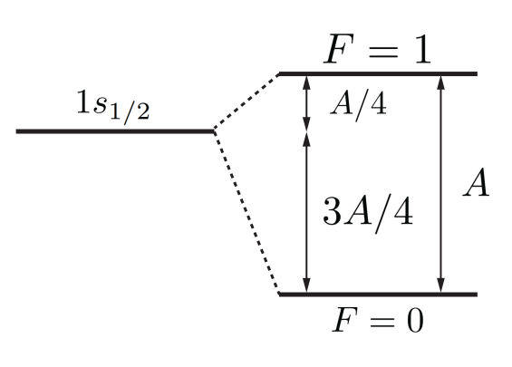

```python tags=["initialize"]

from matplotlib import pyplot
import numpy as np

from common import draw_classic_axes, configure_plotting

configure_plotting()

```

# Assignment two

The first assignment covers the content from weeks 3 and 4, which includes topics such as identical particles, transitions, the density matrix, and the optical Bloch equations.

<figure markdown>
<a href = '../hosted/Assignment2.pdf'> <i class="fas fa-file-pdf fa-3x"></i> </a>
    <figcaption>A .pdf version of the assignment as distributed
    </figcaption>
</figure>

---

## Question 1

!!! question "Multiparticle harmonic oscillator"

    Consider two non-interacting particles of mass $m$ in the harmonic oscillator potential well. For the case with one particle in the single-particle state $\ket{n}$ and the other in state $\ket{k}$ (where $n \ne k$), we are going to calculate the expectation value of the squared interparticle spacing: $\left\langle \left( x_1 - x_2 \right)^2 \right\rangle$. Do this for the cases where the particles are:

    - distinguishable
    - spin-0
    - spin-1/2 in a spin triplet state

    In all cases, calculate the expected interpatricle spacing and explain whether the results are consistent with your expectations, and why (1).
1. **Hint**: Use Dirac notation. With the correct application, integration is not required for the above calculations. Go forth and harness the power of state vectors to improve your quality of life!

For the astute observer, this problem is *extremely* similar to problem 4 from tutorial 3. Indeed, it is so similar that I can cut and paste a large amount of the $\LaTeX$ which I prepared for that solution.

`\begin{Tutorial 3 problem 4 solution}`

We need to look at the three cases of the 2-particle wave function, which is a product of the two single-particle wave functions which are

- not symmetrised in the case of distinguishable particles
- symmetrised in the case of bosons
- antisymmetrised in the case of fermions

with respect to exchange of the two particles. In the three cases, we have

\begin{align*}
    & \left|\psi_D\right\rangle=|n k\rangle \equiv|n\rangle_1|k\rangle_2 \\
    & \left|\psi_B\right\rangle=\frac{1}{\sqrt{2}}[|n k\rangle+|k n\rangle] \\
    & \left|\psi_F\right\rangle=\frac{1}{\sqrt{2}}[|n k\rangle-|k n\rangle]
\end{align*}

where the single particle wave function $\ket{n}=\phi_n(x)=\sqrt{\frac{2}{L}}\sin\left(\frac{n \pi x}{L}\right)$.

For distinguishable particles

$$
    \left\langle x_1^2\right\rangle_D=\left\langle n k\left|x_1^2\right| n k\right\rangle=\left\langle n\left|x_1^2\right| n\right\rangle\langle k | k\rangle=\left\langle x^2\right\rangle_n
$$

At this point, we can write down the integral, so

$$
    \left\langle x^2\right\rangle_n=\int_0^L \varphi_n^{+}(x) x^2 \varphi_n(x) d x=\int_0^L x^2\left|\varphi_n(x)\right|^2 d x
$$

is a single-particle expectation value for $x^2$. Likewise, we get

$$
  \begin{gathered}
      \left\langle x_2^2\right\rangle_D=\left\langle n k\left|x_2^2\right| n k\right\rangle=\langle n | n\rangle\left\langle k\left|x_2^2\right| k\right\rangle=\left\langle x^2\right\rangle_k \\
      \left\langle x_1 x_2\right\rangle_D=\left\langle n k\left|x_1 x_2\right| n k\right\rangle=\left\langle n\left|x_1\right| n\right\rangle\left\langle k\left|x_2\right| k\right\rangle=\langle x\rangle_n\langle x\rangle_k \\
      \left\langle\left(x_1-x_2\right)^2\right\rangle_D=\left\langle x^2\right\rangle_n+\left\langle x^2\right\rangle_k-2\langle x\rangle_n\langle x\rangle_k
  \end{gathered}
$$

So really, we need only perform the integrals to compute $\left\langle x^2\right\rangle_n$ and $\langle x\rangle_n$. But before we actually integrate, lets look at which integrals we need to compute in the case of fermions and bosons.

\begin{align*}
      \left\langle x_1^2\right\rangle_{B, F} & =\frac{1}{\sqrt{2}}\left[\langle n k| \pm\langle k n|\right] x_1^2 \times \frac{1}{\sqrt{2}}\left[|n k\rangle \pm|k n\rangle\right] \\
      & =\frac{1}{2}\left[\left\langle n\left|x_1^2\right| n\right\rangle\langle k | k\rangle \pm\left\langle n\left|x_1^2\right| k\right\rangle\langle k | n\rangle \pm\left\langle k\left|x_1^2\right| n\right\rangle\langle n | k\rangle +\left\langle k\left|x_1^2\right| k\right\rangle\langle n | n\rangle\right] \\
      & =\frac{1}{2}\left[\left\langle n\left|x_1^2\right| n\right\rangle \pm 0 \pm 0+\left\langle k\left|x_1^2\right| k\right\rangle\right]=\frac{1}{2}\left[\left\langle x^2\right\rangle_n+\left\langle x^2\right\rangle_k\right] \\
      \left\langle x_1 x_2\right\rangle_{B, F} & =\frac{1}{\sqrt{2}}\left[\langle n k| \pm\langle k n|\right] x_1 x_2 \times \frac{1}{\sqrt{2}}\left[|n k\rangle \pm|k n\rangle\right] \\
      & = \frac{1}{2}\left[\left\langle n\left|x_1\right| n\right\rangle\left\langle k\left|x_2\right| k\right\rangle \pm\left\langle n\left|x_1\right| k\right\rangle\left\langle k\left|x_2\right| n\right\rangle \pm\left\langle k\left|x_1\right| n\right\rangle\left\langle n\left|x_2\right| k\right\rangle+\left\langle k\left|x_1\right| k\right\rangle\left\langle n\left|x_2\right| n\right\rangle\right] \\
      & = \frac{1}{2}\left[\langle x\rangle_n\langle x\rangle_k \pm\langle x\rangle_{n k}\langle x\rangle_{k n} \pm\langle x\rangle_{k n}\langle x\rangle_{n k}+\langle x\rangle_k\langle x\rangle_n\right]=\langle x\rangle_n\langle x\rangle_k \pm\left|\langle x\rangle_{n k}\right|^2
\end{align*}

where

$$
  \langle x\rangle_{n k}=\langle n|x| k\rangle=\int_0^L \varphi_n^*(x) x \varphi_k(x) d x .
$$

Combining this, we have

$$
    \left\langle\left(x_1-x_2\right)^2\right\rangle_{B, F}=\left\langle x^2\right\rangle_n+\left\langle x^2\right\rangle_k-2\langle x\rangle_n\langle x\rangle_k \mp 2\left|\langle x\rangle_{n k}\right|^2
$$

meaning we need only compute one extra integral.

`\end{Tutorial 3 problem 4 solution}`

Now the hint promises that one need not compute any integrals, and this is because in the above solution, we need to change the single particle wave functions to that of the harmonic oscillator rather than the square well. But the secret sauce to this problem is recalling that the position (and momentum, and therefore Hamiltonian) can be expressed in terms of the ladder operators $a$ and $a^\dagger$. Explicitly, we have

\[
    x = \sqrt{\frac{\hbar}{2m\omega}}\left(a^\dagger+a\right)
\]

which means we can evaluate the required expectation values via

\begin{align*}
        \left\langle x^2\right\rangle_n & =\left\langle n\left|x^2\right| n\right\rangle=\frac{\hbar}{2 m \omega}\left\langle n\left|\left(a^{\dagger}+a\right)^2\right| n\right\rangle=\frac{\hbar}{2 m \omega}\left\langle n\left|\left(a^{\dagger}\right)^2+a^{\dagger} a+a a^{\dagger}+a^2\right| n\right\rangle \\
        & =\frac{\hbar}{2 m \omega}\left\langle n\left|a^{\dagger} a+a a^{\dagger}\right| n\right\rangle=\frac{\hbar}{2 m \omega}\langle n|\sqrt{n} \sqrt{n}+\sqrt{n+1} \sqrt{n+1}| n\rangle \\
        & =\frac{\hbar}{2 m \omega}(2 n+1)=\frac{\hbar}{m \omega}\left(n+\frac{1}{2}\right)
\end{align*}

Notice the appearance of the number operator and it conjugate from tutorial 2.

\begin{align*}
        \langle x\rangle_n & =\langle n|x| n\rangle=\sqrt{\frac{\hbar}{2 m \omega}}\left\langle n\left|a^{\dagger}+a\right| n\right\rangle \\
        & =\sqrt{\frac{\hbar}{2 m \omega}}\left[\left\langle n\left|a^{\dagger}\right| n\right\rangle+\langle n|a| n\rangle\right]=\sqrt{\frac{\hbar}{2 m \omega}}[\langle n|\sqrt{n+1}| n+1\rangle+\langle n|\sqrt{n}| n-1\rangle] \\
        & =\sqrt{\frac{\hbar}{2 m \omega}}[\sqrt{n+1}\langle n | n+1\rangle+\sqrt{n}\langle n | n-1\rangle]=0 \text { since }\langle n | m\rangle=\delta_{n m}
\end{align*}

which is to be expected: where will be find the particle? At the bottom of the well, which is centred on $x=0$. The final term to calculate are the matrix elements $x_nk$, which wouldn't you know it, we calculated in tutorial 2:

\begin{align*}
        \langle x\rangle_{n k} & =\langle n|x| k\rangle=\sqrt{\frac{\hbar}{2 m \omega}}\left\langle n\left|a^{\dagger}+a\right| k\right\rangle \\
        & =\sqrt{\frac{\hbar}{2 m \omega}}\left(\left\langle n\left|a^{\dagger}\right| k\right\rangle+\langle n|a| k\rangle\right)=\sqrt{\frac{\hbar}{2 m \omega}}(\langle n|\sqrt{k+1}| k+1\rangle+\langle n|\sqrt{k}| k-1\rangle) . \\
        & =\sqrt{\frac{\hbar}{2 m \omega}}(\sqrt{k+1}\langle n | k+1\rangle+\sqrt{k}\langle n | k-1\rangle)=\sqrt{\frac{\hbar}{2 m \omega}}\left(\sqrt{n} \delta_{n, k+1}+\sqrt{k} \delta_{n, k-1}\right)
\end{align*}

Putting everything together

\begin{align*}
        \left\langle\left(x_1-x_2\right)^2\right\rangle_D & =\left\langle x^2\right\rangle_n+\left\langle x^2\right\rangle_k-2\langle x\rangle_n\langle x\rangle_k=\frac{\hbar}{m \omega}\left(n+\frac{1}{2}\right)+\frac{\hbar}{m \omega}\left(k+\frac{1}{2}\right) \\
        & =\frac{\hbar}{m \omega}(n+k+1) \\
\end{align*}

and

\begin{align*}
        \left\langle\left(x_1-x_2\right)^2\right\rangle_{B, F}&=\left\langle x^2\right\rangle_n+\left\langle x^2\right\rangle_k-2\langle x\rangle_n\langle x\rangle_k \mp 2\left|\langle x\rangle_{n k}\right|^2 \\
        & =\frac{\hbar}{m \omega}(n+k+1) \mp \frac{\hbar}{m \omega}\left(n \delta_{n, k+1}+k \delta_{n, k-1}\right)
\end{align*}

For the lowest energy state $(n=0, k=1)$ the expected interparticle spacings are

\begin{align*}
        & \sqrt{\left\langle\left(x_1-x_2\right)^2\right\rangle_D}=2\frac{\hbar}{m\omega} \\
        & \sqrt{\left\langle\left(x_1-x_2\right)^2\right\rangle_B}=2\frac{\hbar}{m\omega} - \frac{\hbar}{m\omega} = \frac{\hbar}{m\omega}  \\
        & \sqrt{\left\langle\left(x_1-x_2\right)^2\right\rangle_F}=2\frac{\hbar}{m\omega} + \frac{\hbar}{m\omega} = 3\frac{\hbar}{m\omega}
\end{align*}

This shows, as expected, that bosons tend to attract and fermions tend to repel as enforced by the symmetrisation postulate and associated exchange interaction.

## Question 2

!!! question annotate "Helium ground state energy"

    1. Compute the direct integral for the ground state of helium and show the first-order correction to the energy is $E_{1s,1s}^{(1)} = \frac{5}{2} \mathrm{Ry} = 34~\mathrm{eV}$.

       **Hint**: For no reason, here is the *spherical harmonic addition theorem*:

       \[
       \frac{1}{\left\rvert \mathbf{r_1} - \mathbf{r_2} \right\rvert} = \sum_{\ell = 0}^{\infty} \sum_{m=-\ell}^{\ell} \frac{4\pi}{2\ell+1} \frac{r_{<}^\ell}{r_{>}^{\ell+1}} Y_\ell^m   {}^* \left(\theta_1, \phi_1\right) Y_\ell^m \left(\theta_2, \phi_2\right)
       \]

       where $r_{>}$/$r_{<}$ denoting the larger/smaller of the two distances $r_1$ and $r_2$.

    2. Imagine that we are back in week one, where the variational method was introduced. If we had guessed that the wave function of helium was roughly

       \[
           \psi_{He} = \varphi_{nlm}(\mathbf{r}_1)\varphi_{nlm}(\mathbf{r}_2)
       \]

       where $\varphi_{nlm}(\mathbf{r})$ are the usual hydrogenic wave functions, explain why we would have calculated the identical result to that above, assuming that the interaction potential between electrons was the same. You can incorporate into your answer why I am nice for not having asked you to calculate the ground state energy for a trail wave function *not* of that form, for example, if $\varphi(\mathbf{r})=\exp\left(-\alpha(r_1 - r_2)^2\right)$.

### 2.1
!!! question ""
    Compute the direct integral for the ground state of helium and show the first-order correction to the energy is $E_{1s,1s}^{(1)} = \frac{5}{2} \mathrm{Ry} = 34~\mathrm{eV}$.

    **Hint**: For no reason, here is the *spherical harmonic addition theorem*:

    $$
    \frac{1}{\left\rvert \mathbf{r_1} - \mathbf{r_2} \right\rvert} = \sum_{\ell = 0}^{\infty} \sum_{m=-\ell}^{\ell} \frac{4\pi}{2\ell+1} \frac{r_{<}^\ell}{r_{>}^{\ell+1}} Y_\ell^m {}^*    \left(\theta_1, \phi_1\right) Y_\ell^m \left(\theta_2, \phi_2\right)
    $$

    where $r_{>}$/$r_{<}$ denoting the larger/smaller of the two distances $r_1$ and $r_2$.

The first order correction is calculated using perturbation theory, stating that

\[
    E_{1s,1s}^{(1)} = \left\langle \psi_{1s,1s}^{SA} \rvert H' \rvert \psi_{1s,1s}^{SA}\right\rangle
\]

which we saw in class defines the direct integral $J_{11}$. At the time, I emphasised that such integrals had physical meanings, which was the important bit, and the actual numbers that popped out were just a computational exercise. Well, here we are.

The direct integral of the ground state of helium is

\[
    E_{1s,1s}^{(1)} = \int\int\psi_{100}^*\left(\mathbf{r}_1\right)\psi_{100}^*\left(\mathbf{r}_2\right)\frac{e^2}{4\pi\varepsilon_0 \left\rvert \mathbf{r_1} - \mathbf{r_2} \right\rvert}\psi_{100}\left(\mathbf{r}_1\right)\psi_{100}\left(\mathbf{r}_2\right)
\]

where the ground state wave function is

\[
    \psi_{100}\left(\mathbf{r}\right) = \psi_{100}\left(r,\theta,\phi\right)=\sqrt{\frac{Z^3}{\pi a_0^3}}e^{-Zr/a_0}
\]

As the hint states, to make this problem tractable, we can use the spherical harmonic addition theorem, which yields

\begin{align*}
        E_{1 s, 1 s}^{(1)} & =\frac{Z^6 e^2}{4 \pi^3 \varepsilon_0 a_0^6} \iint e^{-2 Z_1 / a_0} e^{-2 Z r_2 / a_0} \sum_{\ell=0}^{\infty} \sum_{m=-\ell}^{\ell} \frac{4 \pi}{2 \ell+1} \frac{r_{<}^{\ell}}{r_{>}^{\ell+1}} Y_\ell^m{}^*\left(\theta_1, \phi_1\right) Y_\ell^m\left(\theta_2, \phi_2\right) d^3 \mathbf{r}_1 d^3 \mathbf{r}_2 \\
        & =\frac{Z^6 e^2}{4 \pi^3 \varepsilon_0 a_0^6} \sum_{\ell=0}^{\infty} \sum_{m=-\ell}^{\ell} \frac{4 \pi}{2 \ell+1} \iint e^{-2 Z\left(r_1+r_2\right) / a_0} \frac{r_{<}^{\ell}}{r_{>}^{\ell+1}} Y_\ell^m{}^*\left(\theta_1, \phi_1\right) Y_\ell^m\left(\theta_2, \phi_2\right) d^3 \mathbf{r}_1 d^3 \mathbf{r}_2
\end{align*}

Now plugging in $\ell = m = 0$:

\begin{align*}
        E_{1 s, 1 s}^{(1)}=\frac{Z^6 e^2}{4 \pi^3 \varepsilon_0 a_0^6} & (4 \pi)^2 \int_0^{\infty} \int_0^{\infty} e^{-2 Z\left(r_1+r_2\right) / a_0} \frac{1}{r_{>}} r_1^2 d r_1 r_2^2 d r_1 \\
        & \times \int Y_{0}^{0}{}^*\left(\theta_1, \phi_1\right) Y_0^0\left(\theta_1, \phi_1\right) d \Omega_1 \int Y_0^0{}^*\left(\theta_2, \phi_2\right) Y_{0}^0\left(\theta_2, \phi_2\right) d \Omega_2
\end{align*}

The spherical harmonics are orthonormal, so the angular integral evaluates to 1 and we are left with

\[
    E_{1 s, 1 s}^{(1)}=\frac{4 Z^6 e^2}{\pi \varepsilon_0 a_0^6} \int_0^{\infty} \int_0^{\infty} e^{-2 Z\left(r_1+r_2\right) / a_0} \frac{1}{r_{>}} r_1^2 d r_1 r_2^2 d r_2
\]

The trick here is to split the integral with $r_>$ into two parts, and with that, the rest is just cranking the handle:

\begin{align*}
        E_{1 s, 1 s}^{(1)} & =\frac{4 Z^6 e^2}{\pi \varepsilon_0 a_0^6} \int_0^{\infty} e^{-2 Z r_1 / a_0} r_1^2 d r_1\left[\frac{1}{r_1} \int_0^{r_1} e^{-2 Z {r_2} / a_0} r_2^2 d r_2+\int_{r_1}^{\infty} e^{-2 Z r_2 / a_0} \frac{1}{r_2} r_2^2 d r_2\right] \\
        & =\frac{4 Z^6 e^2}{\pi \varepsilon_0 a_0^6} \int_0^{\infty} e^{-2 Z r_1 / a_0} r_1^2 d r_1 \times \bigg[ \frac{1}{r_1}\left(\frac{a_0}{4 Z^3}\right)\left(a_0^2-e^{-2 Z_1 / a_0}\left\{a_0^2+2 a_0 r_1 Z+2 r_1^2 Z^2\right\}\right) \\
        &\hspace{5cm} +\left(\frac{a_0}{4 Z^2}\right) e^{-2 Z_{r_1} / a_0}\left\{a_0+2 r_1 Z\right\} \bigg] \\
        & =\frac{Z^3 e^2}{\pi \varepsilon_0 a_0^5}\bigg[
        \int_0^{\infty}\left(a_0^2 e^{-2 Z_1 / a_0}-e^{-4 Z_{\mathrm{i}} / a_0}\left\{a_0^2+2 a_0 r_1 Z+2 r_1^2 Z^2\right\}\right) r_1 d r_1 \\
        &\hspace{2cm} + \int_0^{\infty} e^{-4 Z_{\mathrm{i}} / a_0}\left(a_0 Z+2 r_1 Z^2\right) r_1^2 d r_1 \bigg] \\
        & =\frac{Z^3 e^2}{\pi \varepsilon_0 a_0^5}\left[\frac{a_0^4}{4 Z^2}-\frac{a_0^4}{16 Z^2}-\frac{a_0^4}{16 Z^2}-\frac{3 a_0^4}{64 Z^2}+\frac{a_0^4}{32 Z^2}+\frac{3 a_0^4}{64 Z^2}\right] \\
        & =\frac{5 Z e^2}{32 \pi \varepsilon_0 a_0}=\frac{5}{8}\left(\frac{Z e^2}{4 \pi \varepsilon_0 a_0}\right) \\
\end{align*}

Plugging in the values for helium we get

$$
    E_{1 s, 1 s}^{(1)}=\frac{5}{8} Z\left(\frac{e^2}{4 \pi \varepsilon_0 a_0}\right)=\frac{5}{8} 2(2 \mathrm{Ry})=\frac{5}{2} 13.6 \mathrm{eV}=34~\mathrm{eV}
$$

### 2.2
!!! question ""
    Imagine that we are back in week one, where the variational method was introduced. If we had guessed that the wave function of helium was roughly

    \[
      \psi_{He} = \varphi_{nlm}(\mathbf{r}_1)\varphi_{nlm}(\mathbf{r}_2)
    \]

    where $\varphi_{nlm}(\mathbf{r})$ are the usual hydrogenic wave functions, explain why we would have calculated the identical result to that above, assuming that the interaction potential between electrons was the same. You can incorporate into your answer why I am nice for not having asked you to calculate the ground state energy for a trail wave function \emph{not} of that form, for example, if $\varphi(\mathbf{r})=\exp\left(-\alpha(r_1 - r_2)^2\right)$.

In order to calculate the ground state energy using the variational method, we need to compute the expectation value

\[
    E \le \left\langle \psi | H | \psi \right\rangle
\]

It is usual to split this into kinetic, potential and interaction terms, where

\[
    H = T + V + V_{int} = ((T_1 + V_1) + (T_2 + V_2)) + V_{int}.
\]

As we compute these expectation values, we have $\varphi_{nlm}(\mathbf{r}_{1,2})$ as eigenstates of $T_1 + V_1$ and $T_2 + V_2$ respectively, meaning that each of their contributions to the expectation value would be

\[
  -Z^2\,\mathrm{Ry}
\]

or $-108.8~\mathrm{eV}$ in total. The final component of the expectation value would be calculate as

\[
  \left\langle \psi | V_{int} | \psi \right\rangle
\]

which is the direct integral that was computed above.

The reason that I am nice is because this is only true because $\varphi_{nlm}(\mathbf{r}_{1,2})$ are eigenstates; had I given you something like the Gaussian listed (as I had been planning), you would have had to explicitly compute the expectation values for $T_{1,2} + V_{1,2}$, meaning lots of nasty integration!

## Question 3

!!! question annotate "Density of states"
    In class, it was stated that the density of states $g(E)$ can be calculated as the Fourier transform of the emitted field, and for an exponentially decaying excited state, the density of states is

    \[
    g(E) = \frac{\hbar A_{21}/2\pi}{\left(E-\hbar\omega_{12}\right)^2 + \left( \frac{\hbar A_{21}}{2}\right)^2}
    \]

    We are going to show exactly this.

    1. Explain why that given a population which decays exponentially with time dependence $e^{-t/\tau}$, the field decays with the a time dependence $e^{-t/2\tau}$.
    2. Calculate the Fourier transform of the emitted field,
           \[
            E(t) = \begin{cases}
                    0 & t < 0 \\
                    E_0 e^{-t/2\tau} e^{-i\omega_{21}t} & t\geq 0
                   \end{cases}
           \]
       and hence find the frequency spectrum of the radiated power in spontaneous emission(1).
    3. Convert this frequency spectrum to an energy spectrum, and normalise it (to 1) and voilà, you should arrive at the density of states above (2).

1. **Hint**: The power spectral density is computed as the square of the absolute value of the Fourier transform.
2. **Hint**: You will need to make the (very valid) approximation that the linewidth $A_{21}$ is much less than the resonance frequency $\omega_{21}$

### 3.1
!!! question ""            
    Explain why that given a population which decays exponentially with time dependence $e^{-t/\tau}$, the field decays with the a time dependence $e^{-t/2\tau}$.

The radiated power exhibits the same time dependence, but the power is calculated as the field squared, hence the factor of two.

### 3.2
!!! question ""            
    Calculate the Fourier transform of the emitted field,

    \[
        E(t) = \begin{cases}
                0 & t < 0 \\
                E_0 e^{-t/2\tau} e^{-i\omega_{21}t} & t\geq 0
               \end{cases}
    \]

    and hence find the frequency spectrum of the radiated power in spontaneous emission(1).
1. **Hint**: The power spectral density is computed as the square of the absolute value of the Fourier transform.

The Fourier transform of $E(t)$ is

\begin{align*}
    \mathscr{F}\{E(t); t\rightarrow \omega\} &\equiv\hat{E}(\omega) = \frac{1}{\sqrt{2\pi}}\int_{-\infty}^{\infty} E(t) e^{-i \omega t} dt \\
    & = \frac{1}{\sqrt{2\pi}}\int_{0}^{\infty} E_0 e^{-t/2\tau} e^{i\omega_{21}t} e^{-i \omega t} dt \\
    & = \frac{E_0}{\sqrt{2\pi}}\int_{0}^{\infty} e^{-i(\omega - \omega_{21})t - t/2\tau} dt \\
    & = \frac{E_0}{\sqrt{2\pi}} \left. \frac{e^{-i(\omega - \omega_{21})t - t/2\tau}}{-i(\omega - \omega_{21}) - 1/2\tau} \right\rvert_0^\infty \\
    & = \frac{E_0}{\sqrt{2\pi}} \frac{1}{i(\omega - \omega_{21}) + 1/2\tau}
\end{align*}

The power is then

\begin{align*}
    P(\omega) & = \left\rvert\hat{E}(\omega)\right\rvert^2 \propto \left\rvert \frac{1}{i(\omega - \omega_{21}) + 1/2\tau} \right\rvert^2 \\
    & \propto \frac{1}{(\omega - \omega_{21})^2 + (1/2\tau)^2} \\
    & = \frac{1}{(\omega - \omega_{21})^2 + (A_{21}/2)^2}
\end{align*}

where we have used the definition of the Einstein $A$ coefficient as $1/\tau$, and have binned the factor out the front as we are going to normalise the spectrum in the next part.

### 3.3
!!! question ""            
    Convert this frequency spectrum to an energy spectrum, and normalise it (to 1) and voilà, you should arrive at the density of states above (1).
1. **Hint**: You will need to make the (very valid) approximation that the linewidth $A_{21}$ is much less than the resonance frequency $\omega_{21}$

Converting to an energy spectrum, we have

\[
g(E) \propto \frac{1}{(E - \hbar\omega_{21})^2 + (\hbar A_{21}/2)^2}
\]

which we need to normalise. Doing so:

\[
\int_0^\infty g(E) dE = \int_0^\infty \frac{C}{(E - \hbar\omega_{21})^2 + (A_{21}/2)^2} dE = 1
\]

Making the substitution $x = E-\hbar\omega_{21}$

\begin{align*}
  1 & = \int_{-\hbar\omega_{21}}^\infty \frac{C}{x^2 + (A_{21}/2)^2} dx \\
  & = C\left.\frac{\tan^{-1}(2x/\hbar A_21)}{\hbar A_{21}/2}\right\rvert_{-\hbar\omega_{21}}^{\infty} \\
  & = \frac{2C}{\hbar A_{21}}\left(\frac{\pi}{2}-\tan^{-1}\left(-\frac{\omega_{21}}{A_{21}}\right)\right)
\end{align*}

Now making the assumption that $A_{21}\ll\omega_{21}$ gives

\[
    1=\frac{2\pi C}{\hbar A_{21}} \Rightarrow C = \frac{\hbar A_{21}}{2\pi}
\]

and ultimately the desired result

\[
    g(E) = \frac{\hbar A_{21}/2\pi}{\left(E-\hbar\omega_{12}\right)^2 + \left( \frac{\hbar A_{21}}{2}\right)^2}
\]

## Question 4

!!! question "Absorption of light"
    Light of frequency $\omega$ propagates in the $z$ direction and is incident on an ensemble of two-level atoms. In the steady state, we can model the absorption process by assuming that the intensity falls off as $I(z)=I_0e^{-\alpha z}$.

    1. Show that $\alpha = k\,\mathrm{Im}\left[\chi\right]$ where k is the wavenumber
    2. Show that in the case of homogeneous broadening, the absorption per unit length is given by
    \begin{equation*}
        \frac{dI}{dz}=-\frac{kInd_{12}^2}{\epsilon_0\hbar}\frac{\Gamma}{2}\frac{1}{\Delta^2+\frac{\Gamma^2}{4}+\frac{\Omega^2}{2}}
    \end{equation*}
    4. Assuming resonant conditions, by introducing the on-resonance saturation parameter, $s_0=\frac{2\Omega^2}{\Gamma^2}$, derive the \emph{Beer-Lambert law}:
    \begin{equation*}
        \frac{1}{I}\frac{dI}{dz}=-\frac{n\hbar\omega}{I_{sat}}\frac{\Gamma}{2}
    \end{equation*}
    where $\frac{I}{I_{sat}}=s_0$.
    5. In the high-intensity limit ($s\rightarrow\infty$), this reduces to
    \begin{equation*}
        \frac{dI}{dz}=-n\hbar\omega\frac{\Gamma}{2}.
    \end{equation*}
    Comment on the significance of this, in particular, what happens to the transmission as a function of light as a function of incident intensity?

### 4.1
!!! question ""
    Show that $\alpha = k\,\mathrm{Im}\left[\chi\right]$ where k is the wavenumber

The electric field of the light field in the ensemble (with refractive index $n$) is given by

\begin{equation*}
    \mathbf{E}(z,t)=\mathbf{E}_0e^{i\left(k n_R z-\omega t\right)}e^{-k n_I z}.
\end{equation*}

We know that the intensity is related to the electric field through

\begin{align*}
    I(z,t)&=\frac{1}{2}\epsilon_0 c |\mathbf{E}(z,t)|^2 \\
    &= \frac{\epsilon_0 c}{2}|\mathbf{E}_0|^2 e^{-2k n_I z}
\end{align*}

when we plug in the electric field above. Comparing this to the form $I(z)=I_0e^{-\alpha z}$ is clear that

\begin{align*}
    \alpha&=2k n_I \\
    &=k\,\mathrm{Im}\left[\chi\right]
\end{align*}

since $n=\sqrt{1+\chi}\approx1+\frac{\chi}{2}$ for small $\chi$.

### 4.2
!!! question ""
    Show that in the case of homogeneous broadening, the absorption per unit length is given by
    $$
        \frac{dI}{dz}=-\frac{kInd_{12}^2}{\epsilon_0\hbar}\frac{\Gamma}{2}\frac{1}{\Delta^2+\frac{\Gamma^2}{4}+\frac{\Omega^2}{2}}
    $$

The light absorbed by a slab of atoms with thickness $dz$ is

\begin{equation*}
    dI=-\alpha dz I
\end{equation*}

which implies that

\begin{equation*}
    \frac{dI}{dz}=-k\,\mathrm{Im}\left[\chi\right]I.
\end{equation*}

We showed in class that the susceptibility is related to the slowly varying coherence $\sigma_{12}$ via

\begin{equation*}
    \chi=\frac{2nd_{12}^2}{\epsilon_0 \hbar \Omega}\sigma_{12}.
\end{equation*}

We also saw that in the steady state, the slowly varying coherence $\sigma_{12}$ evaluated for $t\rightarrow\infty$ is given by

\begin{equation*}
    \sigma_{12}\bigg\rvert_{t\rightarrow\infty}=\frac{i\Omega}{2\gamma_{\perp}} \frac{1-\frac{i\Delta}{\gamma_{\perp}}}{1+\left(\frac{\Delta}{\gamma_{\perp}}\right)^2+\frac{\Omega^2}{\gamma_{\perp}\Gamma}}
\end{equation*}

which in a medium with homogeneous broadening ($\gamma_{\perp}=\frac{\Gamma}{2}$) reduces to

\begin{equation*}
    \sigma_{12}\bigg\rvert_{t\rightarrow\infty}=\frac{i\Omega}{\Gamma}\frac{1-i\frac{2\Delta}{\Gamma}}{1+\left(\frac{2\Delta}{\Gamma}\right)^2+2\left(\frac{\Omega}{\Gamma}\right)^2}.
\end{equation*}

With this, it is simply a matter of plugging and playing:

\begin{align*}
    \frac{dI}{dz}&=-\frac{k I 2n d_{12}^2}{\epsilon_0\hbar\Gamma} \frac{1}{1+\left(\frac{2\Delta}{\Gamma}\right)^2+2\left(\frac{\Omega}{\Gamma}\right)^2}\\
    &=-\frac{k I nd_{12}^2}{\epsilon_0\hbar}\frac{\Gamma}{2} \frac{1}{\Delta^2+\frac{\Gamma^2}{4}+\frac{\Omega^2}{2}}
\end{align*}

where we pulled out a factor of $\frac{4}{\Gamma^2}$ from the denominator of $\mathrm{Im}\left[\sigma_{12}\bigg\rvert_{t\rightarrow\infty}\right]$ to achieve the desired form.

### 4.3
!!! question ""
    Assuming resonant conditions, by introducing the on-resonance saturation parameter, $s_0=\frac{2\Omega^2}{\Gamma^2}$, derive the *Beer-Lambert law*:
    \begin{equation*}
        \frac{1}{I}\frac{dI}{dz}=-\frac{n\hbar\omega}{I_{sat}}\frac{\Gamma}{2}
    \end{equation*}
    where $\frac{I}{I_{sat}}=s_0$.

As we are now talking about an resonant system, we are dealing with a detuning of zero ($\Delta=0$). Next, as the on-resonance saturation parameter is given by $s_0=\frac{2\Omega^2}{\Gamma^2}$, it is wise to write everything in terms of $\frac{2\Omega^2}{\Gamma^2}$:

\begin{equation*}
    \frac{dI}{dz}=-\frac{k I nd_{12}^2}{\epsilon_0\hbar} \frac{\Gamma}{2} \frac{2}{\Omega^2} \frac{\frac{2\Omega^2}{\Gamma^2}}{1+\frac{2\Omega^2}{\Gamma^2}}.
\end{equation*}

Now

\begin{equation*}
    I d_{12}^2 = \frac{1}{2}\epsilon_0 c\frac{|\mathbf{E}_0|^2 d_{12}^2}{\left(\hbar\Omega\right)^2}
\end{equation*}

which implies

\begin{equation*}
    \frac{dI}{dz}=-k c n \hbar \frac{\Gamma}{2} \frac{s_0}{1+s_0}
\end{equation*}

and as $k=\frac{\omega}{c}$, we have

\begin{equation*}
    \frac{dI}{dz}=-n \hbar \omega \hbar \frac{\Gamma}{2} \frac{s_0}{1+s_0}.
\end{equation*}

Substituting $s_0=\frac{I}{I_{sat}}$, we arrive at the Beer-Lambert law:

\begin{equation*}
    \frac{1}{I}\frac{dI}{dz}=-\frac{n\hbar\omega}{I_{sat}}\frac{\Gamma}{2}.
\end{equation*}

### 4.4
!!! question ""
    In the high-intensity limit ($s\rightarrow\infty$), this reduces to
    \begin{equation*}
        \frac{dI}{dz}=-n\hbar\omega\frac{\Gamma}{2}.
    \end{equation*}
    Comment on the significance of this, in particular, what happens to the transmission as a function of light as a function of incident intensity?

The Beer-Lambert law as derived above returns the behavior that we expect, $I(z)=I_0e^{-\alpha z}$, but only for small intensities. Explicitly, we identify that the intensity decays exponentially as light propagates through the medium and is absorbed by the two-level system.

In the high-intensity limit we have
\begin{equation*}
    \frac{dI}{dz}=-n\hbar\omega\frac{\Gamma}{2}
\end{equation*}
which has the solution $I(z)=I_0 - n\hbar\omega\frac{\Gamma}{2}z$. We now identify that there is a linear absorption in the medium. But why?

As we discussed in class, transitions experience *saturation*. The physical origin of saturation is intuitive: a system can only scatter so many photons per unit time. So once the system is in a regime whereby the medium cannot scatter any more light, we observe an increase in transmission. This simple principle has some extremely practical applications, including a spectroscopic technique used to stabalise laser systems to atomic transitions with an incredible degree of accuracy, so-called [saturated absorption spectroscopy](https://en.wikipedia.org/wiki/Saturated_absorption_spectroscopy). Understanding of saturation and related spectroscopy was rewarded with [the Nobel Prize in physics](https://www.nobelprize.org/prizes/physics/1981/press-release/) in 1981.

## Question 5

!!! question "The density matrix and OBEs"
    Here we are going to compute some density matrices, and then we are going to solve the optical Bloch equations.

    1. What is the density matrix for the state $\psi = 0.577\ket{+} + 0.577(1+i)\ket{-}$ in the $\ket{\pm}$ basis?
    2. What is the expectation value for $S_y$?
    3. What is a mixed state which would give the same probabilities of measuring the system in states $\ket{+}$ and $\ket{-}$
    4. Explain why we care about the difference between pure and mixed states, and what differences one might observe in experiments when using either a pure or mixed state

    `\begin{Computational content}`

    The computation of density matrices can be tedious, especially once we have larger systems. Consider the state

    \[
       \ket{\psi} = \frac{1}{\sqrt{10}}\left( 3\ket{++} + 1\ket{+-} + 4 \ket{-+} + 2\ket{--} \right)
    \]

    in the basis $|J_1\,J_2\,m_{J_1}\, m_{J_2}\rangle$, where $J_1, J_2 = 1/2$ and have been dropped from the state labels.

    Using `Python` (or equivalent)
    5. Compute the density matrix $\rho$ for the above state $\ket{\psi}$
    6. Compute the expectation value $\langle \mathbf{F}^2 \rangle$ for this state

    We now turn to the optical Bloch equations. We have seen that in the rotating wave approximation, we can solve them analytically, but such approximations are not always valid, and more generally, in large systems the analytical solutions become nightmarish (e.g. see appendix D of [my Ph.D thesis](https://minerva-access.unimelb.edu.au/items/85e376d9-3109-5548-86ef-28614f8e6823). Consequently, we seek to solve them numerically.

    Using `Python`
    7. Compute and plot the evolution of the matrix elements $\rho_{11}, \rho_{12}, \rho_{21},$ and $\rho_{22}$ as a function of time for realistic experimental parameters(1).
    8. Use the computational package `[QuTiP](https://qutip.readthedocs.io/en/master/index.html)` to produce plots of the same matrix elements(2).

    As computational experience, competence, and confidence will vary across the class, I have provided a [jupyter notebook](https://github.com/Andy-UTAS/atomic-physics/blob/master/Assignment\%202.ipynb) to provide a few hot tips.
1. **Hint**: This means that you will need to figure out what realistic parameters are.
2. **Hint**: This is an exercise to demonstrate that using established libraries can make complex tasks simple, and thus should not require any complex computation \emph{per se}

### 5.1
!!! question ""
    What is the density matrix for the state $\psi = 0.577\ket{+} + 0.577(1+i)\ket{-}$ in the $\ket{\pm}$ basis?

### 5.2
!!! question ""
    What is the expectation value for $S_y$?

### 5.3
!!! question ""
    What is a mixed state which would give the same probabilities of measuring the system in states $\ket{+}$ and $\ket{-}$

### 5.4
!!! question ""
    Explain why we care about the difference between pure and mixed states, and what differences one might observe in experiments when using either a pure or mixed state

### 5.5
!!! question ""
    Compute the density matrix $\rho$ for the above state $\ket{\psi}$

~~~ python

~~~

### 5.6
!!! question ""
    Compute the expectation value $\langle \mathbf{F}^2 \rangle$ for this state

~~~ python

~~~

### 5.7
!!! question ""
    Compute and plot the evolution of the matrix elements $\rho_{11}, \rho_{12}, \rho_{21},$ and $\rho_{22}$ as a function of time for realistic experimental parameters(1).
1. **Hint**: This means that you will need to figure out what realistic parameters are.

~~~ python

~~~  

### 5.8
!!! question ""
    Use the computational package `[QuTiP](https://qutip.readthedocs.io/en/master/index.html)` to produce plots of the same matrix elements(1).
1. **Hint**: This is an exercise to demonstrate that using established libraries can make complex tasks simple, and thus should not require any complex computation *per se*

~~~ python

~~~

<figure markdown>
  {width="800"}
  <figcaption>A schematic of the Stern-Gerlach experiment</figcaption>
</figure>

--8<-- "includes/abbreviations.md"
