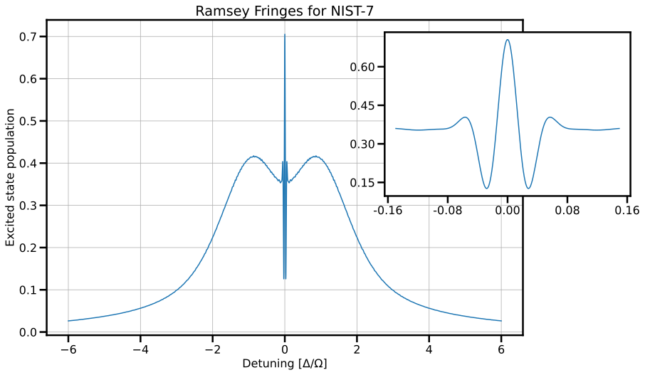
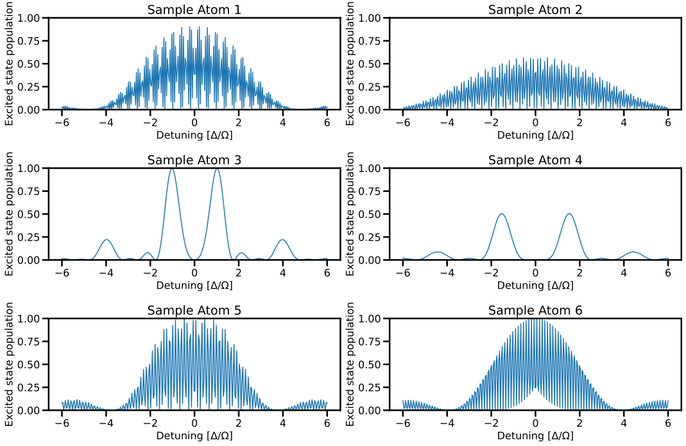

```python tags=["initialize"]

from Atomic import *

from common import draw_classic_axes, configure_plotting

configure_plotting()

```

# Assignment three

The third assignment covers the content from weeks 5 and 6, which includes topics such as ensembles, laser cooling and trapping, dressed states (eigenstates of a coupled system), and Ramsey interferometry.

<figure markdown>
<a href = '../hosted/Assignment3.pdf'> <i class="fas fa-file-pdf fa-3x"></i> </a>
    <figcaption>A .pdf version of the assignment as distributed
    </figcaption>
</figure>

---

## Question 1

!!! question "Stern-Gerlach: measurement edition"
    Consider an ensemble of silver atoms incident on an inhomogeneous magnetic field (i.e. the OG Stern-Gerlach experiment with spin-1/2 particles).

    1. Suppose we have measured $\expectation{S_x}$, $\expectation{S_y}$ and $\expectation{S_z}$ but we do not know the initial state of the system. Is it possible to know the density matrix of the system, $\rho$?
    2. Now suppose that we know that the system is pure. Is it possible to determine $\rho$ with fewer measurements?

### 1.1
!!! question ""
    Suppose we have measured $\expectation{S_x}$, $\expectation{S_y}$ and $\expectation{S_z}$ but we do not know the initial state of the system. Is it possible to know the density matrix of the system, $\rho$?

The general form of the density matrix for an ensemble of spin-1/2 particles is

\begin{equation*}
    \rho = \begin{pmatrix} \rho_{11} & \rho_{12} \\ \rho_{21} & \rho_{22} \end{pmatrix}
\end{equation*}

Essentially, we want to see if the expectation values $\expectation{S_x}$, $\expectation{S_y}$ and $\expectation{S_z}$ can uniquely constrain $\rho_{11}, \rho_{12}, \rho_{21}$ and $\rho_{22}$. We do not know anything about our system (for example, we cannot assume that it is pure) nor can we assume that the $\rho$ is diagonal in our basis of choice. It is worth noting that $\rho$ will be diagonal in a basis, but currently we do not know what is that basis that. We do know that $\rho$ is both normalised and Hermitian, that is $\mathrm{tr}\left(\rho\right)=1$ and $\rho=\rho^{\dagger}$, so it is convenient to write

\begin{equation*}
    \rho = \begin{pmatrix} \frac{1}{2}+c & a-ib \\ a+ib & \frac{1}{2}-c \end{pmatrix}.
\end{equation*}

We now have three independent parameters which describe $\rho$. Recalling the Pauli matrices

\begin{equation*}
    \sigma_x=\begin{pmatrix} 0 & 1 \\ 1 & 0 \end{pmatrix},\, \sigma_y=\begin{pmatrix} 0 & -i \\ i & 0 \end{pmatrix},\, \sigma_z=\begin{pmatrix} 1 & 0 \\ 0 & -1 \end{pmatrix}
\end{equation*}

we identify that

\begin{equation*}
    \rho = \frac{1}{2}\mathbbm{1} + a\sigma_x + b\sigma_y + c\sigma_z
\end{equation*}

and we are really cooking with gas now. The in $z$ basis, we know the spin operators $S_{x,y,z}$ act to return $\frac{\hbar}{2}\sigma_{x,y,z}$. Combining this with knowledge $\mathrm{Tr}\left(\sigma_i\sigma_j\right)=2\delta_{ij}$, we have

\begin{align*}
    \expectation{S_x}&=\mathrm{Tr}\left(\rho\,\frac{\hbar\sigma_x}{2}\right)=\frac{\hbar}{2}\mathrm{Tr}\left(\frac{1}{2}\sigma_x + a\mathbbm{1} + b\sigma_y\sigma_x + c\sigma_z\sigma_x \right)\\
    &= \hbar a
\end{align*}

and similarly

\begin{align*}
    \expectation{S_y} &=\hbar b\\
    \expectation{S_z} &=\hbar c.
\end{align*}

Life is good: now we have

\begin{align*}
    \rho &= \frac{1}{2}\mathbbm{1} + \frac{\expectation{S_x}}{\hbar}\sigma_x + \frac{\expectation{S_y}}{\hbar}\sigma_y + \frac{\expectation{S_z}}{\hbar}\sigma_z\\
    &= \frac{1}{\hbar}\begin{pmatrix} \frac{\hbar}{2}+\expectation{S_z} & \expectation{S_x}-i\expectation{S_y} \\ \expectation{S_x}+i\expectation{S_y} & \frac{\hbar}{2}-\expectation{S_z} \end{pmatrix}
\end{align*}

which shows that yes, it is possible to construct $\rho$ with knowledge of $\expectation{S_x}$, $\expectation{S_y}$ and $\expectation{S_z}$.\\


### 1.2

!!! question ""
    Now suppose that we know that the system is pure. Is it possible to determine $\rho$ with fewer measurements?

If the state is pure, we know that $\mathrm{Tr}\left(\rho^2\right)=1$. The question then becomes can I *uniquely* express $\expectation{S_z}$ in terms of $\expectation{S_x}$, $\expectation{S_y}$ and thus reduce the number of independent parameters in the density matrix? The condition $\mathrm{Tr}\left(\rho^2\right)=1$ means that

\begin{equation*}
    \mathrm{Tr}\left(\rho^2\right)=\mathrm{Tr}\left(\frac{1}{4}\mathbbm{1}+\frac{\expectation{S_x}^2}{\hbar^2}\sigma_x^2 + \frac{\expectation{S_y}^2}{\hbar^2}\sigma_y^2 + \frac{\expectation{S_z}^2}{\hbar^2}\sigma_z^2 + \cdots\right)
\end{equation*}

where $\cdots$ hides the cross terms which have zero trace. Then
\begin{align*}
    \mathrm{Tr}\left(\rho^2\right)&=\frac{1}{2}+2\left(\frac{\expectation{S_x}^2}{\hbar^2}+\frac{\expectation{S_y}^2}{\hbar^2}+\frac{\expectation{S_z}^2}{\hbar^2}\right) \\
    & = 1
\end{align*}

as all Pauli matrices have trace 2 when squared, and so

\begin{equation*}
    \expectation{S_z}=\pm\hbar\sqrt{\frac{1}{4}-\frac{\expectation{S_x}^2}{\hbar^2}-\frac{\expectation{S_y}^2}{\hbar^2}}.
\end{equation*}

This shows that knowing the system is pure *almost* allows us to capture $\rho$ with just two free parameters, but without further information it is not possible. Clearly, if we also know the sign of $\expectation{S_z}$, we would be in business.


## Question 2

!!! question annotate "Laser cooling"
    We are going to perform some calculations based on the simplest laser-cooling system, namely a laser beam incident on a source of thermal atoms.

    1. Find the distance required to stop a room-temperature rubidium atom with the resonant scattering force
    2. Show that rubidium atoms with velocity $v=350~\mathrm{m/s}$ are resonant with a counter-propagating laser with a frequency detuning of $450\unit{MHz}$
    3. In class, we looked at using a magnetic field to deal with the changing Doppler shift of the light as seen by the atom. An alternative method is to change the laser frequency, known as *chirping* the frequency. What is the maximum rate at which one could chirp the laser frequency to cool rubidium atoms? Assuming a Doppler width of $1\unit{GHz}$, how long would it take to slow the atoms?
    4. In laser cooling experiments, it turns out to be necessary to have (at least) two laser beams to actually cool atoms; in the case of rubidium, only two are required. Suggest what is the reason that multiple lasers are required, and describe what properties (e.g. intensity, frequency, polarisation) that these laser beams should have, and why?

    The Magneto-Optical Trap (MOT) is the workhorse of atomic physics, having revolutionised how ensembles of atoms can be prepared and interrogated.

    5. Explain what a MOT is, and how it works
    6. Imagine that you have a MOT: it is completely standard except you altered the beams which propagate along the vertical axis to have a frequency difference between thnormally, all six beams have the same detuning $\Delta \approx - \Gamma/2$, but here the beams in the horizontal plane have the detuning $\Delta$, but the vertical beams each ha detuning $\Delta \pm \delta$. What will happen?
    7. Atoms trapped in a MOT are typically imaged using absorption imaging, that is, illuminating the atom cloud with an on-resonant laser beam, and then imaging the profile of laser beam, which will have a *shadow* where the atoms were. What effect will this imaging have on the atoms?
    8. Assuming that the system can be described in the steady state, what would be the effect of imaging with an slightly detuned laser?

### 2.1
!!! question ""
    Find the distance required to stop a room-temperature rubidium atom with the resonant scattering force

The acceleration experienced by the rubidium atom will be

\begin{align*}
    a_{\max } & =\frac{F_{\max }}{M} = \frac{\hbar k}{2 M \tau} = \frac{h}{2 M \lambda \tau}=\frac{(h c) c}{2 M c^2 \lambda \tau} \\
    & =\frac{(1240 \mathrm{eV~nm})\left(3 \times 10^8 \mathrm{~m} / \mathrm{s}\right)}{2(85 \times 931 \mathrm{MeV})(780 \mathrm{~nm})\left(27 \times 10^{-9} \mathrm{~s}\right)}=1.12 \times 10^5 \mathrm{~m} / \mathrm{s}^2
\end{align*}

and from basic kinematics, the distance to stop the atom with an initial velocity $v_0$ is

\[
    v^2=v_0^2-2 a z \Rightarrow z=\frac{v_0^2}{2 a}
\]

We can calculate $v_0$ from the thermal distribution, since the most probable velocity will be $M v^2=2 k_B T$, so the stopping distance for a rubidium atom ( $M=85 \unit{amu}, \lambda=780 \unit{~nm}, \tau=27 \unit{~ns})$ is

\begin{align*}
    z & =\frac{v_0^2}{2 a}=\frac{2 k_B T}{2 M} \frac{2 M \lambda \tau}{h}=\frac{2 k_B T \lambda \tau}{h} \\
    & =\frac{2\left(8.62 \times 10^{-5} \mathrm{eV} / \mathrm{K}\right)(300 \mathrm{~K})\left(780 \times 10^{-9} \mathrm{~m}\right)\left(27 \times 10^{-9} \mathrm{~s}\right)}{\left(4.14 \times 10^{-15} \mathrm{eVs}\right)}=0.26 \mathrm{~m}
\end{align*}

### 2.2
!!! question ""
    Show that rubidium atoms with velocity $v=350~\mathrm{m/s}$ are resonant with a counter-propagating laser with a frequency detuning of $450\unit{MHz}$

The Doppler shifted frequency of a laser beam with wave vector $\mathbf{k}$ as seen be an atom with velocity $\mathbf{v}$ is given by

\[
    \omega_{atom} = \omega_{laser} - \mathbf{k}\cdot\mathbf{v}
\]

This means that the frequency detuning must match the doppler term, i.e.

\[
    2\pi \left( f_{laser} - f_0 \right) = \mathbf{k}\cdot\mathbf{v}
\]

and so for a laser which is colinear with the atomic velocity

\[
    f_{laser} - f_0 = \Delta = \frac{kv}{2\pi} = \frac{v}{\lambda}
\]

and thus for an atom at $350\unit{m/s}$

\[
    \Delta = \frac{v}{\lambda} = \frac{350}{780\times10^{-9}} = 449 \unit{MHz}
\]

### 2.3
!!! question ""
    In class, we looked at using a magnetic field to deal with the changing Doppler shift of the light as seen by the atom. An alternative method is to change the laser frequency, known as *chirping* the frequency. What is the maximum rate at which one could chirp the laser frequency to cool rubidium atoms? Assuming a Doppler width of $1\unit{GHz}$, how long would it take to slow the atoms?

From the previous question, we have the condition that

\[
    \Delta = \frac{v}{\lambda}.
\]

The chirp rate is the rate of change of the frequency

\[
    \frac{df_{laser}}{dt} = \frac{d}{dt} \frac{v}{\lambda} = \frac{a}{\lambda}
\]

which for the condition of maximum cooling (which would allow the maximum chirp rate) would have $a=a_{max}$ and so

\[
    \left. \frac{df_{laser}}{dt} \right\rvert_{max} = \frac{a_max}{\lambda} = \frac{h}{2 M \lambda^2 \tau}=\frac{(h c) c}{2 M c^2 \lambda \tau}.
\]

In the case of rubidium, this evaluates to

\begin{align*}
    \left. \frac{df_{laser}}{dt} \right\rvert_{max} & = \frac{(1240 \mathrm{eVnm})\left(3 \times 10^8 \mathrm{~m} / \mathrm{s}\right)}{2(85 \times 931 \mathrm{MeV})(780 \mathrm{~nm})\left(780 \times 10^{-9} \mathrm{~m}\right)\left(27 \times 10^{-9} \mathrm{~s}\right)} \\
    & =1.43 \times 10^{11} \mathrm{~s}^{-2}=143 \mathrm{MHz} / \mathrm{ms}
\end{align*}

and for a velocity distribution of order $1\unit{GHz}$, we would require $7\unit{ms}$ to sweep the frequency.

### 2.4
!!! question ""
    In laser cooling experiments, it turns out to be necessary to have (at least) two laser beams to actually cool atoms; in the case of rubidium, only two are required. Suggest what is the reason that multiple lasers are required, and describe what properties (e.g. intensity, frequency, polarisation) that these laser beams should have, and why?

Multiple lasers are required as the cooling of atoms requires that they cycle on a particular transition, and loose momentum by scattering photons, and if they are not scattering photons, they are not being cooled. So one must ask, why might they no longer scatter photons?
* They might be out of resonance. This will happen, as the atoms slow and thus the Doppler shift changes, leading to a decrease in absorption; however, we have discussed ways of dealing with this: the Zeeman effect, or frequency chirping
* They might not remain in the correct state.
It is the latter point which must be corrected for: we want to ensure that our atom stays cycling on a given transition. Whilst in many cases, the two-level atom picture is sufficient for understanding population dynamics in multi-level atoms as there is little atomic response for light that is off-resonant, they decay mechanisms can really mess this up! For example, the $5S_{1/2}$ ground state of Rb-85 has two hyperfine substates ($F=2,3$) and the excited state $5P_{3/2}$ has four hyperfine substates ($F=1, 2, 3, 4$)(1). If we had a laser coupling the $F = 2 \rightarrow F^\prime = 3$ states the excited electron could decay back to the $F=2$, but it could also decay into the $F=3$ state, and then it would be lost to us!(2). So how can we solve this issue? Well, firstly, have selection rules operate in your favour: if we had $\sigma^+$ light coupling the stretched states $F = 3 \rightarrow F^\prime = 4$, in principle, the electron would be cycling between the $M_F = 3 \rightarrow M_F^\prime = 4$ substates, where decay is dipole forbidden to any other state. But even still, this is not enough, as there are small probabilities for other decay pathways, and if one cycles enough times (which occurs at the Rabi frequency) the atom will eventually find itself in a "dark" state, i.e. in a state which we aren't coupled to. In the case of a laser coupling the $5S_{1/2}~F = 3 \rightarrow 5P_{3/2} ~ F^\prime = 4$ states, decay to the $5S_{1/2}~F = 2$ is inevitable. So, in order to return atoms from the dark state, one must introduce a laser to return the atoms to the system so they can be cooled. It doesn't really matter too much what states are coupled, provided there is a reasonable decay pathway back to the cooling transition, for example a typical "repump" laser would couple the $5S_{1/2}~F = 2 \rightarrow 5P_{3/2} ~ F^\prime = 3$ states. The polarisation should be set to maximise the chance of decay to the cooling transition state(s) and the frequency must match any Doppler shift of the atoms. The intensity shouldn't be too large, otherwise the repump laser will begin to alter the energy levels we care about!
1. **Question**: what is the nuclear spin $I$ of the Rb-85 nucleus?
2. **Question**: what would be the probability this would happen?

### 2.5
!!! question ""
    Explain what a MOT is, and how it works

A magneto-optical trap is an arrangement of lasers and a magnetic field which is designed to both cool and trap atoms. Laser cooling is applied by individual laser beams which propagate along the $\pm x, \pm y, \pm z$ axes, meaning an atom which propagates along any of those axes is slowed. The secret sauce in the introduction of a magnetic field which is created by a pair of coils in an anti-Helmholtz configuration, resulting in a zero at the centre of the trap, which increases with distance from the trap centre. With careful control over the frequncy, the balance between detuning, Doppler shift (atomic velocity), and Zeeman shift (distance from the trap centre) can be used to both cool and trap atoms via the scattering of light. It should be noted that whilst there is a trapping magnetic field, this is distinct from a magnetic trap, which directly traps atoms due to the interaction between the magnetic dipole of the atoms and the field: one needs *very* large fields to do this.

### 2.6
!!! question ""
    Imagine that you have a MOT: it is completely standard except you altered the beams which propagate along the vertical axis to have a frequency difference between thnormally, all six beams have the same detuning $\Delta \approx - \Gamma/2$, but here the beams in the horizontal plane have the detuning $\Delta$, but the vertical beams each ha detuning $\Delta \pm \delta$. What will happen?

The MOT (in 1D) can be well understood by looking at the scattering force from a single laser beam

\[
    F_{scatt} = \hbar k \frac{\Gamma}{2}\frac{I/I_{sat}}{1+I/I_{sat}+(4\Delta/\Gamma)^2}
\]

when it is applied in both $\pm$ directions

\[
    F_{MOT} = F_{scatt}^{\sigma^+}\left(\omega-kv-(\omega_0 + \beta z)\right) - F_{scatt}^{\sigma^-}\left(\omega+kv-(\omega_0 - \beta z)\right)
\]

where

\[
    \beta z = \frac{g \mu_{\mathrm{B}}}{\hbar}\frac{dB}{dz}z
\]

is the Zeeman shift at point $z$. If the horizontal ($x$ and $y$) beams all have a detuning of $\Delta$, this is no different to a standard MOT, so the cooling and trapping would look identical. The spice in the mix here is the vertical beams having a relative detuning. We can make this detuning disappear with either the addition of a height-dependent magnetic field (not helpful), or with a Doppler shift (very helpful). This means that the $F_{MOT}$ would look familiar if we shifted into a reference frame with Doppler shift $kv = \delta$, which means the MOT would function as normal, but cool atoms in a moving reference frame - thus making a beam of atoms!

Building something to do this may or may not have been my Honours project.

### 2.7
!!! question ""
    Atoms trapped in a MOT are typically imaged using absorption imaging, that is, illuminating the atom cloud with an on-resonant laser beam, and then imaging the profile of laser beam, which will have a *shadow* where the atoms were. What effect will this imaging have on the atoms?

If we have cold atoms that are trapped in a MOT, this means that their Doppler shift is essentially negligible and therefore the will strongly absorb resonant light. When something strongly absorbs light, it scatters many photons, which ultimately exerts a radiation pressure and the associated acceleration, which will push them out of the trap. In essence, you could call this laser heating, but colloquially this is called blasting your atom trap: all your trapped atoms will be kicked out.

### 2.8
!!! question ""
    Assuming that the system can be described in the steady state, what would be the effect of imaging with an slightly detuned laser?

This is a tad complicated, but recall that in the steady state, we arrived at the result that the susceptibility of an atom was

\[
    \chi = \frac{2nd_{12}^2}{\varepsilon_0\hbar\Omega}\sigma_{12}
\]

and

\[
    \sigma_{12} = \frac{i\Omega}{2\gamma_\perp} \frac{1 - \frac{i\Delta}{\gamma_\perp}}{1+\left(\frac{\Delta}{\gamma_\perp}\right)^2 + \frac{\Omega^2}{\gamma_\perp \Gamma}}.
\]

The key part of this is that the real component of the refractive index ($\chi$) represents the phase accumulated in the medium, whereas the imaginary component quantifies the absorption. The plot below tells a better story:

``` python
import numpy as np
import matplotlib.pyplot as plt

# Define the atomic coherence
def sigma21(Omega, Delta, Gamma, gamma):
    """
    Calculate the blackbody radiation spectrum using Planck's law.

    Parameters:
    Omega (float): Rabi frequency
    Delta (array): Detuning
    Gamma (float): Linewidth
    gamma (flat): Decay rate of coherence

    Returns:
    array: off-daigonal density matrix element
    """

    term1 = - 1j * Omega / (2 * gamma)
    term2 = 1 + ( 1j * Delta / gamma)
    term3 = 1 + (Delta / gamma) ** 2 + ((Omega ** 2) / (gamma * Gamma))

    return term1 * term2 / term3

def chi(Omega, Delta, Gamma, gamma, n, d):
    """
    Calculate the blackbody radiation spectrum using Planck's law.

    Parameters:
    Omega (float): Rabi frequency
    Delta (array): Detuning
    Gamma (float): Linewidth
    gamma (flat): Decay rate of coherence
    n (flat): number density
    d (flat): dipole matrix element

    Returns:
    array: complex susceptibility
    """

    factor = (2 * n * d **2) / (epsilon_0 * hbar * Omega)

    return factor * sigma21(Omega, Delta, Gamma, gamma)

Omega = 0.1
Gamma = 1
gamma = 1
n = 1
d = 1

# Set up parameters for plot
det = np.linspace(-7.5, 7.5, 500) # Detuning values
chifull = chi(Omega, det, Gamma, gamma, n, d)
chi_im = np.imag(chifull)
chi_re = np.real(chifull)
chi_0 = np.imag(chi(Omega, 0, Gamma, gamma, n, d))

# Make the plot                  
plt.figure()
plt.plot(det, chi_im / chi_0, label = '$Im[\chi]$: absorption')
plt.plot(det, chi_re / chi_0, label = '$Re[\chi]$: dispersion')
plt.hlines(0, det.min(), det.max(), color = 'k', linestyle = '--')
plt.xlabel('Detuning [$\Gamma$]')
plt.ylabel('Susceptibility')

plt.xlim(det.min(), det.max())
plt.legend()

plt.show()
```

which shows that with a detuning from resonance, absorption (and therefore heating) can be reduced, and a phase will be imprinted on the light field. In the best case, you could imagine being able to perform phase imaging so one could image the atoms without having them be kicked out of the trap.

But the question is why does this happen physically? Ultimately it comes down to what the real and imaginary components of $\sigma_{12}$ represent: the *in-phase* add *in-quadrature* components of the system's response to the coupling field. When we are driving an atom with an electric dipole field, there is a delay between the field and the atomic response. When we are perfectly on resonance, this delay is $\pi/2$, and tells us that the energy exchange between the atom and light field is as efficient as it can be, and there is no dispersion in the medium. Conversely, any in-phase component tells us that energy is going into the system, but not in its most efficient form (which would be stimulated absorption and emission) but is perhaps modulating the polarisation of the atom. A good analogy of this is imagining a driven classical oscillator. When you drive a classical oscillator, there is always a phase lag between the driving field and the response of the system, and when the driving frequency matches the natural frequency of the system, there is efficient energy transfer between the driving field and the system, but when the frequency is different, the system will oscillate at the driving frequency, and this phase will change, in the extreme limit being driving purely in phase as the system is not responding to the driving field.      

## Question 3

!!! question annotate "Density of states"
    We have looked extensively at the two-level atom, that is, a ground state $\rvert 1 \rangle$ and an excited state $\rvert 2 \rangle$ which have an energy difference $\hbar\omega_0$, and we expose the system to radiation of frequency $\omega$. In our description of this system, states $\rvert 1 \rangle$ and $\rvert 2 \rangle$ are energy eigenstates of some Hamiltonian $H_0$ (e.g. the hydrogen atom) and we have treated the dipole interaction as a perturbation, $H'$, to this Hamiltonian.

    1. Are the states $\rvert 1 \rangle$ and $\rvert 2 \rangle$  eigenstates of the full Hamiltonian $H = H_0 + H^\prime$?
    2. Using the pure state

    \[
    \rvert \psi \rangle = c_1 \rvert 1 \rangle + c_2 \rvert 2 \rangle,
    \]

    the Schr\"{o}dinger equation, and the rotating wave approximate, show that

    \[
    \frac{d}{dt}\begin{pmatrix}
                \bar{c}_2 \\
                c_1
                \end{pmatrix}
                = - i \begin{pmatrix}
                -\Delta & \Omega/2 \\
                \Omega/2 & 0
                \end{pmatrix}
                \begin{pmatrix}
                \bar{c}_2 \\
                c_1
                \end{pmatrix}
    \]

    where $\bar{c}_2$ is the slowly-varying variable in the rotating wave approximation.

    3. Using the above result, or otherwise, show that the eigenvalues $\lambda_{\pm}$ and the associated eigenvectors $\rvert \pm \rangle$ of this system are

    \[
    \lambda_{\pm} = -\frac{\hbar\Delta}{2} \pm \frac{\hbar\Omega^\prime}{2}
    \]

    and

    \begin{align*}
        \rvert + \rangle & = \sin(\theta) \rvert 1 \rangle + \cos(\theta) \rvert 2 \rangle \\
        \rvert - \rangle & = \cos(\theta) \rvert 1 \rangle - \sin(\theta) \rvert 2 \rangle
    \end{align*}

    where $\tan(2\theta) = -\Omega/\Delta$(1).

    4. The time has come: interpret the above mathematical results physically. Given this is hard, you should make a plot of the eigenvalues as a function of $\Delta$, first for the case  $\Omega = 0$, and then make additional plots for $\Omega \ne 0$ and comment on what happens. What is happening in our system, and why? (2)

    5. Perhaps the most surprising result of this work is how this system will respond to a frequency chirp (i.e. changing $\Delta$). Let us imagine we start in the ground state, and we sweep our coupling field frequency, beginning such that $\Delta \ll \Omega$ and ending with $\Delta \gg \Omega$, and we do this sufficiently slowly such that no funny business will occur (effects that we have not considered). Explain physically what will have transpired, and why it happens.
    **Note**: This is an *advanced* problem, insomuch as it knocks on the door of the kind of quantum effects which start to crop up everywhere once you start looking, but are not routinely covered in undergraduate courses because it is hard to interpret classically. As such, this question is only worth one point, but a golden point, meaning there is an additional bonus (which will not alter your mark) for providing a correct answer.  
1. **Hint**: computing the ratio of the coefficients $c_1$ and $\bar{c}_2$ might prove useful.
2. **Hint**: Think hard about what eigenvalues and eigenvectors mean physically

### 3.1
!!! question ""            
    Are the states $\rvert 1 \rangle$ and $\rvert 2 \rangle$  eigenstates of the full Hamiltonian $H = H_0 + H^\prime$?

No, they are not: the eigenstates of $H_0$ are $\rvert 1 \rangle$ and $\rvert 2 \rangle$, and we are adding additional terms to our Hamiltonian in such a way that

\[
    H\rvert 1 \rangle \ne H_0\rvert 1 \rangle \ne E_0 \rvert 1 \rangle.
\]

It is worth stating that rarely would one want to bring along the computational machinery of time-dependent perturbation theory just to compute something that doesn't change the energy!

### 3.2
!!! question ""            
    Using the pure state

    \[
    \rvert \psi \rangle = c_1 \rvert 1 \rangle + c_2 \rvert 2 \rangle,
    \]

    the Schr\"{o}dinger equation, and the rotating wave approximate, show that

    \[
    \frac{d}{dt}\begin{pmatrix}
               \bar{c}_2 \\
               c_1
               \end{pmatrix}
               = - i \begin{pmatrix}
               -\Delta & \Omega/2 \\
               \Omega/2 & 0
               \end{pmatrix}
               \begin{pmatrix}
               \bar{c}_2 \\
               c_1
               \end{pmatrix}
    \]

    where $\bar{c}_2$ is the slowly-varying variable in the rotating wave approximation.

Note that the second exercise of tutorial 5 has \textit{much} common content with this question. Almost like it was designed that way, hey?!

The Schr\"{o}dinger equation for the pure state gives

\begin{align*}
   i\hbar\frac{\partial}{\partial t} \rvert \psi \rangle & = H \rvert \psi \rangle \\
   \Rightarrow \frac{\partial c_1}{\partial t} \rvert 1 \rangle + \frac{\partial c_2}{\partial t} \rvert 2 \rangle & = -i\omega_0 c_2 \rvert 1 \rangle - i\frac{\Omega}{2}e^{i\omega t} c_2 \rvert 1  \rangle - i\frac{\Omega}{2}e^{-i\omega t} c_1 \rvert 2  \rangle
\end{align*}

where we have used the fact all the time-dependence is stored in the coefficients, and the Hamiltonian is constructed via

\begin{align*}
   H_0 & = \hbar\omega_0 \left\rvert 2 \right\rangle \left\langle 2 \right\rvert \\
   H^\prime & = \frac{\hbar \Omega}{2} \left(e^{i\omega t} \left\rvert 1 \right\rangle \left\langle 2 \right\rvert +e^{-i\omega t} \left\rvert 2 \right\rangle \left\langle 1 \right\rvert \right)
\end{align*}

which was the result shown in tutorial 5. But with the Schr\"{o}dinger equation in that form, how can we make it more tractable? How about using the orthogonality of $\rvert 1 \rangle$ and  $\rvert 2 \rangle$? Projecting the the Schr\"{o}dinger equation onto both $\rvert 1 \rangle$ and  $\rvert 2 \rangle$ (that is, applying the bras $\langle 1 \rvert$ and $\langle 2 \rvert$)

\begin{align*}
   \frac{\partial c_1}{\partial t} & = -i \frac{\Omega}{2} c_2 e^{i\omega t} \\
   \frac{\partial c_2}{\partial t} & = -i\omega_0 c_2 - i \frac{\Omega}{2} c_1 e^{-i\omega t}
\end{align*}

we get two coupled equations. Now we define the slowly-varying excited-state amplitude

\[
   \bar{c}_2 \equiv c_2 e^{-i\omega t}
\]

and our coupled equations reduce to

\begin{align*}
   \frac{\partial c_1}{\partial t} & = -i \frac{\Omega}{2} \bar{c}_2 \\
   \frac{\partial \bar{c}_2}{\partial t} & = -i\Delta \bar{c}_2 -i \frac{\Omega}{2} c_1
\end{align*}

which can be rewritten as

\[
   \frac{d}{dt}\begin{pmatrix}
               \bar{c}_2 \\
               c_1
               \end{pmatrix}
               = - i \begin{pmatrix}
               -\Delta & \Omega/2 \\
               \Omega/2 & 0
               \end{pmatrix}
               \begin{pmatrix}
               \bar{c}_2 \\
               c_1
               \end{pmatrix}
\]

### 3.3
!!! question ""            
    Using the above result, or otherwise, show that the eigenvalues $\lambda_{\pm}$ and the associated eigenvectors $\rvert \pm \rangle$ of this system are

    \[
    \lambda_{\pm} = -\frac{\hbar\Delta}{2} \pm \frac{\hbar\Omega^\prime}{2}
    \]

    and

    \begin{align*}
        \rvert + \rangle & = \sin(\theta) \rvert 1 \rangle + \cos(\theta) \rvert 2 \rangle \\
        \rvert - \rangle & = \cos(\theta) \rvert 1 \rangle - \sin(\theta) \rvert 2 \rangle
    \end{align*}

    where $\tan(2\theta) = -\Omega/\Delta$(1).
1. **Hint**: computing the ratio of the coefficients $c_1$ and $\bar{c}_2$ might prove useful.

The result

\[
    \frac{d}{dt}\begin{pmatrix}
                \bar{c}_2 \\
                c_1
                \end{pmatrix}
                = - i \begin{pmatrix}
                -\Delta & \Omega/2 \\
                \Omega/2 & 0
                \end{pmatrix}
                \begin{pmatrix}
                \bar{c}_2 \\
                c_1
                \end{pmatrix}
\]

tells us that our Hamiltonian, defined through $i\hbar \frac{d}{dt} \ket{\psi} = H \ket{\psi}$ must have the form

\[
    H = \hbar \begin{pmatrix}
                -\Delta & \Omega/2 \\
                \Omega/2 & 0
                \end{pmatrix}
\]

and so to compute the eigenvalues, we must solve $\mathrm{det}(H - \lambda I) = 0

\begin{align*}
    \mathrm{det}(H-\lambda I) & = \begin{pmatrix}
                -\hbar\Delta - \lambda & \hbar\Omega/2 \\
                \hbar\Omega/2 & - \lambda
                \end{pmatrix} \\
                & = \hbar\left( \lambda(\hbar\Delta + \lambda) - \left(\frac{\hbar\Omega}{2}\right)^2 \right)
\end{align*}

which yields a quadratic in $\lambda$ with roots that can be found using the quadratic formula

\begin{align*}
    \lambda & = \frac{-\hbar\Delta \pm \sqrt{\hbar^2\Delta^2 - 4\left(\frac{\hbar\Omega}{2}\right)^2}}{2} \\
    \lambda & = -\frac{\hbar\Delta}{2} \pm \hbar\frac{\sqrt{\Delta^2 - \Omega^2}}{2} = -\frac{\hbar\Delta}{2} \pm \frac{\hbar\Omega^\prime}{2}
\end{align*}


from the definition of the generalised Rabi frequency $\Omega^\prime$. To find the eigenvectors we need to find the vectors which satisfy the relation

\[
    H \begin{pmatrix}
            \bar{c}_2\\
            c_1
        \end{pmatrix}
        = \lambda
        \begin{pmatrix}
            \bar{c}_2\\
            c_1
        \end{pmatrix}
\]

which gives the coupled equations

\begin{align*}
    -\hbar \Delta \bar{c}_2 + \frac{\hbar\Omega}{2} c_1 & = \lambda \bar{c}_2\\
    \frac{\hbar\Omega}{2} \bar{c}_2& = \lambda c_1.
\end{align*}             

We now plug in our values for $\lambda$ into the 2nd equation:

\[
    \frac{\hbar\Omega}{2} \bar{c}_2 = \left(-\frac{\hbar\Delta}{2} \pm \frac{\hbar\Omega^\prime}{2} \right) c_1
\]

which gives the ratio

\[
    \frac{\bar{c}_2}{c_1} = \frac{-\Delta \pm \Omega^\prime}{\Omega}
\]

which is consistent with the first equation. This means our eigenvectors will be of the form

\[
    \ket{\pm} = \begin{pmatrix}
            \bar{c}_2/c_1 \\
            1
        \end{pmatrix}
\]

although these should be normalised. However, these are not in terms of trigonmetric functions: we need to introduce the angular relation - called the St\"{u}kelberg angle - which can be defined via

\begin{align*}
    \cos\left(\theta\right) & = -\frac{\Delta}{\Omega^\prime} \\
    \sin\left(\theta\right) & = \frac{\Omega}{\Omega^\prime}.
\end{align*}

It is worth noting that there are a few different conventions for this, and I should have told you which one I was using, as this is required to get the correct result. We also shift to considering the cases of $\lambda = -\frac{\hbar\Delta}{2} \pm \frac{\hbar\Omega^\prime}{2}$ separately - for the ease of computation/manipulation. Considering $\lambda_+$, we can use the angular relations above to construct the relation

\[
    -\Delta + \Omega^\prime = \Omega^\prime\left( 1 + \cos\left(\theta\right)\right)
\]

which combined with our definition of $\sin\left(\theta\right)$ allows us to re-express the quotient

\begin{align*}
    \frac{\bar{c}_2}{c_1} & = \frac{-\Delta + \Omega^\prime}{\Omega} \\
    & = \frac{\Omega^\prime \left( 1 + \cos\left(\theta\right) \right)}{\Omega} \\
    & = \frac{\Omega}{\sin\left(\theta\right)} \frac{\Omega^\prime \left( 1 + \cos\left(\theta\right)\right)}{\Omega} \\
    & = \frac{1 + \cos\left(\theta\right)}{\sin\left(\theta\right)} = \cot\left(\theta/2\right)
\end{align*}

using a half-angle formula for the (co)tangent function. This means our eigenvector is

\[
    \ket{+} = \begin{pmatrix}
            \bar{c}_2/c_1 \\
            1
        \end{pmatrix}
        = \begin{pmatrix}
            \cot\left(\theta/2\right) \\
            1
        \end{pmatrix}
\]

but this must be normalised, so it must be scaled by

\[
    \sqrt{1 + \cot^2\left(\theta/2\right)} = \frac{1}{\sin\left(\theta/2\right)}
\]

giving the final result

\[
    \ket{+} = \begin{pmatrix}
            \cos\left(\theta/2\right) \\
            \sin\left(\theta/2\right)
        \end{pmatrix}
\]

For the case of $\lambda_-$, the calculation is more-or-less identical, except one finds that

\begin{align*}
    \frac{\bar{c}_2}{c_1} & = \frac{-\Delta - \Omega^\prime}{\Omega} \\
    & = \frac{\Omega^\prime \left(\cos\left(\theta\right) - 1 \right)}{\Omega} \\
    & = \frac{\Omega}{\sin\left(\theta\right)} \frac{\Omega^\prime \left( \cos\left(\theta\right) - 1 \right)}{\Omega} \\
    & = \frac{\cos\left(\theta\right) - 1}{\sin\left(\theta\right)} = -\tan\left(\theta/2\right)
\end{align*}

and then normalising the associated eigenvector, one ends up dividing by a factor of $1/\cos\left(\theta / 2\right)$ which gives

\[
    \ket{-} = \begin{pmatrix}
            -\sin\left(\theta/2\right) \\
            \cos\left(\theta/2\right)
        \end{pmatrix}
\]

which are the results quoted - although in terms of $\theta$ and $\theta/2$ rather than $2\theta$ and $\theta$.

### 3.4
!!! question ""            
    The time has come: interpret the above mathematical results physically. Given this is hard, you should make a plot of the eigenvalues as a function of $\Delta$, first for the case  $\Omega = 0$, and then make additional plots for $\Omega \ne 0$ and comment on what happens. What is happening in our system, and why? (1)
1. **Hint**: Think hard about what eigenvalues and eigenvectors mean physically

As per the hint, we are going to produce a plot of the eigenvalues as a function of $\Delta$ for different values of $\Omega$ and code to produce this can be found below

\begin{center}
    \includegraphics[width=0.75\textwidth]{Images/A3_coupled-eigenstates.pdf}\par
\end{center}
~~~ python
# Parameters
Delta = np.linspace(-6, 6, 500)  # Detuning
Omega_values = np.linspace(0.6,6,16) # Rabi frequency

# Function to calculate eigenvalues (energies)
def eigenvalues(Delta, Omega):
   Omega_prime = np.sqrt(Delta**2 + Omega**2)
   lambda_plus = -Delta / 2 + Omega_prime / 2
   lambda_minus = -Delta / 2 - Omega_prime / 2
   return lambda_plus, lambda_minus

# Set the colormap
colormap = plt.get_cmap('plasma')

# Plotting
plt.figure(figsize=(12,6))

# Make a plot of the bare states (no coupling)
no_coupling_plus, no_coupling_minus = eigenvalues(Delta, 0)
plt.plot(Delta, no_coupling_plus, c = 'k', linewidth=2.5, linestyle='--')
plt.plot(Delta, no_coupling_minus, c= 'k', linewidth=2.5, linestyle='--')

# Plot the eigenstates with non-zero coupling
for i, o in enumerate(Omega_values):
   lambda_plus, lambda_minus = eigenvalues(Delta, o)
   plotcolour = colormap(i / len(Omega_values))
   l = f'$\Omega$ = {o:.1f}'
   plt.plot(Delta, lambda_plus, color=plotcolour, label=l)
   plt.plot(Delta, lambda_minus, color=plotcolour)

# Add legend outside the plot on the right-hand side
plt.legend(loc='center left', bbox_to_anchor=(1, 0.5), frameon=False)

# Adjust the subplot parameters to give some space for the legend
plt.subplots_adjust(right=0.75)

# Adding text - nothing fancy, just brute force
plt.text(-5, 0.2, f'$E_1 = 0$', fontsize=16, color='k')
plt.text(-4.6,2.6, f'$E_2 = -\hbar\Delta$', fontsize=16, color='k')
textcolour = colormap(0.2) # Need something better than 'plotcolour' as this is unreadable for text
plt.text(-2.5, -2.5, f'$E_-$', fontsize=16, color=textcolour)
plt.text(2.5, 2.3, f'$E_+$', fontsize=16, color=textcolour)

# tweak plot
plt.title('Energy eigenstates for a coupled system')
plt.xlabel('Detuning $\Delta$')
plt.ylabel('Energy [a.u]')
plt.ylim(-3, 3)
plt.xlim(-5.5, 5.25)

if savefigflag: # Change to True to save the figures
   plt.savefig('Images/A3_coupled-eigenstates.pdf', bbox_inches= 'tight')

plt.show()
~~~

Now what does this all mean? The solutions above have already poked at what is going on: our beloved states $\ket{1}$ and $\ket{2}$ are no longer eigenstates of our Hamiltonian: when a coupling field is present, we need to solve the Schr\"{o}dinger equation and look for the new energy eigenstates: this is exactly what we have just done. The states $\ket{\pm}$ are these states, and they have associated energies $E_\pm$ which are given by the associated eigenvalues. These states are referred to as *dressed states*, and introduces an important feature we have not encountered, namely, states crossing in energy, which in this case occurs when $\Delta=0$ when there is no coupling (see the plot). But to talk about a detuning $\Delta$, we must have a non-zero coupling - in the same way we can't meaningfully talk about the frequency of a laser with zero intensity - and the consequence of any coupling is to lift the degeneracy of the states at $\Delta = 0$ (again, see the plot) in such a way this is usually referred to as an *avoided crossing*. Notable features of the coupled and uncoupled states are that for large detunings, they are approximately equal and therefore we can identify these states, but near resonance, the coupled energies are shifted, departing from the uncoupled states, and importantly, the eigenstates are formed from a mixture of the ground and excited states - which can lead to interesting behaviour. The energy shift which arises here is usually called the *AC Stark shift* by analogy with the DC Stark shift - it is just our AC frequency is *emph* high.

### 3.5
!!! question ""            
    Perhaps the most surprising result of this work is how this system will respond to a frequency chirp (i.e. changing $\Delta$). Let us imagine we start in the ground state, and we sweep our coupling field frequency, beginning such that $\Delta \ll \Omega$ and ending with $\Delta \gg \Omega$, and we do this sufficiently slowly such that no funny business will occur (effects that we have not considered). Explain physically what will have transpired, and why it happens(1).
1. **Note**: This is an *advanced* problem, insomuch as it knocks on the door of the kind of quantum effects which start to crop up everywhere once you start looking, but are not routinely covered in undergraduate courses because it is hard to interpret classically. As such, this question is only worth one point, but a golden point, meaning there is an additional bonus (which will not alter your mark) for providing a correct answer.  

The answer to this is effectively given in the discussion above, but in short: with a large detuning, our dressed states are our uncoupled eiegenstates $\ket{1}$ and $\ket{2}$. If we look at the plot shown above, let us imagine that we chirp from $-\Delta$ to $\Delta$ and we were initially in the state $\ket{1}$ with energy $E_1$, which for negative detuning would be state $\ket{-}$ with energy $E_-$. If the chirp happens nicely (and when we say nicely in physics, we usually mean adiabatically) we will remain in the same eigenstate, namely $\ket{-}$. If we follow this to the end of our chirp, say some positive value of $\Delta$, we now find ourselves in a state that looks much like $\ket{2}$ with an energy $E_2$. In essence, the existence of an avoided crossing *exchanges the identities of the uncoupled eigenstates*. Cool huh!

I want to pause and reiterate what has happened: we stated in $\ket{-}\approx\ket{1}$, we slowly increased the laser frequency such that we followed the $\ket{-}$ state (which ultimately means that the angle $\theta$ in our eigenstates goes from $0$ to $\pi/2$) and then we have ended up in $\ket{-}\approx\ket{2}$! This is super crazy! We have seen that we can send an atom from the ground to the excited state by applying a $\pi$ pulse, but sometimes this is not feasible - lasers drift in both frequency and amplitude, resulting in imperfect $\pi$ pulses - and using so-called *adiabatic passage* is a better way to achieve high-fidelity population transfer. You might ask "how good is the transfer?", to which I respond: you should see if you can calculate this - although it is pretty hard to actually get through this - but you can research the *Landau-Zener* limit if you want to know. Basically, ensure there are lots of photons and a very adiabatic process (slow frequency slew) and you will be sitting pretty.

## Question 4

!!! question "Ramsey interferometry"

    In this question, we are going to explore Ramsey interferometry in a two-level atom.

    1. Explain how Ramsey interferometry allows for a precise determination of the resonance frequency in a two-level system

    As seen in class, the excited-state population for a general detuning $\Delta$ for Ramsey interferometry can be calculated via

    \[
        \rho_{22} = 4\left(\frac{\Omega}{\Omega'}\right)^2\sin^2\left(\frac{\Omega'\tau}{2}\right)\left[\cos\left(\frac{\Delta T}{2}\right)\cos\left(\frac{\Omega'\tau}{2}\right)-\frac{\Delta}{     \Omega'}\sin\left(\frac{\Delta T}{2}\right)\sin\left(\frac{\Omega'\tau}{2}\right)\right]^2.
    \]

    2. The NIST-7 (also discussed in class) has experimental parameters $\left(v,l,L,\tau,\frac{\Omega}{2\pi}\right)=(230 \unit{m/s}, 23\unit{mm},1.53\unit{m},100\unit{\mu s},2.5\unit{kHz})$ for the beam velocity, interaction region width, propagation distance, interaction time, and Rabi frequency. Explain why these values are chosen to obtain an accurate measurement of the transition, with specific reference the the effect(s) of changing the parameters.

    `\begin{Computational content}`

    Our goal is to understand the experimental signal that is measured when the clock is operational.

    3. Using the experimental parameters given above, plot the expected signal - that is, excited state population as a function of the detuning from atomic resonance, $\Delta$
    4. Shown below is a (simulated) plot of the measured signal from the apparatus

    <figure markdown>
      {width="800"}
      <figcaption>The energy levels of muonic hydrogen</figcaption>
    </figure>

    This should look distinctly different to the plot you produced in the previous question. Your goal is to reproduce the above plot, which will require you to identify why the signal does not look like the signal predicted by the equation above, and then you will have to simulate what is actually measured, and hopefully it will look like the above plot (which is indeed what is actually measured)(1)
1. **Hint**: The [Maxwell-Boltzmann distribution](https://en.wikipedia.org/wiki/Maxwell\%E2\%80\%93Boltzmann_distribution) may or may not be useful, along with the information that the temperature of the caesium beam oven was about 55 degrees C.

### 4.1
!!! question ""
    Explain how Ramsey interferometry allows for a precise determination of the resonance frequency in a two-level system

Let us consider the "simple" way of measuring a resonance frequency, namely simply sweeping our frequency across the atomic resonance. If we monitor the population in the excited state from a single interaction region, we know that there will be Rabi oscillations and

\[
   \rho_{22}=\frac{1}{1+\left(\frac{\Delta}{\Omega}\right)^2}\sin^2\left(\frac{\sqrt{\Omega^2+\Delta^2}\tau}{2}\right)=\frac{1}{1+\left(\frac{\Delta}{\Omega}\right)^2}\sin^2\left(\frac{L}{2v}\sqrt{\Omega^2+\Delta^2}\right)
\]

which will have a width dominated by the Lorentzian $\frac{\Delta}{\Omega}$. As we want $\Omega\tau=\pi$ for maximum $\rho_{22}$, the width of this peak will scale with $\Omega$ and hence $\frac{\pi}{\tau}=\frac{\pi v}{L}$. As we want the most precise value, that is, we want to reduce the width, we can either increase $L$ and/or decrease $v$ and $\Omega$ - although there are practical considerations to doing this.

In the case of Ramsey interferometry, in class we saw that the excited state population goes as $\rho_{22}=\cos^2\left(\frac{\Delta T}{2}\right)=\cos^2\left(\frac{\Delta L}{2v}\right)$. Firstly, we note that there is no dependence of $\Omega$, and in addition, there is no longer a Lorentzian term. Once again, we can improve the precision of this measurement by increasing $L$ or decreasing $v$. So seemingly, by magic, we now have a more sensitive measurement. But what is going on?

Fundamentally, we are probing the phase evolution of the states - which accumulate phase at different rates - by interfering them, and the rate at which the phase difference accumulates is related to the difference in energy of the states. This is analogous to the [Mach-Zehnder interferometer](https://en.wikipedia.org/wiki/Mach\%E2\%80\%93Zehnder_interferometer), where our $\frac{\pi}{2}$ pulses from the light-atom interaction are the atomic equivalent to optical beamsplitters.

The principle which undergirds the precise measurement of frequency is one that exists for all waves, namely the relationship between the time and frequency domains. Explicitly, the more precisely I desire knowledge of a frequency, the longer time I must sample the wave. This concept is often bundled up in uncertainty relations; however, these themselves are manifestations of this fundamental property of waves (which are elegantly elucidated through Fourier analysis). If one is more comfortable in the language of uncertainty principles, one can simply say that achieving a small energy uncertainty (a precise measurement) requires a large time uncertainty.

### 4.2
!!! question ""
    The NIST-7 (also discussed in class) has experimental parameters $\left(v,l,L,\tau,\frac{\Omega}{2\pi}\right)=(230 \unit{m/s}, 23\unit{mm},1.53\unit{m},100\unit{\mu s},2.5\unit{kHz})$ for the beam velocity, interaction region width, propagation distance, interaction time, and Rabi frequency. Explain why these values are chosen to obtain an accurate measurement of the transition, with specific reference the the effect(s) of changing the parameters.

The answer to this is effectively covered in the previous question, as the difference between the expression provided here for $\rho_{22}$ when there is detuning and that discussed in class (no detuning) is a modulation of the on-resonance signal by something that looks much like an off-resonant Rabi oscillation. Therefore, the considerations which result in precise measurements as discussed above for both the Rabi and Ramsey interferometery cases apply. These include

* Increase $L$ (further to travel $\Rightarrow$ more phase)
* Decrease $v$ (longer propagation time $\Rightarrow$ more phase)
* Increase $\tau = L/v$, but this is set by $L$ and $v$
* Decrease $l$ (Try to minimise the effect of velocity spread, coupling field inhomogeneities)
* Decrease $\Omega$ (no saturation broadening)

It is also worth mentioning practical considerations: For example, I can keep increasing $L$, but at some point, I have a really long stainless steel vacuum chamber that I need to store somewhere! Similarly, I would love to have a low $v$, but if I require a beam of atoms, I need them to vapourise, which means heating up a solid and then one gets an increased velocity spread. Ultimately $l$ will be limited by the optical system (e.g. diffraction limit for a lens) but one also wants to have a uniform, well-defined intensity of the coupling field, and thus aberrations play a role. Similarly, $\Omega$ should be small, but if it is too small, there will be no interaction with the atoms! The values used here represent the maximum bang for buck.

### 4.3
!!! question ""
    Using the experimental parameters given above, plot the expected signal - that is, excited state population as a function of the detuning from atomic resonance, $\Delta$

~~~ python
# Parameters
L = 1.53
l = 0.023
T_new = np.pi / 2 * (L / l)
tau_new = np.pi / 2

# Define the probability for excitation function for a given velocity
def P(Delta, T_new, tau_new):
   term1 = (4 / (1 + Delta**2)) * (np.sin(np.sqrt(1 + Delta**2) * tau_new / 2))**2
   cos_term = np.cos((Delta * T_new) / 2) * np.cos(np.sqrt(1 + Delta**2) * tau_new / 2)
   sin_term = (Delta / np.sqrt(1 + Delta**2)) * np.sin((Delta * T_new) / 2) * np.sin(np.sqrt(1 + Delta**2) * tau_new / 2)
   term2 = (cos_term - sin_term)**2
   return term1 * term2

# Define the detuning range
Delta_range = np.linspace(-6, 6, 10000)

# Calculate the excitation probability
P_values = P(Delta_range, T_new, tau_new)

# Plotting
plt.figure(figsize=(14, 8))
plt.plot(Delta_range, P_values, lw = 1)
plt.xlabel(r'Detuning [$\Delta/\Omega$]')
plt.ylabel('Excited state population')
plt.title('Ramsey Fringes for a Single Atom')
plt.grid(True)

if savefigflag: # Change to True to save the figures
   plt.savefig('Images/A3_NIST-7-ramsey.pdf', bbox_inches= 'tight')

plt.show()
~~~

The code above should produce the following plot:

``` python
import numpy as np
import matplotlib.pyplot as plt

# Parameters
L = 1.53
l = 0.023
T_new = np.pi / 2 * (L / l)
tau_new = np.pi / 2

# Define the probability for excitation function for a given velocity
def P(Delta, T_new, tau_new):
   term1 = (4 / (1 + Delta**2)) * (np.sin(np.sqrt(1 + Delta**2) * tau_new / 2))**2
   cos_term = np.cos((Delta * T_new) / 2) * np.cos(np.sqrt(1 + Delta**2) * tau_new / 2)
   sin_term = (Delta / np.sqrt(1 + Delta**2)) * np.sin((Delta * T_new) / 2) * np.sin(np.sqrt(1 + Delta**2) * tau_new / 2)
   term2 = (cos_term - sin_term)**2
   return term1 * term2

# Define the detuning range
Delta_range = np.linspace(-6, 6, 10000)

# Calculate the excitation probability
P_values = P(Delta_range, T_new, tau_new)

# Plotting
plt.figure(figsize=(14, 8))
plt.plot(Delta_range, P_values, lw = 1)
plt.xlabel(r'Detuning [$\Delta/\Omega$]')
plt.ylabel('Excited state population')
plt.title('Ramsey Fringes for a Single Atom')
plt.grid(True)

plt.show()
```

### 4.4
!!! question ""
    Shown below is a (simulated) plot of the measured signal from the apparatus

    <figure markdown>
      {width="800"}
      <figcaption>The energy levels of muonic hydrogen</figcaption>
    </figure>

    This should look distinctly different to the plot you produced in the previous question. Your goal is to reproduce the above plot, which will require you to identify why the signal does not look like the signal predicted by the equation above, and then you will have to simulate what is actually measured, and hopefully it will look like the above plot (which is indeed what is actually measured)(1)
1. **Hint**: The [Maxwell-Boltzmann distribution](https://en.wikipedia.org/wiki/Maxwell\%E2\%80\%93Boltzmann_distribution) may or may not be useful, along with the information that the temperature of the caesium beam oven was about 55 degrees C.

This question requires that you understand both what Ramsey interferometry is, but also how it is performed in practice. As we discussed in class, initial experiments typically had a source of atoms which passed through two light fields separated by some distance. Fundamental to our description of this experiment is that an atom will have a velocity $v$, which determines the time spent in the laser field and also the evolution time. If $v$ changes, the Rabi cycle will be slightly different and hence we will no longer have a $\frac{\pi}{2}-$pulse, so our population after a given evolution time will change - and hence our fringes will look different.\\

Returning to the experimental setup, typically a beam of atoms is created by heating a reservoir of atoms to about $50^{\circ}$C, meaning that there will be a spread in velocities as determined by the Maxwell-Boltzmann distribution. Each atom will have a different Ramsey fringe pattern and we measure the collective behaviour, which means that these fringes will effectively interfere and act to reduce the visibility of the our detected fringes - and in the extreme only leave one or two fringes.\\

In an attempt to reproduce the effects of moving from a single atom to an ensemble of atoms with different speeds, below I show the Ramsey interference pattern individual atoms with different velocities as selected from the Maxwell-Boltzmann distribution.

<figure markdown>
  {width="800"}
</figure>

We can see that the fringe patterns look wildly different, with different frequencies of oscillation, but also different modulation envelopes. Hopefully it is clear that when these are averaged, that is, incoherently summed together as they would be in an experiment - the different frequency components will result in an averaged signal (i.e. no fringes), expect a small amount of remnant fringe structure about $\Delta=0$. This is a bit similar to observing interference in a Michelson interferometer using white light. Likewise, due to the a common envelope structure, there is a "background" to this fringe pattern, which is manifest as a much broader blob of signal around $\Delta=0$. For small values of the detuning, this platform is essentially constant, and the primary fringes are clearly observable - see the insert - and this is the kind of data you would be measuring if you were doing such a measurement. For reference, the figure in the question was produced by summing the excited state populations for $100,000$ atoms.


~~~ python
# Constants and Parameters
mCs = 132.90545 * amu  # Caesium mass in kg (from atomic mass units)
beamtemp = 330  # Temperature in Kelvin

# Mean velocity calculation from Maxwell-Boltzmann distribution
def vmean(T):
   return np.sqrt((8 * kb * T) / (np.pi * mCs))

# Generate velocities using Maxwell-Boltzmann distribution
n_atoms = 100000
MDvelocities = maxwell.rvs(scale=np.sqrt(kb * beamtemp / mCs), size=n_atoms)

# Plot the velocity distribution
plt.figure(figsize=(10, 6))
plt.hist(MDvelocities, bins=50, density=True, edgecolor='w', linewidth=.5, alpha=0.6, label="Histogram of velocities")
v_values = np.linspace(0, 1000, 1000)
plt.plot(v_values, maxwell.pdf(v_values, scale=np.sqrt(kb * beamtemp / mCs)), 'C1', lw=2, label="Maxwell-Boltzmann PDF")
plt.xlabel('Speed [m/s]')
plt.ylabel('Probability Density')
plt.title('Velocity Distribution of Cs Atoms at 100°C')
plt.legend()

if savefigflag: # Change to True to save the figures
   plt.savefig('Images/A3_NIST-7-velocity-dist.pdf', bbox_inches= 'tight')
plt.show()

#### Calculate Ramsey signal for individual atoms with different velocities

# Sample velocities and calculate probabilities
samplev = MDvelocities[:6]
sampleprobs = [P(np.linspace(-6, 6, 300), np.pi / 2 * v / vmean(beamtemp) * L / l, np.pi / 2 * v / vmean(beamtemp)) for v in samplev]

# Plotting the Ramsey fringes for the sample velocities
fig, axes = plt.subplots(3, 2, figsize=(15, 10))
axes = axes.flatten()
for i, prob in enumerate(sampleprobs):
   axes[i].plot(np.linspace(-6, 6, 300), prob)
   axes[i].set_ylim(0, 1)
   axes[i].set_xlabel(r'Detuning [$\Delta/\Omega$]')
   axes[i].set_ylabel('Excited state population')
   axes[i].set_title(f'Sample Atom {i+1}')
plt.tight_layout()

if savefigflag: # Change to True to save the figures
   plt.savefig('Images/A3_NIST-7-NIST-7-ramsey-individual.pdf', bbox_inches= 'tight')

plt.show()

#### Calculate experimental Ramsey signal

from matplotlib.ticker import MaxNLocator, FormatStrFormatter

delta_range = 6 # Range of detuning, -delta_range - 0 - delta_range
delta = np.linspace(-delta_range, delta_range, 10000)

# Calculate the ensemble signal by summing over all atoms
probs = np.array([P(delta, np.pi / 2 * v / vmean(beamtemp) * L / l, np.pi / 2 * v / vmean(beamtemp)) for v in MDvelocities])
signal = np.mean(probs, axis=0)
delta_lim = 0.15 # Subplot range, around zero detuning
selector = (delta > -delta_lim) & (delta < delta_lim) # Select elements to plot for insert

# Create the main plot
fig, ax = plt.subplots(figsize=(12, 8))
ax.plot(delta, signal)
plt.xlabel(r'Detuning [$\Delta/\Omega$]')
plt.ylabel('Excited state population')
plt.title('Ramsey Fringes for NIST-7')
plt.grid(True)

# Add an inset with zoom around the origin
inset_ax = fig.add_axes([0.675, 0.45, 0.4, 0.4])  # [left, bottom, width, height]
inset_ax.plot(delta[selector], signal[selector])

# Customize tick spacing
# Specify the number of ticks
inset_ax.xaxis.set_major_locator(MaxNLocator(nbins=5))  # Set number of x-axis ticks to 5
inset_ax.yaxis.set_major_locator(MaxNLocator(nbins=5))

inset_ax.xaxis.set_major_formatter(FormatStrFormatter('%.2f'))
inset_ax.yaxis.set_major_formatter(FormatStrFormatter('%.2f'))

if savefigflag: # Change to True to save the figures
   plt.savefig('Images/A3_NIST-7-NIST-7-ramsey-ensemble.pdf', bbox_inches= 'tight')
plt.show()
~~~


--8<-- "includes/abbreviations.md"
